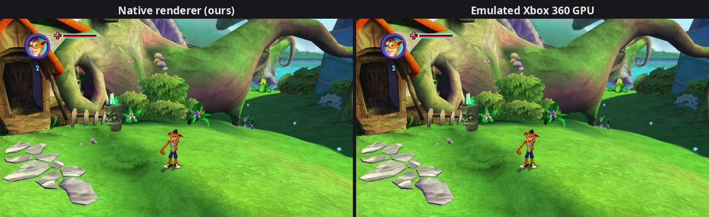
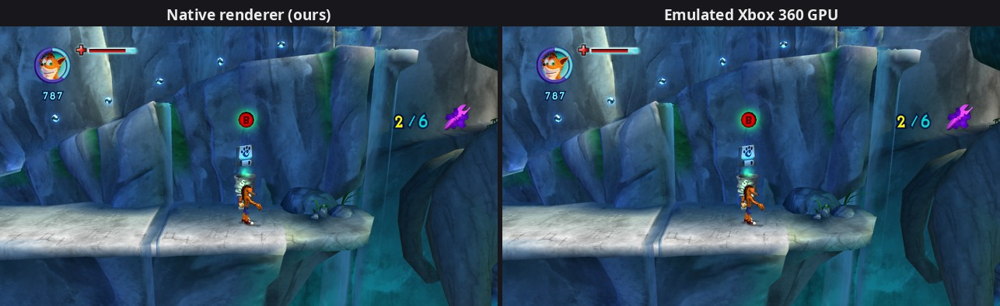

# Mind over Recomp

An unofficial port of **Crash: Mind over Mutant** (Xbox 360, 2008, Radical
Entertainment) into a native PC game, built by **statically recompiling** the
original Xbox 360 executable into C++ with
[ReXGlue](https://github.com/rexglue/rexglue-sdk). Linux today, Windows
planned.

**Note:** developed with extensive AI assistance, see
[Development approach](#development-approach).

> **No game files are included, and none ever will be.** You need your own
> copy of the Xbox 360 disc, dumped to an `.iso`. This repo contains only
> our tools, notes, and native code. Everything derived from the game
> (extracted files and the generated C++) stays on your machine and is
> blocked by `.gitignore`.

## Status

| Milestone | State |
|---|---|
| Extract disc (`tools/xiso_extract.py`) | ✅ done |
| Profile the executable (`tools/xex_info.py`) | ✅ done ([findings](docs/findings/01-disc-and-executable.md)) |
| Recompile `default.xex` → C++ (0 unresolved branches) | ✅ done ([findings](docs/findings/02-recompilation.md)) |
| Boots: kernel, fibers, audio, Vulkan up | ✅ done ([findings](docs/findings/03-first-boot.md)) |
| Loading finishes (fixed an XMA audio decoder bug in the SDK) | ✅ done ([findings](docs/findings/04-loading-hang-xma.md)) |
| Sound (5.1 audio) | ✅ done |
| No freeze after the intros (fixed an SDK fiber bug) | ✅ done ([findings](docs/findings/05-post-intro-freeze-fibers.md)) |
| Intro movies with picture, title screen, menus, cutscenes | ✅ done ([findings](docs/findings/06-black-screens-render-target-path.md)) |
| Playable (first level reached, saves load) | ✅ first look, playtesting in progress |
| 60 fps option (`--fps_cap=60`) | ✅ works, same game speed ([findings](docs/findings/07-frame-rate.md)) |
| Above 60 fps (`--fps_cap=144`, `--fps_cap=0` = no cap) | 🧪 work in progress: any cap is paced exactly by the clock; 140-160 fps uncapped in gameplay with the native renderer; no problems found in playtesting so far, but not yet confirmed stable ([findings](docs/findings/07-frame-rate.md#pacing-by-the-clock-2026-09-30)) |
| Native Vulkan renderer | 🔧 in progress: the menus and every area playtested so far are drawn by our own Vulkan code (world, characters, shadows, reflections, water, particles, depth of field, 2x MSAA, mipmaps, lights). F9 switches pictures, F8 shows both side by side in two windows, F10 saves a photo from both, `--native_only` turns the emulated GPU's drawing off ([plan](docs/04-native-renderer.md), findings [09](docs/findings/09-native-first-screens.md) to [21](docs/findings/21-motion-blur-cut.md)) |
| Windows build, mods, remappable KB+M | planned ([roadmap](docs/03-roadmap.md)) |

## Screenshots

The native renderer next to the emulated Xbox 360 GPU, on the **same game
frame** (the port's comparison tool captures one frame from both):





More comparisons, each with the write-up of how that effect was rebuilt:
[reflections](docs/findings/13-native-reflections.md),
[water and particles](docs/findings/14-native-water-particles.md),
[depth of field](docs/findings/15-native-depth-of-field.md),
[anti-aliasing](docs/findings/16-native-msaa.md) and
[texture filtering](docs/findings/17-native-mipmaps.md). Captured from the
maintainer's own copy of the game; the game's imagery belongs to its
owners (see [Disclaimer](#disclaimer)).

## Requirements

* **Your own copy** of the Xbox 360 game, dumped to an `.iso`.
* **Linux**. Windows is planned.
* **A Vulkan GPU with `VK_EXT_fragment_shader_interlock`**, which the
  emulated rendering mode needs. Without it the port falls back to a mode
  where the movies and some screens render black
  ([findings/06](docs/findings/06-black-screens-render-target-path.md)).
* **Build tools:** clang, CMake 3.25+, git, Python 3, `glslc` (shaderc; compiles our shaders).
* **16 GB RAM** for building (the recompiled game is ~140 large C++ files;
  `-j 6` keeps memory in check). About **16 GB of disk**: the ISO (7.8 GB,
  removable after extraction), the extracted game (6 GB) and builds (~2 GB).
* A controller (anything SDL recognizes as a gamepad). Basic keyboard/mouse
  also works (`--mnk_mode=true`); a proper remapping menu is planned.

## Quick start (Linux)

See **[docs/01-building.md](docs/01-building.md)** for the full walkthrough
and requirements. The short version:

```bash
# 1. unpack your disc into game/
python3 tools/xiso_extract.py "Crash - Mind over Mutant (USA).iso" game/

# 2. build + install the ReXGlue SDK, with our fixes applied (once)
git submodule update --init --recursive
cd thirdparty/rexglue-sdk
git apply ../../patches/rexglue-sdk/*.patch
cmake --preset linux-amd64 -DCMAKE_INSTALL_PREFIX=$PWD/../rexglue-install
cmake --build out/build/linux-amd64 --config Release        --target install
cmake --build out/build/linux-amd64 --config RelWithDebInfo --target install
cd ../..

# 3. recompile the game, then build the port
cmake --preset linux-amd64-relwithdebinfo
cmake --build --preset linux-amd64-relwithdebinfo --target crash_mom_codegen
cmake --preset linux-amd64-relwithdebinfo   # first time only: picks up the generated code
cmake --build --preset linux-amd64-relwithdebinfo -j 6

# 4. play (one log file per session in logs/)
tools/play.sh                  # original 30 fps
tools/play.sh --fps_cap=60     # 60 fps
tools/play.sh --fps_cap=144 --native-only   # above 60 (work in progress)
```

## Repo layout

```
README.md                  you are here
LICENSE                    GPL-3.0 (see "License" below)
crash_mom_manifest.toml    recompiler config: every analysis fix and hook, commented
CMakeLists.txt             builds the port (generated code + ReXGlue + src/)
src/                       OUR native code: app setup, hooks, fixes, debug tools
  pddi/                    interception of the game's renderer calls + the frame tracer
  native/                  our Vulkan renderer (in development)
tools/                     disc extraction, xex inspection, disassembler, play/debug scripts
patches/rexglue-sdk/       our fixes to the ReXGlue SDK (applied to the submodule)
docs/                      how everything works + everything we've found
  01-building.md           step-by-step build guide
  02-how-the-port-works.md the big picture: static recompilation explained
  03-roadmap.md            where the project is going
  04-native-renderer.md    the native Vulkan renderer: plan and progress
  findings/                reverse-engineering notes about the game itself
  images/                  a few screenshots of the port's progress (used by the docs)
thirdparty/rexglue-sdk     the recompiler + runtime (git submodule, pinned)

# local only (gitignored):
*.iso                      your disc image
game/                      extracted disc contents (the port reads these at runtime)
generated/default/         C++ produced by the recompiler
out/, logs/                build output, run logs
```

## Reading order

1. [How the port works](docs/02-how-the-port-works.md): what static recompilation is and why we use it
2. [Building](docs/01-building.md): get it running on your machine
3. [Findings](docs/findings/): everything we've learned about the game's internals
4. [Roadmap](docs/03-roadmap.md): what's next

## Development approach

This project is developed with extensive AI assistance (Claude, via
Claude Code). The code, the reverse-engineering notes and the documentation
were largely written by the AI. The maintainer sets direction, tests every
change on the real game and reviews the results, but isn't a specialist in
recompilation or reverse engineering.

* Findings are verified against the running game (logs, screenshots,
  measurements), but have **not been reviewed by domain experts**. Treat
  them as working notes, and please report errors.
* Reviews from people experienced with Xbox 360 internals, Radical's
  engine, ReXGlue/Xenia or Vulkan are especially valuable.

## Contributing

Contributions of any kind (code, reverse engineering, testing, bug reports,
corrections) are welcome and will be credited by name in [Credits](#credits).
Hand-written, expert work is especially valued. For bug reports, the
session log from `tools/play.sh` (in `logs/`) helps a lot.

## Credits

* **Maxilure**: project lead, direction, playtesting.
* **[ReXGlue](https://github.com/rexglue/rexglue-sdk)**: the static
  recompiler and runtime that make this possible.
* **[Xenia](https://github.com/xenia-project/xenia)**: the Xbox 360 emulator
  that ReXGlue's runtime and GPU emulation build on.
* **Claude** (Anthropic): AI assistant that wrote most of the code and
  documentation (see [Development approach](#development-approach)).
* **You?** Every human contribution (code, reverse engineering, testing,
  bug reports, corrections to our notes) gets listed here by name.

## Why this project exists

*Crash: Mind over Mutant* divided fans, but it's part of Crash's history.
This project aims to preserve the game and its legacy as a native PC game,
and to give it the upgrades and love it deserves.

## License

* The code in this repository is licensed under the **GNU General Public
  License v3.0** ([LICENSE](LICENSE)).
* The patches in `patches/rexglue-sdk/` modify ReXGlue's source code and stay
  under ReXGlue's **BSD 3-Clause** license, like the SDK itself
  (`thirdparty/rexglue-sdk`, which also builds on the
  [Xenia](https://github.com/xenia-project/xenia) emulator's code).
* The screenshots in `docs/images/` show the game's own imagery and are not
  covered by these licenses.

## Disclaimer

This is an unofficial fan project for game preservation. It is not
affiliated with, endorsed by, or sponsored by Activision, Sierra
Entertainment, Radical Entertainment, or Microsoft. *Crash Bandicoot* and
*Crash: Mind over Mutant* are trademarks of their respective owners. This
repository contains no game code, assets or data (only a few screenshots in
`docs/images/` that document the port's progress): you need your own legally
obtained copy of the game.
