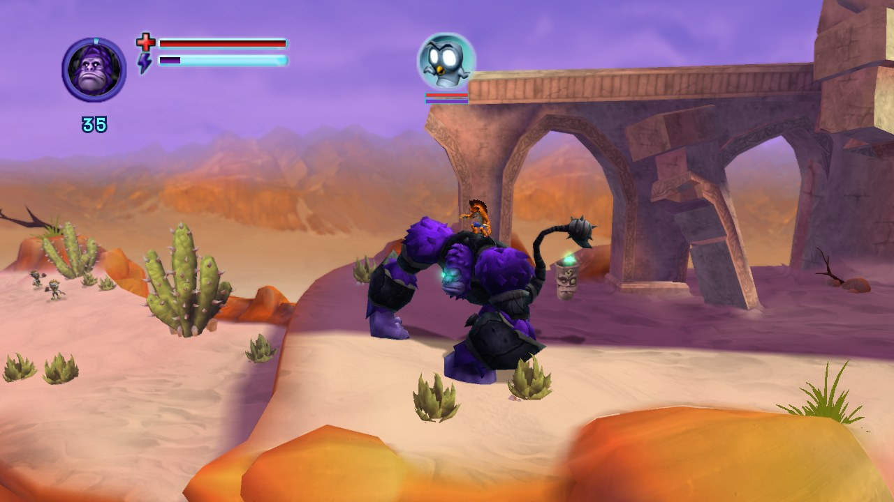
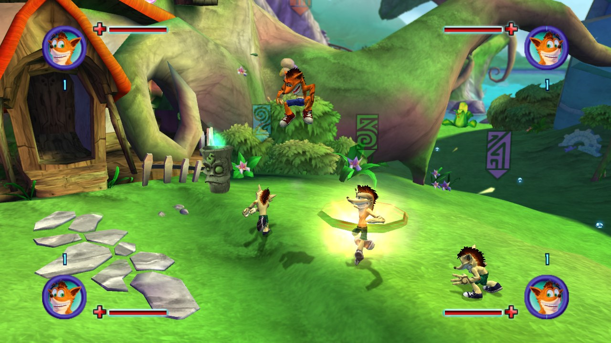

<div align="center">

# Mind over Recomp

**An unofficial native PC port of *Crash: Mind over Mutant***<br>
<sub>Xbox 360 · 2008 · Radical Entertainment — statically recompiled, then rebuilt piece by piece with native code</sub>

<br>

[](https://github.com/Maxilure/MindOver-Recomp/releases/latest)
[](#-download-and-play)
[](#-download-and-play)
[](LICENSE)
[](https://github.com/rexglue/rexglue-sdk)

**[Download](#-download-and-play)** · **[Features](#-features)** · **[Going native](#-going-native)** · **[Building](#%EF%B8%8F-building-from-source)** · **[Docs](#-documentation)**

<br>



</div>

<br>

> [!WARNING]
> **Alpha.** The game boots and plays, but it hasn't been played through to the end yet. Expect bugs, crashes and rough edges, and back up your saves.

> [!IMPORTANT]
> **No game files are included, and none ever will be.** You need your own Xbox 360 disc of *Crash: Mind over Mutant* (USA), dumped to an `.iso`. The launcher builds the game on your computer from it.

## 📖 About

*Crash: Mind over Mutant* divided fans, but it's part of Crash's history, and it only ever came out on consoles. **Mind over Recomp** aims to preserve it as a real PC game and give it the upgrades it deserves.

It isn't an emulator. The game's original Xbox 360 program is **translated into C++ ahead of time** ([static recompilation](docs/02-how-the-port-works.md) with [ReXGlue](https://github.com/rexglue/rexglue-sdk)) and compiled into a native Linux or Windows program. From there, the parts that still pretend to be an Xbox are replaced one by one with the port's own code: its own Vulkan renderer, plain save files, PC controls, and more.

## ✨ Features

<table>
<tr>
<td width="50%" valign="top">

### 🎨 Its own renderer
A native Vulkan renderer draws the game itself, effect by effect: lighting, water, reflections, depth of field, anti-aliasing. It matches the original's look and runs far lighter than emulating the Xbox's GPU.

</td>
<td width="50%" valign="top">

### ⚡ 60 fps and beyond
Runs at **60 fps** with the original game speed. 120, 144 and uncapped work too *(experimental)*, plus V-sync and a frame-rate counter.

</td>
</tr>
<tr>
<td valign="top">

### 👥 Up to four players
Co-op for **four** instead of two: HUDs, markers and loading screens for players 3 and 4, and a co-op camera that keeps everyone in view *(experimental)*.

</td>
<td valign="top">

### 💾 Unlimited, named saves
One scrolling list in the game's own save screen: as many saves as you like, renamed with the game's own keyboard, deleted safely. Every save is a plain `.sav` file.

</td>
</tr>
<tr>
<td valign="top">

### ⌨️ Keyboard, mouse and any controller
Every key rebindable (**F6**), any controller SDL knows, both at once or one per player.

</td>
<td valign="top">

### ⚙️ Options in the game's own look
Pause → **Options**: frame rate, renderer, brightness, V-sync, audio, controls and camera, all live, built from the game's own menu pieces.

</td>
</tr>
</table>

<div align="center">

</div>

<sub>Screenshots are from the port's own renderer, captured from the maintainer's copy of the game. The game's imagery belongs to its owners (see [License and disclaimer](#%EF%B8%8F-license-and-disclaimer)).</sub>

## 📥 Download and play

<div align="center">

### **[⬇ Download the latest release](https://github.com/Maxilure/MindOver-Recomp/releases/latest)**

</div>

| | Windows | Linux |
|---|---|---|
| **System** | Windows 10 / 11, 64-bit | x86-64 with glibc 2.39+ (Ubuntu 24.04, Fedora 40, Mint 22, Arch, or newer) |
| **Download** | `MindOverRecomp-…-windows-x86_64.zip` | `MindOverRecomp-…-linux-x86_64.tar.gz` |
| **Note** | an NTFS drive, not a OneDrive folder | |

Both need a **Vulkan** graphics card (only NVIDIA tested so far), **16 GB RAM** recommended, **~25 GB** free disk space, and internet for the first setup.

1. **Unpack** the download into a folder with enough space (on Windows, a short path such as `C:\Games\`).
2. **Start the launcher**, *Mind over Recomp*. Windows may warn about an unknown program: **More info → Run anyway**.
3. In the **Setup** tab, install the tools it lists, pick your `.iso`, and press **Set up everything**. The first time downloads ~550 MB and builds the game on your computer.
4. Press **Play**. Next time, **Continue** jumps straight into your last save.

The launcher also lists your saves, edits settings, shows a live game log and keeps the port up to date (your saves and settings stay).

> [!TIP]
> Something not working? See **[Troubleshooting](docs/06-troubleshooting.md)** and the [known issues](docs/06-troubleshooting.md#known-issues). Found a bug? **Report a problem...** in the launcher packs your log and settings and opens the [bug form](https://github.com/Maxilure/MindOver-Recomp/issues/new/choose) already filled in.

## 🎮 Controls

| Action | Keyboard and mouse | Controller |
|---|---|---|
| Move / walk | <kbd>W</kbd> <kbd>A</kbd> <kbd>S</kbd> <kbd>D</kbd> / hold <kbd>Ctrl</kbd> | left stick |
| Jump (twice: double jump) | <kbd>Space</kbd> | <kbd>A</kbd> |
| Light / heavy attack | left / right mouse button | <kbd>X</kbd> / <kbd>Y</kbd> |
| Spin | <kbd>Q</kbd> or middle mouse button | rotate the left stick |
| Block | <kbd>Shift</kbd> | <kbd>RT</kbd> |
| Jack / unjack a titan | <kbd>E</kbd> | <kbd>B</kbd> |
| Titan special / pocket a titan | <kbd>F</kbd> / <kbd>R</kbd> | <kbd>LT</kbd> / <kbd>RB</kbd> |
| Map / pause | <kbd>Tab</kbd> / <kbd>Esc</kbd> | <kbd>Back</kbd> / <kbd>Start</kbd> |

<details>
<summary><b>Port keys</b> (F5 to F10)</summary>
<br>

| Key | What it does |
|---|---|
| <kbd>F5</kbd> | Cheats menu, for testing: level ups, god mode, free camera, spawning |
| <kbd>F6</kbd> | Controls: change keys, pick which device plays as which player |
| <kbd>F9</kbd> | Switch between the emulated picture and the port's renderer |
| <kbd>F10</kbd> | Save a photo of the game into `user/photos/` |

</details>

Friends join from the pause menu (**Join Game**), as in the original's co-op.

## 🧩 Going native

The game's own code already runs natively. What's still emulated is the **Xbox 360 around it**: the system services the game asks for, answered today by the ReXGlue runtime. Each one the port answers itself is one less piece of pretend Xbox.

<!-- native-progress:begin -->
<!-- Written by tools/native_progress.py --readme: edit the tool, not this block. -->
**Xbox services replaced: 17 of 66 (26%)** `▰▰▰▱▱▱▱▱▱▱`

| Xbox piece | Replaced | Becomes |
|---|---|---|
| Graphics driver | `▱▱▱▱▱▱▱▱▱▱` 0 / 20 | the port's own Vulkan renderer, then the emulated GPU off |
| Profiles and sign-in | `▰▰▰▰▰▰▰▰▰▰` 4 / 4 | no profiles at all: who plays = which controllers play |
| Saves and storage | `▰▰▰▰▰▰▰▰▰▰` 11 / 11 | plain save files in one folder: no storage devices, no content packages |
| Controllers | `▱▱▱▱▱▱▱▱▱▱` 0 / 3 | the input manager fed directly (keyboard and mouse, any SDL controller, rumble) |
| Sound output | `▱▱▱▱▱▱▱▱▱▱` 0 / 5 | each mixed frame straight to the PC's audio |
| XMA sound decoder | `▱▱▱▱▱▱▱▱▱▱` 0 / 2 | a software decoder instead of the emulated sound chip |
| System pop-ups and notifications | `▰▰▰▰▱▱▱▱▱▱` 2 / 5 | PC behaviour (the port's own messages); gone once profiles and saves are native |
| System messages (achievements, ...) | `▱▱▱▱▱▱▱▱▱▱` 0 / 3 | the port's own handlers |
| Console settings | `▱▱▱▱▱▱▱▱▱▱` 0 / 8 | the port's settings (language, region, video mode) |
| Quit and launch | `▱▱▱▱▱▱▱▱▱▱` 0 / 4 | quit the program cleanly |
| Network | `▱▱▱▱▱▱▱▱▱▱` 0 / 1 | not needed (no online features) |

Not counted: 89 kernel basics (threads, locks, memory, files), already thin translations to the PC's own.
<!-- native-progress:end -->

## 🛠️ Building from source

For developers: players don't need this, the launcher does it all. Linux needs clang 20+, CMake 3.25+, Ninja, Python 3, Git and `glslc`; the full walkthrough, Windows included, is in **[Building](docs/01-building.md)**.

<details>
<summary><b>Build commands</b></summary>
<br>

```bash
git clone --recursive https://github.com/Maxilure/MindOver-Recomp.git
cd MindOver-Recomp

# the launcher (its Setup tab does everything below, with progress bars)
cmake -S launcher -B out/build/launcher -G Ninja -DCMAKE_BUILD_TYPE=Release \
      -DCMAKE_C_COMPILER=clang -DCMAKE_CXX_COMPILER=clang++
cmake --build out/build/launcher && out/build/launcher/crash_mom_launcher

# or by hand: unpack the disc, build the SDK with our patches, then the game
python3 tools/xiso_extract.py "Crash - Mind over Mutant (USA).iso" game/
(cd thirdparty/rexglue-sdk && git apply ../../patches/rexglue-sdk/*.patch \
  && cmake --preset linux-amd64 -DCMAKE_INSTALL_PREFIX=$PWD/../rexglue-install \
  && cmake --build out/build/linux-amd64 --config Release --target install \
  && cmake --build out/build/linux-amd64 --config RelWithDebInfo --target install)
cmake --preset linux-amd64-relwithdebinfo
cmake --build --preset linux-amd64-relwithdebinfo --target crash_mom_codegen
cmake --preset linux-amd64-relwithdebinfo   # first time only: picks up the generated code
cmake --build --preset linux-amd64-relwithdebinfo -j 6
tools/play.sh                               # one log per session in logs/
```

</details>

<details>
<summary><b>Repository layout</b></summary>
<br>

```
crash_mom_manifest.toml    recompiler config: every analysis fix and hook, commented
CMakeLists.txt             builds the port (generated code + ReXGlue + src/)
src/                       the port's own native code
  input/                   keyboard + mouse, the Controls menu (F6)
  players/                 up to four players, the co-op camera, who plays
  saves/                   the PC save drive, the save list
  options/                 the Options screen
  cheats/                  the Cheats menu (F5)
  data/                    changed copies of game data, built at run time from your files
  pddi/, native/           the game's renderer calls, and the port's Vulkan renderer
launcher/                  the launcher: setup, play, settings, log, updates (no game code)
assets/                    the port's own pictures (players 3-4's markers)
tools/                     disc extraction, disassembler, play/debug and release scripts
patches/rexglue-sdk/       our fixes to the ReXGlue SDK (applied to the submodule)
docs/                      guides, and findings about the game's internals
thirdparty/rexglue-sdk     the recompiler + runtime (git submodule, pinned)

# made on your machine, never committed:
*.iso, game/               your disc and its extracted files
generated/default/         C++ produced by the recompiler
out/, logs/, cache/        builds, logs, caches
user/                      YOUR files: saves, settings, controls, photos, logs
```

</details>

## 📚 Documentation

| | |
|---|---|
| 🧠 [How the port works](docs/02-how-the-port-works.md) | static recompilation, explained |
| 🔧 [Building](docs/01-building.md) | every build step, the launcher, releases |
| 🩺 [Troubleshooting](docs/06-troubleshooting.md) | common problems on Linux and Windows |
| ✨ [Enhancements](docs/05-enhancements.md) | what only this port adds, with pictures |
| 🗺️ [Roadmap](docs/03-roadmap.md) | where the project is going |
| 🎨 [Native renderer](docs/04-native-renderer.md) | the port's own Vulkan renderer |
| 🔬 [Findings](docs/findings/) | everything learned about the game's internals |

## 🤝 Contributing

Contributions of any kind are welcome: code, reverse engineering, testing, bug reports, corrections. Every human contribution is credited by name in [CREDITS.md](CREDITS.md). Reviews from people who know Xbox 360 internals, Radical's engine, ReXGlue / Xenia or Vulkan are especially valuable.

> [!NOTE]
> **Developed with extensive AI assistance** (Claude, via Claude Code). The code, the reverse-engineering notes and the documentation were largely written by the AI. The maintainer sets direction, tests every change on the real game and reviews the results, but isn't a specialist in recompilation or reverse engineering. Findings are checked against the running game, not reviewed by experts: treat them as working notes, and please report errors.

## 💛 Credits

- **Maxilure**: project lead, direction, ideas, playtesting, art
- **[ReXGlue](https://github.com/rexglue/rexglue-sdk)**: the static recompiler and runtime that make this possible
- **[Xenia](https://github.com/xenia-project/xenia)**: the Xbox 360 emulator ReXGlue's runtime and GPU emulation build on
- **Claude** (Anthropic): AI assistant that wrote most of the code and documentation
- **You?** Every contribution gets listed in [CREDITS.md](CREDITS.md)

## ⚖️ License and disclaimer

- The code in this repository is licensed under the **[GNU General Public License v3.0](LICENSE)**.
- The patches in `patches/rexglue-sdk/` modify ReXGlue's source and stay under ReXGlue's **BSD 3-Clause** license, like the SDK itself (which also builds on [Xenia](https://github.com/xenia-project/xenia)'s code).
- The screenshots in `docs/images/` show the game's own imagery and are not covered by these licenses.
- The marker pictures in `assets/markers/` were drawn for this port, after the save-slot numbers of *Crash of the Titans* (Radical Entertainment, 2007), to match the game's own markers.

<sub>This is an unofficial fan project for game preservation. It is not affiliated with, endorsed by, or sponsored by Activision, Sierra Entertainment, Radical Entertainment, or Microsoft. *Crash Bandicoot* and *Crash: Mind over Mutant* are trademarks of their respective owners. This repository contains no game code, assets or data: you need your own legally obtained copy of the game.</sub>
