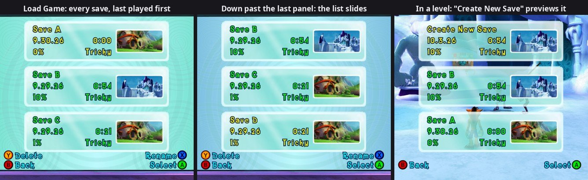
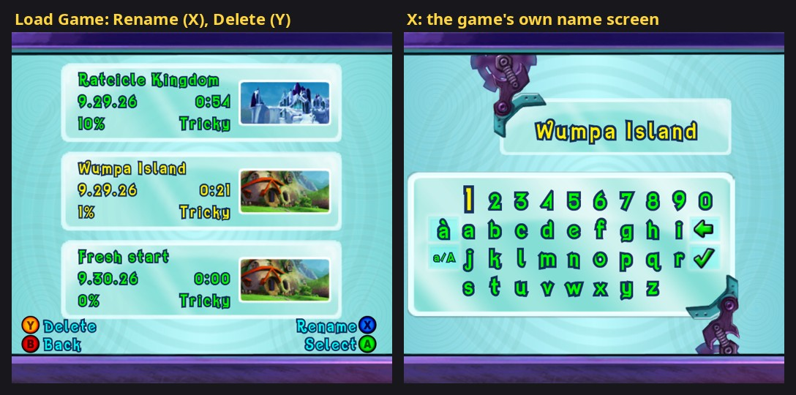
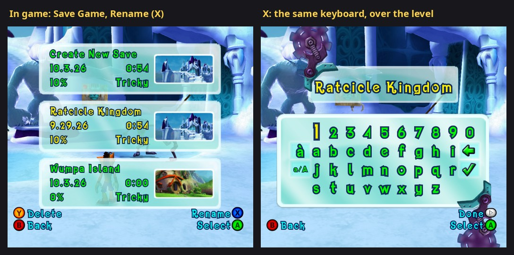
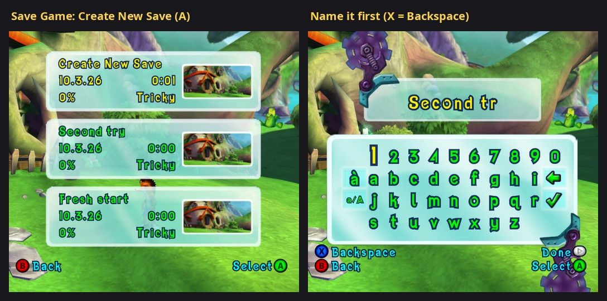

# Enhancements: what only this port adds

Some of this project is what any good PC port is expected to do: run
natively, at higher frame rates, with keyboard and mouse, drawn by a
renderer of its own. That work is tracked in the
[README's status table](../README.md#status) and the
[roadmap](03-roadmap.md).

This page is for the rest: **big additions the Xbox 360 game never had**,
unique to this port. Each one is optional; the game still plays as the
original if you don't use it.

Status: ✅ done · 🧪 in testing · 🔧 in progress · 📋 planned

| Enhancement | Original game | This port | Status |
|---|---|---|---|
| [More saves, with names](#more-saves-with-names) | 3 save slots; a save's name is typed once, at New Game | as many saves as you like, in the game's own Load / Save Game screen; rename and delete | 🧪 in testing |
| [Up to four players](#up-to-four-players) | two-player co-op | four players together on one PC | 📋 |

## More saves, with names

🧪 Built, in testing ([findings/24](findings/24-save-system.md) section 6).

The original Load Game / Save Game screen shows three slots, and a save's
name (shown at the top of its slot) is the name typed when starting a New
Game. In the port:

* **As many saves as you like, in one list.** The screen keeps its three
  panels, but they are a window onto a list of every save, the one played
  most recently on top: move down past the bottom panel and the list
  slides up. With one or two saves, they sit in the middle of the screen.
* **Saving**: "Create New Save" comes first and previews the new save
  (today's date, your play time, %, difficulty and the picture of where you
  are); the cursor starts on the save you're playing. Picking it opens the
  name screen first, with your game's name in it to keep or change (Back =
  don't save). Overwriting a save keeps that save's name. **New Game**
  creates its own save at once, named what you typed: no slot to pick,
  nothing to forget.
* **Rename**: on a save, press **X**: the game's own name screen opens
  (the on-screen keyboard of New Game) with the save's name in it, up to
  16 letters, so a controller can type too. It works in every level too:
  there the keyboard shows over the level, like the in-game save list (the
  game keeps that screen only in its menus and in Crash's house; the port
  adds a rename screen of its own to the game's menu logic and the keyboard
  to the in-game menus, built from your own game files at startup). On the
  name screen, **X** erases a letter. On a keyboard, **F2** opens a quick
  box to type a name instead.
* **Delete**: press **Y** (or the Delete key) and answer the game's own
  question ("Are you sure you wish to delete this save file?"). The save isn't
  destroyed: it moves to a "Deleted saves" folder next to the saves, out of
  the game's sight, and can be moved back by hand.
* The screen's button prompts say so: "Rename X" replaces the Xbox's
  "Storage Device", which means nothing on a PC, and "Delete Y" fills the
  empty spot above "Back".

Why it was possible without rebuilding the screen: the game only ever
thinks in slots 1-3, but a slot becomes a file in a single small function,
and the screen re-reads its three files every time it opens. Changing which
files sit behind the three slots is enough; the list slides by changing
them and redrawing the panels.

Off: `--save_library=false` (the game's own three slots).

## Up to four players

📋 Planned.

The original has drop-in co-op for two: a second player joins from the
pause menu (Join Game) and leaves again (Drop Out). The goal is four
players together on one PC, whenever the game can be taught to handle them.

What's already in place: the Controls menu (**F6**, Players tab) decides
which device plays as which player, and players 2-4 share player 1's
profile ([findings/23](findings/23-keyboard-and-mouse.md) section 5). Not
studied yet: how much of the game is built for exactly two players (who
can join, the HUD, the camera, the co-op rules).
