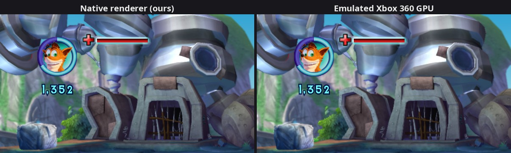

# 13. The reflect material and the underground material, drawn natively

2026-09-26. Two gaps found in playtesting: while Crash digs underground,
the dirt marker that shows where he is was missing in the native picture,
and on Wumpa Island a whole building, N. Gin's lab, was invisible. Both
were materials the native renderer didn't know yet: the log said `not
drawn natively yet: material class xnUndergroundShader` and `...
xnReflectShader`. Both are drawn now, and match the emulated picture.

## 1. The digging marker: xnUndergroundShader

`xnUndergroundShader` (vtable `0x82016CEC`, 23 slots like every xn shader).
Its draw setup is slot 14, `0x82435390`. Put side by side with
`xnSimpleShader`'s setup (`0x82441EA8`), the two are the same code line for
line:

* the same shader programs: the executable lists the six "simple" shader
  files (`simpleshader{lit,unlit}vp`, `simpleshader{lit,unlit}fp`,
  `palsimpleshader{lit,unlit}fp`) a second time, followed by the string
  "underground": the material loads its own copy of the simple shaders
  (table `0x82596810`);
* the same object offsets: +56 lit, +92 texture, +64..+92 colours into
  PS c64-c68, fade in PS c2.x, "textured" in PS c20.x, texture size in c112,
  address modes from +48/+52.

The one addition comes after the common states (`0x8242DA28`): a call to
`0x8242D8C8`, the state cache's **blend setter** (enable, op, source and
destination factor in PDDI numbering, cached at +204..+216 and passed to
D3D). It forces blending on, with the factors picked by a byte at +105:

| +105 | source × | destination × |
|---|---|---|
| 0 | zero | zero |
| 1 | one | one (additive) |
| 2 | destination alpha | 1 − destination alpha |
| 3 | zero | source alpha |
| other | destination alpha | one |

Mode 2 mixes the dirt in by the alpha already stored in the picture, which
is how it's shaped around Crash.

Our recorder reads a draw's blend state from that same state cache
**after** the game's setup has run, so it already sees the forced mode.
The whole fix was to treat the underground material as the simple one
(`recorder.cpp`, `guest.h` `kUndergroundShaderVtable`). Checked in a
digging section: identical to the emulated picture.

## 2. Reflections: xnReflectShader

`xnReflectShader` (vtable `0x82018FAC`), draw setup slot 14 `0x8244B430`:

* **Textures**: +96 the diffuse texture (sampler 0; if it's 8-bit
  palettized, its palette too), +100 the **reflection** texture (sampler 1;
  setter `0x8244B2B8`).
* **Shaders**: its own table at `0x82597380`: `reflectvp`, `reflectfp`,
  `palreflectfp` (the last one for a palettized diffuse texture).
* **Constants**: the lit materials' surface colours into PS c64-c68 (the
  same code as the simple material), fade in PS c2.x, and two of its own:
  * +104, a colour `0xAARRGGBB`, into **PS c100**: the shader calls it
    `EnvColour`, the reflection's tint (the constructor `0x8244B350` sets
    `0x80808080`, 50% grey);
  * +92, a word, into **PS bool b10** through D3D's
    `SetPixelShaderConstantB`: the shader calls it `HasVertexColour`.
* No b80/b81 (its shader has no additive-fade path) and no c20 (it always
  samples its texture).

**The vertex shader** (`reflectvp`, shipped with a debug file naming its
constants): position × MVP (c4-c7); vertex colour and UV passed through;
the normal rotated into world space (c0-c3); the direction from the camera
to the vertex, normalized, with the clip-space depth for fog. The camera is
in **c9** here (the lit simple vertex shader reads c8), so the recorder
reads c9 for this material.

**The pixel shader** (`reflectfp`, microcode only; disassembled with
`--dump_shaders`, matched to the `.out` files after swapping each 32-bit
word; its constant table names every input). Inputs in the usual order,
texture coordinates first: r0 = UV, r1 = normal, r2 = view (w = fog depth),
r3 = vertex colour. In order:

1. **Lights**: up to 4 directional lights (bools b0-b3, direction and
   colour in c9-c16). Diffuse = colour × saturate(N·−L), summed. Specular
   = colour × saturate(N·H)^power (c68.x, as log / multiply / exp), with H
   the normalized half vector −(view + L). Unlike the lit simple shader:
   no surface diffuse or specular colour, nothing clamped, and when **no**
   light is on the diffuse counts as full white.
2. light = ambient (c8) × surface ambient (c67) + diffuse + emissive (c66).
3. **The reflection**: the second texture is a *sphere map* (a picture of
   the surroundings as seen in a mirrored ball), looked up with the
   world-space normal: u = 0.5 + 0.5·N.x, v = 0.5 − 0.5·N.y (literal
   constants 0.5 and 1 from the shader file). Not a true reflection vector:
   the view direction only enters the specular. The result is multiplied by
   the diffuse texture's **alpha**, a per-pixel "how shiny" mask, and by
   `EnvColour`.
4. colour = vertex colour (only with b10) × texture × light + reflection +
   specular.
5. Distance fog (bool b69, c70-c72), the same formula as the other materials.
6. alpha = vertex alpha (1 without b10) × fade. The texture's alpha isn't in
   it: it only masks the reflection.

Reading the microcode, the colour channels show up in reversed order
(`.zyx` swizzles everywhere, and the diffuse fetch written as `r7.yxzw`);
following one channel through every instruction settles which is which.
The palettized variant is the same after its four-texel palette lookup
(the one findings/09 describes, texture size in c112).

On our side: `Material::kReflect`, the lit materials' `LitParams` block
(c100 goes in the character's rim-colour slot, same register; two new
flags, `kLitVertexColour` and `kLitNoColour`), texture bindings 0 (diffuse),
1 (reflection), 3 (palette), and `shaders/reflect.vert` / `reflect.frag`.

## 3. Results

Same-frame A/B (findings/11) in front of N. Gin's lab:

| Region | Mean difference | Signed, after a 3-pixel blur (R, G, B) |
|---|---|---|
| Whole frame | 2.8 / 255 | +0.06, −0.02, +0.06 |
| The lab, top part | 3.4 / 255 | −0.09, −0.03, −0.11 |
| The lab, middle part | 5.3 / 255 | +0.29, +0.18, +0.03 |
| The lab, a round window | 3.5 / 255 | +0.33, +0.41, +0.15 |

The colours agree within half a step out of 255: the lighting, the
reflection and its tint are right. The rest of the difference is
sharpness: the emulated picture is softer because the depth-of-field pass
(`xnDOFShader`), anti-aliasing (MSAA) and mipmaps aren't done natively yet.



*N. Gin's lab on Wumpa Island, on the same
frame from both renderers (captured 2026-09-27,
when depth of field, MSAA and mipmaps were native too, findings/15 to 17).*

## 4. Not drawn natively yet

Still reported at that spot: water (`xnWaterSpecularShader`, e.g. the
waterfalls of the waterfall area, name TBD), particles (`xnParticleShader`) and
depth of field. (Water and particles: done in
[findings/14](14-native-water-particles.md), which also found that the
small glowing blue specks are not particles.) Elsewhere: `xnFxGridShader`,
`xnBumpMegaShader`. Plus the list in findings/12, section 6.

Also seen, not investigated yet: `BaseHeap::Release failed because address
is not a region start` (2-3 lines) when a level is left, with nothing
visibly wrong. Seen so far only in runs with the native picture on; not
yet checked whether emulated-only runs log it too. (SOLVED 2026-09-30:
a race in the SDK's physical-memory release, unrelated to the renderer;
fixed by SDK patch 0008, see docs/01-building.md.)

## Reproduce

Load a save near N. Gin's lab, on a **copy** of the save data. Scripted
presses can be dropped while the load list animates in, so pick the save
live through the input FIFO and check the newest capture before
confirming:

```bash
S=<tmp>; cp -a ~/.local/share/crash_mom $S/userdata
crash_mom --game_data_root=$PWD/game --user_data_root=$S/userdata --renderer=native \
  --readback_resolve=full --debug_capture_dir=$S/cap --debug_capture_interval_ms=1000 \
  --debug_native_ab_trigger=$S/ab.now --debug_input_fifo=$S/input.fifo \
  --debug_input_script="8000:start,9500:start,11000:start,12500:start,14000:start,17000:start,23000:down,25000:a" &
# ~40 s: the load list. Move to the save with `echo down > $S/input.fifo`
# (the selected one is yellow in the newest capture), then:
echo a > $S/input.fifo; echo a > $S/input.fifo         # load, "Load successful" -> Continue
touch $S/ab.now                                        # ~20 s later: ab_<ms>_{native,emulated}.ppm
```

The reflect pixel shader's microcode: add `--dump_shaders=$S/shaders`; it's
the dump whose words, byte-swapped, appear in `game/shaders/reflectfp.out`
(game content: keep it local).
