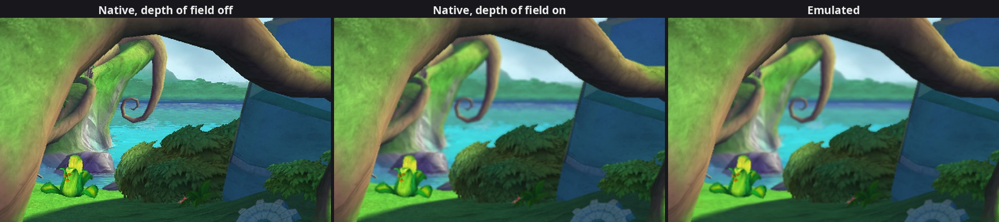

# 15. Depth of field drawn natively

2026-09-26. Since the water and particles
(findings/14), the biggest visible difference in the hub was the
**depth of field**: in the emulated picture the distance is slightly soft,
in ours it was sharp. That also made every comparison of distant things
unfair. The log said `not drawn natively yet: material class xnDOFShader`.
It's drawn now, and the log of a session on Wumpa Island or in the
waterfall area (name TBD) no longer lists
anything as "not drawn".

What depth of field is: a camera lens is sharp at one distance (the focal
plane) and blurs what's nearer or farther. Games imitate it after the
scene is drawn, by blurring each pixel more the farther its depth is from
the focal plane. Here the effect is gentle: at most 2.25 pixels of blur,
only behind the player.

## 1. How the game does it

It's not a material on scenery but one **full-screen pass** in the
post-processing (step 5 of the hub frame in findings/10): after the scene
texture has been drawn back onto the post surface and before the HUD.

`FramebufferFxExt::v30` (`0x82440A50`) is the entry point. The game calls
it every frame with the settings: the focal plane distance (`f1`), the
near blur plane (`f2`), the far blur plane (`f3`) and a pair of floats
"MaxRadius" (`r7`). It stores them into its `xnDOFShader` (the one at
`FramebufferFxExt+92`, then `+16`):

| Offset | What | Default (constructor `0x824494F0`) |
|---|---|---|
| +92 | byte: near blur on (near plane > 0.001) | off |
| +96 | FocalPlaneDistance | 1 |
| +100 | NearBlurPlaneDistance | 0 |
| +104 | FarBlurPlaneDistance | 1000 |
| +108 | MaxRadius (two floats) | 1, 2 |

then tail-calls `0x824406A8`, which draws the quad with plain immediate
geometry: `BeginPrims`, triangle strip, format `0x2021`, 4 vertices, UV 0
to 1, under an orthographic matrix for the screen.

**The values the game uses** (read by a temporary log line):

| Where | Focal | Near | Far | MaxRadius |
|---|---|---|---|---|
| Wumpa Island and the waterfall area | 5 | 0 (off) | 130 | 2.25, 4.5 |
| Title and main menu | 995 | 0 (off) | 1194.6 | 0.011, 0.023 |

On the title and the menus the pass runs too, but a radius of a hundredth
of a pixel does nothing visible.

**The draw setup** (vtable `0x82018D2C`, slot 14, `0x824495D8`):

* sampler 0 "Framebuffer": the context's `0x82430F28` resolves the post
  surface's colour right here, so the pass reads a copy of the (sharp)
  picture so far and draws the blurred one over it;
* sampler 1 "Depthbuffer": the scene's depth, from `0x824310A0`, the
  function the particles and the water use (findings/14): it resolves the
  depth once per frame and hands out the same copy afterwards;
* both bilinear and clamped (the state cache calls at the end);
* shaders from its table `0x82597358`: `DOFvp`, `DOF`;
* pixel shader constants: c0 = 0.25 / screen size (not used by the
  shader), c1 "PixelSizeHigh" = 1 / screen size, and four **overlapping
  windows** onto the settings: c2 starts at `+96`, c3 at `+100`, c4 at
  `+104`, c5 at `+108`. The shader reads c2.x (focal), c3.x (near),
  c4.x (far) and c5.xy (MaxRadius). Bool b10 "bEnableNearBlur" = the byte
  at `+92`. c73 "NearFar" comes from the context, as for particles.

Names from the pixel shader's constant table. The vertex shader has a
debug file: position × the matrix (c4-c7), the UV, and the clip position
once more.

## 2. The pixel shader

Microcode only (a `--dump_shaders` dump from an earlier session matched
`DOF.out`, disassembled by the SDK). For every pixel of the screen:

1. **How blurry is this spot?** The depth under the pixel becomes a
   distance, `d = NearFar.y / ((1 − NearFar.x) − depth)` (the particles'
   formula). Its "circle of confusion" (CoC):
   * at or behind the focal plane: `saturate((d − focal) / (far − focal))`,
     0 at the focal plane, 1 at the far plane and beyond;
   * in front of it, if near blur is on: `(d − focal) / (focal − near)`,
     **not** clamped (−1 at the near plane, less below it); if near blur is
     off, 0.
2. **A radius** in pixels: `R = (CoC × 0.5 + 0.5) × MaxRadius.y −
   MaxRadius.x`. The game's MaxRadius was `(r, 2r)` every time we looked
   (default, hub, title), so R runs from
   −r at the near plane through 0 in focus to r at the far plane; only |R|
   is used.
3. **Seven more samples** around the pixel at fixed offsets on a disk
   (irregularly spread, a "Poisson disk", so the blur shows no pattern),
   scaled by |R| pixels. Each sample's own CoC gives its **weight**: 1 if
   it's at least as blurry as the centre, otherwise |its CoC|. So a sharp
   object in front of a blurry background doesn't bleed into it: its
   samples count for little.
4. `colour = (centre + Σ weight × sample) / (1 + Σ weights)`, alpha 1.

Details worth knowing from the microcode:

* The seven offsets are the shader's literal constants (c252-c255, right
  before the microcode in the `.out` file, as usual), and each is used
  with its two numbers **swapped** (x from the second). Kept exactly.
* The centre's depth is read at the pixel's screen position (from the clip
  position), the samples' depths at their UV. For a full-screen quad that's
  the same place.
* The "0 when near blur is off" is made by an odd instruction,
  `-|uv.x| > 0`, which is always false: the compiler's way to get a zero.

## 3. Native side

* `Material::kDof` (`frame.h`), recognised by its vtable in the recorder;
  its two textures come from D3D's sampler copy (like water's), and its
  settings go into a `DofParams` block (binding 9, like the other block
  materials).
* `shaders/dof.vert`, `shaders/dof.frag`, `shaders/dof_params.glsl`: the
  shader above, one loop over the seven samples.
* Bindings 0 (picture copy) and 1 (depth copy) = the game's samplers. Both
  are required: without them the pass is skipped and the picture stays
  sharp, as before.
* The game samples the depth copy bilinearly. Our depth copies are 32-bit
  float images, which Vulkan doesn't promise to filter; on a GPU that
  can't, they're point-sampled (the renderer checks at start-up).

## 4. Checking it

The effect is small (2.25 pixels at most), and our picture is sharper
than the emulated one anyway: it has no anti-aliasing yet (the emulated
one has 2× MSAA, which softens every edge). So the test was an
experiment: a temporary switch that skipped `FramebufferFxExt::v30` (the
whole pass) in **both** renderers, then the same hub spot with and without
it, each time with a same-frame A/B (findings/11). Sharpness = the mean
absolute Laplacian (how much each pixel differs from its neighbours;
lower = blurrier). "Top" = the top third of the screen, mostly distance.

| | Sharpness native / emulated | Difference | Top | After a 3 px blur of both | Top |
|---|---|---|---|---|---|
| Depth of field skipped | 10.6 / 7.1 | 1.55 | 1.73 | 0.47 | 0.62 |
| Depth of field on | 8.1 / 5.9 | 1.24 | 1.24 | 0.45 | 0.59 |

*The top right of Wumpa Island by Crash's house, enlarged 1.5×: our picture with the pass
skipped, with it, and the emulated picture of the same frame as the
middle one (the first comes from another run; captured 2026-09-27, with
MSAA on). The river, the hills and the plant blur in the distance; the
branch in front stays sharp.*

(Differences in 1/255 per channel.) The pass takes a similar share of
sharpness away in both renderers, the distance now matches much better,
and after blurring away the anti-aliasing difference both runs agree
equally well: our depth of field adds no difference of its own. The
remaining sharpness gap is there with the pass skipped too: that's MSAA
(and mipmaps), not depth of field.

Elsewhere: the waterfall area, 0.59 / 255 for the whole frame
(0.63-0.65 around the same spot before, findings/14; not the same frame). Title 0.08 and main menu 1.41 / 255,
unchanged (0.06-0.15 and 1.41 before).

## 5. Not drawn natively yet

* **MSAA** (now the largest difference everywhere: the jagged edges; done
  next: findings/16) and
  **mipmaps** (we sample only each texture's full-size level, so distant
  textures come out sharper and can shimmer).
* `xnFxGridShader`, `xnBumpMegaShader` (later levels), render target 1 (the
  lit material's motion-blur velocity), the character refraction variant
  (b11), the unlit simple shader's point lights and Fx shadows.
* Near blur hasn't been seen switched on (no area checked so far uses it);
  the shader handles it as the game's does.

## Reproduce

On a **copy** of the save data, as in findings/14 (Load Game, a save on
Wumpa Island or in the waterfall area). The settings: a temporary log line in
the recorder's `ReadDofParams`. The pixel shader: `--dump_shaders`, then
match the dumps to `game/shaders/DOF.out` (game content: keep it local).
