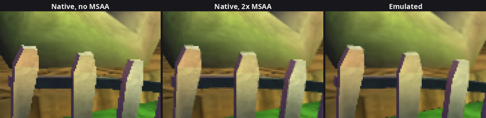

# 16. MSAA: the game's 2x anti-aliasing, natively

2026-09-27. After depth of field
(findings/15), the largest difference between our picture and the emulated
one was at the **edges** of objects: ours had hard stair-steps, the Xbox's
were softened. The Xbox draws its 3D scene with **2x MSAA**; our render
targets were single-sample. They follow the game now: the hub's
difference drops from 1.24 to 1.16 / 255 (edges: 5.98 → 5.19), Crash's
outline shows the same blended stair-steps as the emulated picture, and
nothing else moved.

What MSAA (multisample anti-aliasing) is: instead of deciding once per
pixel whether a triangle covers it, the GPU checks several points inside
the pixel (here 2), keeps a colour and a depth for each, and at the end
averages them. A pixel half covered by Crash's arm becomes half orange,
half grass. The pixel shader still runs once per pixel, so it costs far
less than drawing the picture at twice the size.

## 1. What the game does

**Which surfaces.** From the surface table in findings/10: the hub's main
colour and depth surfaces (the ones the scene is drawn into, in 3 strips)
are **2x**; the post-processing surface (scene copy, depth of field, HUD)
is **1x**. The title and menus draw their 3D backdrop through the same 2x
surfaces. D3D keeps the sample count in the surface object's
`RB_SURFACE_INFO` (bits 16-17), which the recorder already read
(`Surface::msaa`).

**How a resolve combines the samples.** D3D's `Resolve` (`0x8231EE00`)
takes the choice in its flags, bits 4-6: 1-4 = one sample (0-3),
5 = the average of samples 0 and 1, 6 = of 2 and 3, 7 = of all four. If
the game names none, D3D picks by the surface (read off its code at
`0x8231EE3C`): 1x → sample 0 (`0x10`), **2x → the average (`0x50`)**,
4x → the average of all four (`0x70`). The game's colour resolves name
none, so they average. Its depth resolves pass `0x14` = depth + **sample
0**: a depth can't be averaged (the average of a near and a far depth is
a depth nothing is at).

**Where the samples are.** The emulator draws the Xbox's 2x with Vulkan's
standard 2x pattern (the same as Direct3D's: one sample at (0.75, 0.75)
of the pixel, one at (0.25, 0.25)), without custom sample positions. It
also records how the two number them: the Xbox counts the top sample
first, Vulkan the bottom-right one, so **the Xbox's sample 0 is Vulkan's
sample 1** (the SDK's `SpirvShaderTranslator::FSI_LoadSampleMask`; for 4x:
0, 2, 1, 3). Standard Vulkan 2x on our side therefore matches our
reference exactly; only the depth copy has to pick the right sample.

## 2. Native side

All in `src/native/render_targets.*`, plus the pipelines:

* **Images.** A surface gets as many samples as the game gave it
  (`SamplesFor`). One render pass per sample count
  (`render_pass(samples)`); a draw's pipeline is built for its colour
  surface's count (`PipelineKey::samples`, `SurfaceSamples`). Plain
  multisampling like the Xbox's: no sample-rate shading. A colour and a
  depth surface with different counts can't share a pass: the draw then
  gets the scratch depth image of the right count (logged once; never seen).
* **Colour resolves** from a 2x surface: `vkCmdResolveImage`, which
  averages each pixel's samples. A resolve of a single colour sample would
  be averaged too (logged once; never seen).
* **Depth resolves** from a 2x surface: Vulkan can't copy a multisampled
  image into a buffer (the path 1x depth copies take, findings/12). A small
  shader pass does it instead (`shaders/depth_copy.*`): one triangle over
  the resolve's rectangle reads the chosen sample of the depth and of the
  stencil (`texelFetch` on views of each aspect) and writes the two copies
  our render targets keep (R32F depth, R8 stencil) as two colour outputs.
  The multisampled depth image gets its two aspect views and a descriptor
  set once, when it's created. The game's "sample 0" becomes Vulkan's
  sample 1.
* **GPUs that can't.** 2x is used only where the GPU supports it for
  drawing (colour, depth, stencil) and for sampling depth and stencil;
  otherwise surfaces are 1x and the log says so once. Vulkan promises 1x
  and 4x everywhere; 2x is near universal on desktop cards.

The frame and the recorder only gained the resolve's sample choice
(`ResolveCommand::sample_select`).

## 3. Checking it

Same spot on Wumpa Island (by Crash's house), same-frame A/B
(findings/11), once with a temporary switch forcing 1x surfaces and once
with 2x. The **edge mask** = pixels where the emulated picture has a strong
brightness step (6% of the frame), where aliasing shows.

| Hub | Whole frame | Edges | Elsewhere | Sharpness native / emulated |
|---|---|---|---|---|
| 1x (before) | 1.24 | 5.98 | 0.92 | 8.1 / 5.9 |
| 2x | 1.16 | 5.19 | 0.89 | 7.8 / 5.9 |

(Differences in 1/255 per channel; sharpness as in findings/15.)

*The fence by Crash's house, pixels enlarged 4×: without MSAA (a run
with 1x surfaces), with 2x MSAA, and the emulated picture of the same
frame as the middle one. The posts' dark outlines lose their hard
stair-steps.*

Up close the two pictures now anti-alias silhouettes the same way (Crash's
arms and legs against the grass, the fence posts: the same blended
stair-steps). What's left in the edge mask isn't anti-aliasing:

* **Texture detail.** The edge mask also catches strong steps *inside*
  textures, and there the emulated picture is smoother: the grass around
  Crash, the bushes, his own texture. That's the missing **mipmaps** (the
  Xbox samples smaller, pre-filtered copies of a texture that's far away
  or seen at an angle; we always sample the full-size one). They are also
  most of the remaining sharpness gap (7.8 vs 5.9).
* **Where two surfaces meet.** Some differences sit exactly where a stone
  meets the ground: there each sample's depth test decides which surface
  wins, and the Xbox's depth buffer is a 24-bit float (D24FS8) where ours
  is 32-bit. Likely the cause, not verified.
* **No offset.** Moving our picture by quarter pixels in any direction
  only makes the edges worse: the two line up.

Other things checked: Crash's soft shadow (its stencil copy now comes
from the new shader) has the same average colour as the emulated one
within 0.1 / 255. The waterfall area, name TBD (water and particles read
the depth copy): 0.57 / 255 for the whole frame (0.59 before). Title
0.06-0.10, main menu 1.41 / 255, unchanged. The bushes show no sign of
alpha-to-coverage (leaf edges are hard in both pictures). No new log
lines; the 3 "texture fetch constant has invalid type" warnings of a hub
session come from the emulated GPU and are there since 2026-09-25.

## 4. Next

* **Mipmaps**: now the biggest difference in the 3D scenes (texture
  shimmer and grain in the distance and on the ground). Done next:
  findings/17.
* `xnFxGridShader`, `xnBumpMegaShader` (later levels), render target 1,
  the character refraction variant, the unlit simple shader's point lights
  and Fx shadows (findings/15, section 5).

## Reproduce

As in findings/14 (a copy of the save data, Load Game, a Wumpa Island save). The surfaces'
sample counts: `--log_level=debug`, lines `NativeRenderer: surface
<address>: 1280x720 colour 2x MSAA`. For a before/after, a temporary line
at the top of `RenderTargets::SamplesFor` returning
`VK_SAMPLE_COUNT_1_BIT` gives the old single-sample picture.
