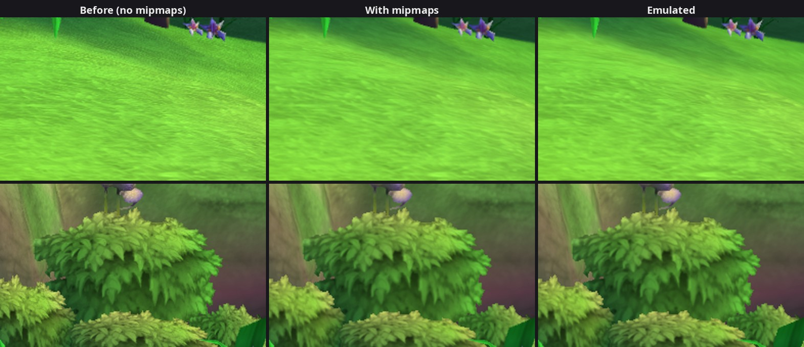

# 17. Mipmaps and the game's texture filtering, natively

2026-09-27. After MSAA (findings/16) the
biggest difference in 3D scenes was texture detail: our grass and bushes
were grainy, the Xbox's smooth. We sampled every texture at full size; the
game's textures come with **mip levels**, and it filters them trilinearly
with **16x anisotropic filtering**. The native renderer does the same now:
Wumpa Island's difference to the emulated picture drops from 1.16 to
0.51 / 255, and away from edges from 0.89 to 0.28.

*Wumpa Island by Crash's house, enlarged 2×: the grass and a bush without
mipmaps, with them, and the emulated picture of the same frame as the
middle one (the first comes from a run before this change).*

What mipmaps are: a texture stored again at 1/2, 1/4, 1/8... of its size.
Where a surface is far away or seen at a shallow angle, one screen pixel
covers many texels; sampling the full-size picture there picks a few of
them almost at random (grain, and shimmer when the camera moves). The GPU
picks the level whose texels are about pixel-sized instead, and
**trilinear** filtering blends the two nearest levels. **Anisotropic**
filtering takes several samples along the direction a slanted surface is
stretched in, so the ground stays sharp at shallow angles instead of
turning to mush.

## 1. What the game uses

A temporary log line listed every texture layout and every sampler setting
seen in Wumpa Island:

* **Textures with mips**: the 3D world's 32-bit `k_8_8_8_8` textures, all
  in the linear (not tiled) layout, with 2 to 6 mip levels and a packed mip
  tail (below). The `k_DXT1` and the 8-bit palettized (`k_8`) ones have no
  mips.
* **Samplers** (D3D's copy of the fetch constants, what the GPU samples):
  the 3D world: linear magnification, minification and mips, and
  anisotropy code 5 = at most **16** samples; the menus and HUD: mip filter
  "base map" (the full-size level only). The level bias is 0 everywhere.

The emulator samples them the same way (the SDK's
`VulkanTextureCache::GetSamplerParameters` / `UseSampler`: the fetch
constant's filters, anisotropy up to what the GPU offers, and anisotropy
forcing linear filters and mips).

## 2. How the Xbox stores mip levels

From the fetch constant (`xenos::xe_gpu_texture_fetch_t`): level 0 is at
the base address (word 1), levels 1 and up at the **mip address** (word 5,
bits 12-31), the range of levels in word 4 (bits 2-5 the most detailed
level allowed, 6-9 the last one), and "packed mips" in word 5 bit 11. The
SDK's texture_util knows the layout (a long comment in its `util.h`):

* each mip level is padded as if the texture were a power of two in size
  (`next_pow2(width) >> level`, then to 32 blocks; linear rows to 256
  bytes), whatever the base level's own pitch;
* with packed mips, the levels of 16 texels or less share one **mip tail**
  stored like the first of them, each level at its own corner of it;
* `GetGuestTextureLayout` gives each stored level's offset from the mip
  address and its row pitch, `GetPackedMipOffset` a packed level's corner.

The SDK's page numbers are physical; like for the base level, we read
through the fetch constant's own (virtual) mip address. For textures read
from D3D's sampler copy (the water's, findings/14) the mip address there
is physical too and is translated the same way as the base address.

## 3. Native side

* **Texture cache** (`texture_cache.*`): every stored level is decoded like
  the base one (untiled if tiled, byte-swapped, 16-bit formats expanded),
  one after the other, and uploaded into the Vulkan image's own mip levels
  (one buffer-to-image copy per level). The content hash covers the mips'
  memory too, and the cache key the fetch constant's mip fields. Uploads
  may now be 24 MiB (a 2048×2048 RGBA8 texture with its mips).
* **Samplers** (`frame.h`, `SamplerState`): the recorder reads the whole
  sampler state (min / mag / mip filters, anisotropy, the most detailed
  level, the level bias); the renderer builds its Vulkan samplers as the
  emulator does: "base map" = the one level, anisotropy (capped by the GPU)
  forces linear filters and mips, the bias in 1/32 of a level. Palettized
  textures (whose indices the shader filters itself) and depth copies on a
  GPU that can't filter them stay point-sampled at full size.

## 4. Checking it

Same-frame A/B (findings/11) at the usual spots (differences in 1/255
per channel; "away from edges" = outside the edge mask of findings/16):

| Place | Before (MSAA) | With mipmaps | Away from edges |
|---|---|---|---|
| Wumpa Island, by Crash's house | 1.16 | **0.51** | 0.28 (was 0.89) |
| The waterfall area (name TBD), the game's second area | 0.57 | **0.35** | 0.17 |
| N. Gin's lab | 1.45 | **0.69** | 0.34 (was 1.09) |

Sharpness (findings/15's measure) now matches too: Wumpa Island 5.90
natively vs 5.94 emulated (7.8 before), the waterfall area 3.67 vs 3.74. Title
and main menu unchanged (0.17 and 1.41; the title animates). No new log
lines.

**Frame rate**, Wumpa Island standing still, 60 fps cap, the native
picture on screen, no readback (as when playing): 57.5-58.4 fps average
with mipmaps, 58.2-59.7 with a temporary switch skipping them. About one
frame per second, likely the 16x anisotropic filtering: the emulated GPU
still runs next to ours on the same graphics card (findings/08); when the
native renderer takes over for good, that work goes away.

What's left in 3D scenes is mostly at edges: where two surfaces meet
(depth precision, findings/16) and small differences in how the two
renderers round colours.

## 5. Next

* The later levels' materials: `xnFxGridShader` (done: findings/18), `xnBumpMegaShader` (and
  the "unreadable memory" warning seen with the latter in a playtest).
* Render target 1 (the lit material's motion-blur velocity), the character
  refraction variant, the unlit simple shader's point lights and Fx
  shadows, the main menu's 1.41 / 255.

## Reproduce

As in findings/14 (a copy of the save data, Load Game). Textures and their mip
counts: `--log_level=debug`, lines `NativeRenderer: texture <w>x<h> <format>
... <n> level(s)`. For a before/after, a temporary `return false;` at the
top of `TextureCache::MipExtent` uploads the base levels alone.
