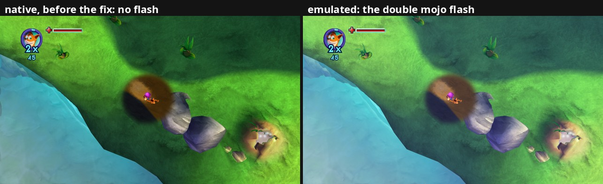

# 18. The double mojo flash (fx grid), and two windows at once

2026-09-27. Two things: a way to watch both
renderers side by side while playing (**dual mode**), and the first bug
playtesting found with it, the missing **double mojo flash**, traced and
fixed the same day.

## 1. Dual mode: both pictures, live

Until now, comparing the renderers meant pressing F9 back and forth, or F10
for a photo of one frame. Now one game can show both: the main window keeps
the emulated picture, a second window ("crash_mom: native renderer") shows
ours, live.

* `tools/play.sh --dual` (the game flag is `--native_window`), or **F8**
  any time to open / close the second window. Closing it doesn't quit the
  game; F9 does nothing while it's open; F10 saves both pictures of one
  frame as usual.
* How (`src/native/native_window.*`): an ordinary SDK window with its own
  presenter, made by the same graphics provider as the main one (so the
  same Vulkan device our images live on). The renderer's picture simply
  goes to that presenter instead of the main window's, and the main
  window's presenter is handed back to the emulated GPU.
* Two SDK details mattered. A presenter with no overlay presents straight
  from the thread that refreshes it, which for us is the game's main thread
  (it could end up waiting for the desktop's compositor): the second window
  gets an empty overlay so it repaints on the UI thread like the main one.
  And the SDK ignores the controller while its main window isn't focused:
  once the second window exists, either window counts.
* Checked: where the two renderers differ, the main window's screenshots
  match the emulated picture (5-7 / 255 off, vs 23-24 from ours), through
  opening, closing and reopening; same frame rate as the native picture
  alone (57.5 vs 57.9 fps average in gameplay at the 60 fps cap).
* The emulated window can be up to about a frame behind ours: the emulated
  GPU works through each frame's commands a little after the game's main
  thread finished it.

## 2. The difference

Playing in dual mode showed it: taking the **double mojo** power-up (it
doubles the mojo Crash collects for a short time), the screen briefly
brightens, on purpose, in the emulated picture only.



What F10 photos of the flash showed (34 pairs, same frames):

* On flash frames the emulated picture is brighter by up to **27 / 255** on
  average, blue about twice as much as red and green: a bluish-white glow.
* The difference is the same on dark and bright pixels (about +20 on
  red/green whether the pixel was 20 or 150) until white, where it stops:
  something **added**, not a brightness multiplier.
* Everywhere on screen except the HUD, and pulsing from frame to frame
  (+4, +25, +8, +12...).

The log pointed at a suspect: at the moment of the pickup, the native
renderer's "not drawn natively yet: material class `xnFxGridShader`",
never seen before. A second, one-minute playtest straight to the double
mojo logged it at the pickup: confirmed.

## 3. Recording a frame on demand

To see exactly how the game draws it, F10 can now also record the frame's
renderer calls (the tracer of findings/08): `tools/play.sh --trace` sets a
trace folder (`logs/trace-<session>/`, 2 frames per press) and saves the
game's shaders there as the emulated GPU meets them (`--dump_shaders`).
One playtest with F10 during the flash brought the photos, the traces
and the fx grid's pixel shader together.

## 4. How the game does it

In the post-processing (after the scene was drawn back onto the post
surface, before the depth of field and the HUD, so the HUD never glows):

1. `0x8242FEC4` resolves the post surface into a texture: a copy of the
   picture so far.
2. About **40 immediate batches** of 160 vertices each (`BeginPrims`,
   format `0x2021`: position, colour, UV; called from `0x8237CAC8`) cover
   the screen through `xnFxGridShader` (vtable `0x82016B1C`).

Its draw setup (slot 14, `0x82434A08`) binds that copy on sampler 0, sets
its two shaders (table `0x8258E468`), a pixel shader bool b10 from the
game's global `0x8258E474`, then the common state; the flash blends
"source alpha, one minus source alpha".

The shaders: `fxgridvp` ships with debug info and is minimal (position
times the matrix in c4-c7, colour and UV passed on). `fxgrid`, from its
microcode:

* look up the copy at the vertex's UV;
* b10 on: colour = copy + vertex colour; off: copy x vertex colour;
* alpha = vertex alpha.

Blended by alpha over the very picture it copied, the "add" mode comes down
to **picture + colour x alpha**: exactly the even, clamped-at-white glow the
photos showed. The grid's vertices can also move the UVs (a screen warp) or
tint instead; the native version handles both the same way the game does.

## 5. Native side

* Recorder: `xnFxGridShader` is `Material::kFxGrid`. Its texture is the
  picture's copy from D3D's sampler 0 (like the depth of field's, a resolve
  our render targets stand in for), `fx_add` = PS bool b10; white tint, no
  fade, no fog (its shaders have none).
* Renderer: the simple material's vertex shader and push constants (the
  game's vertex shaders do the same thing), and a new pixel shader,
  `shaders/fxgrid.frag`. The simple material's alpha test moved into
  `simple_params.glsl` so both use one copy.

## 6. Checking it

* In a 13-minute dual-mode playtest the flash looked the same in both
  windows, and the log no longer lists the fx grid as not drawn.
* Nothing else moved: same-frame A/B at the title 0.01, main menu 0.47 and
  Wumpa Island 0.51 / 255, as before.

## 7. The area scan, and the "unreadable memory" buffer

The plan: walk into each area of the game, one by one, and find what the
native renderer misses there. Timing F10 in every area is tedious, so `--trace` now does it by itself (`src/native/scan.h`): the
**first time each gap shows up** in a session (a material we can't draw, a
buffer or texture we can't read...), the next frame is recorded and a photo
pair taken, and the log says `Scan: first time: <gap>`. `play.sh` lists
the session's new gaps when the game closes.

Its first catch, in the waterfall area (name TBD): the warning
"buffer not supported yet: unreadable memory", seen in playtests since
2026-09-26, was a mesh's **index buffer** (144 bytes, 72 16-bit indices)
named at `EF2DB000`, in the `0xE0000000` window onto physical memory. As
with textures (findings/14), only the window the game allocated a page
through is mapped for us; the buffer cache now tries the same physical
memory through the other windows. That spot now draws
122 of 122 meshes (was 121); the missing mesh was small (the photo pair differed by 0.18 /
255 only). *Later:* another unreadable index buffer that this fallback
didn't fix showed the real cause: `guest::TranslateReadable` asked the
heaps' page bookkeeping, which is wrong for graphics memory. It now reads
any physical-window address through the SDK's raw view of physical memory
(all 512 MB mapped at start, so it can't fault), and the fallback is gone.

## 8. Next

* `xnBumpMegaShader`: a playtest reached an area using it; 1-6
  draws per frame there are skipped. (Done: findings/20.) Its pixel shader (dumped at every
  start with `--trace`) is the biggest yet: palettized diffuse and normal
  map, a reflection (masked, tinted), see-through refraction of the screen
  copy, rim light, a 4-direction shine term, fog, shadow blobs.
* The "BaseHeap::Release failed ... not a region start" errors when
  leaving an area (4 in one playtest). Solved 2026-09-30: an SDK race
  when freeing physical memory, fixed by SDK patch 0008 (docs/01-building.md).

## Reproduce

```bash
tools/play.sh --dual --trace     # take a double mojo power-up, F10 during the flash
```

The area scan: the same command; walk into an area and wait a moment. On a
copy of the saves, a scripted run can load a save through
`--debug_input_fifo` (the recipe in the "Reproduce" section of findings/14).

Traces land in `logs/trace-<session>/` (`pddi_f<frame>_<ms>ms.txt`, the fx
grid's calls under `xnFxGridShader::v14`); the pixel shader is the dump
whose words, byte-swapped, appear in `game/shaders/fxgrid.out`. Game
content: traces, dumps and photos stay local.
