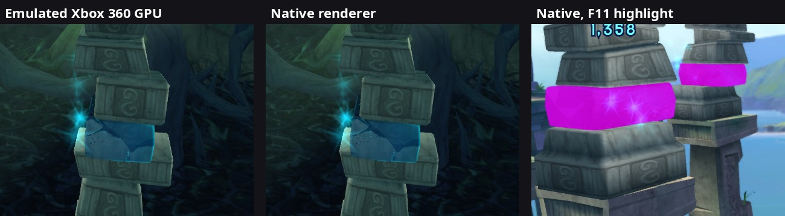
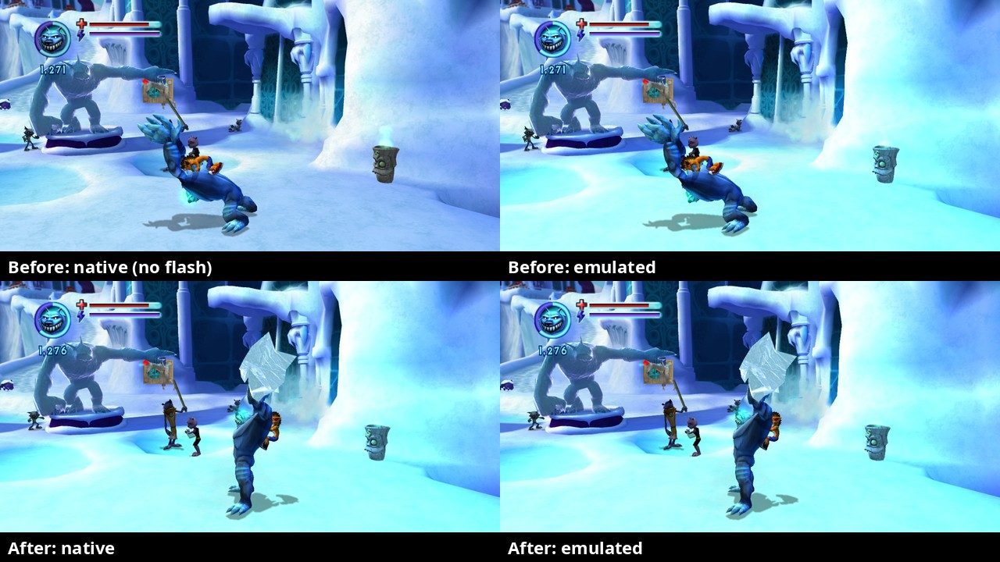

# 20. Cheaper texture checks: watching memory instead of re-hashing it

2026-09-29. Follow-up to findings/19 section 6: our
native renderer took 4-5 ms of the game's main thread per frame, ~3-3.5 ms
of it spent re-hashing every texture the frame used, so busy scenes (the
fight against the Ratnicians) missed the 16.7 ms deadline of 60 fps. Now a texture is only
re-hashed when something actually **wrote to its memory**. The renderer's
cost on Wumpa Island fell from **3.7 to 1.2 ms** per frame.

## 1. Why every texture was hashed every frame

The texture cache (`src/native/texture_cache.*`) turns a game texture in
guest memory into a Vulkan image: it untiles it, swaps its bytes and uploads
it. The game rewrites some textures after loading: palettes, the Bink
movie planes (every frame), memory that holds a new area's textures after
an area change. So the cache has to notice changes. It did that by hashing
each texture's pixels (and mips) the first time a frame used it: correct,
and simple, but on Wumpa Island that's 78 textures, a few MB, **every
frame**, for about one texture that really changes (0.9 uploads per frame).

## 2. The trick: let the memory tell us

The emulated GPU has the same problem and solves it with page protection.
The SDK's guest memory can write-protect pages of **physical** memory
(where all graphics data lives: the `0xA0000000`, `0xC0000000` and
`0xE0000000` windows). A write to such a page, whether by the game's code,
a file read into memory, or a free and re-allocation, faults. The SDK's
fault handler then calls every registered **invalidation callback** with the
page range, lifts the protection, and lets the write finish
(`xmemory.h`: `RegisterPhysicalMemoryInvalidationCallback`,
`EnablePhysicalMemoryAccessCallbacks`). The emulated GPU's `SharedMemory` was
the only listener. Now our `native::WriteWatch` (`src/native/write_watch.*`)
is a second one.

* Per 4 KB page we keep a **write epoch**: a counter value, bumped by our
  callback whenever the page is written.
* After hashing a texture, the cache **arms** a watch on its memory
  (`Arm` returns a ticket = the counter's value, then protects the pages).
* The next frames only ask `Written(range, ticket)`: is any page's epoch
  newer than the ticket? That's a few integer reads instead of a hash of
  the pixels.
* Epochs, not "dirty bits": two cache entries can share a page (the same
  memory seen with two layouts, or neighbouring textures), and one entry's
  check must not erase the news for the other.
* **Ordering** is what makes it safe: ticket first, then protect, then read
  the pixels. A write that lands before the protection is already in the
  pixels we hash; a write after it faults and bumps the epoch past the
  ticket.
* The SDK may unprotect MORE than the written page (one fault for a big
  sequential write instead of one per page), limited to what every listener
  allows. Any page it unprotects stops reporting, so ours allows 64 KB
  blocks and marks the whole block as written (a few innocent neighbours
  just get re-hashed).

## 3. The cases the watch can't see, and the safety nets

* **Textures that change all the time** (movie frames): each write would
  fault. When a watched texture turns out to be written, it gets a
  **cool-down**: hashed every frame for the next 120 checks (~2 s), like
  before, then watched again. During the intro movies the log shows ~3
  uploads per frame (Y, Cr, Cb), and the movie captures animate normally.
* **Read-only pages**: the SDK never protects pages the game keeps
  read-only (a write there must stay a real fault). If the game later made
  them writable and wrote, nobody would hear. `WriteWatch::Watchable` asks
  each page's protection in all three windows first; memory that isn't
  writable everywhere it's allocated is hashed every frame instead.
* **The emulated GPU's own writes** (resolves copied back into memory,
  memexport) use the SDK's raw physical view and bypass the protection.
  Our textures never come from those: resolve destinations are drawn from
  our own images (`render_targets`). The debug mode
  `--debug_native_emulated_resolves` does read them, so it switches the
  watch off.
* **A periodic re-hash**: every watched texture is still hashed once every
  32 frames (spread over frames). If that ever finds a change the watch
  missed, the log says `NativeRenderer: a texture at XXXXXXXX changed unseen
  by the write watch` (first 16 times). None so far.
* `--debug_native_write_watch=false` brings back the old behaviour (hash
  everything every frame): to measure the difference, or to rule the watch
  out if a texture ever looks stale.

## 4. Measured

Same run twice (Wumpa Island by Crash's house, native picture,
`--fps_cap=60`), watch on and off, 300-frame averages from the renderer's
cost line and the new check counts line:

| | watch off (old) | watch on |
|---|---|---|
| our renderer on the main thread | 3.62-3.81 ms | 1.14-1.28 ms |
| of which textures | 2.79-2.94 ms | 0.41-0.45 ms |
| texture checks per frame | 78.0 hashed | 73.7 unchanged, 4.3 hashed |
| real uploads per frame | 0.87-0.90 | 0.87-0.90 |

The upload counts match: the watch doesn't lose updates. The remaining
0.4 ms is the ~4 textures per frame that keep changing (cool-down) plus the
periodic re-hash. Regression A/B (same-frame tool): title 0.15/255, menu
1.41/255, unchanged. The log line to look for in playtests:

```
NativeRenderer: texture checks per frame: 73.7 unchanged (write watch), 4.3 hashed, 0.89 uploaded; 0 missed by the watch
```

## 5. The other slowdown: the graphics card

A 42-minute playtest that day (native picture, MangoHud)
had a different kind of slow stretch. Of 506 five-second windows, 158 were
under 50 fps. Most were loading screens (the game's own 30 fps loading
limiter). But **56** were fights with the main thread idle in
`SwapBuffers` for 10-18 ms, i.e. waiting for the **GPU**. The emulated
Xbox GPU still draws every frame (FSI's EDRAM emulation, findings/07) even
when only our picture is on screen, and together with our renderer that
fills the graphics card in the big fights. The texture fix doesn't touch
that. The fix would be to let the emulated GPU skip its drawing while
nobody looks at its picture. That needs care: the game may read GPU results
back (occlusion queries, sample counts), and photos, A/B captures and dual
mode need the emulated picture. *Later (2026-09-30):* done as
`--native_only` (SDK patch 0009): the emulated GPU skips its drawing while
only our picture is shown, and GPU use in the same area dropped from ~97%
to 15-20%.

*Later (2026-10-03):* dual mode (both pictures side by side) still pays for
both renderers. In a quiet spot of the Ice Prison at 60 fps the GPU was 94%
busy for the emulated picture alone and 97% in dual mode: 60 fps held there,
busier scenes dropped frames. Cheapening the emulation's quality would change
the picture we compare against, so the emulated GPU now draws only **every
second frame** while our renderer draws too (`--emulated_draw_every=2`, the
default; SDK patch 0013, GPU flag `draw_every_nth_frame`). Each frame it draws
is complete and exact; the frames in between are neither drawn nor presented
(the game alternates two frontbuffers, so showing a skipped frame would jump
back in time). The emulated window moves at half the game's frame rate. Same
spot, dual mode: GPU 97% -> 60%, 60.0 fps. A/B photos switch it back to every
frame while they run, so a pair is still one frame from both renderers
(0.53/255, unchanged). The emulated picture on its own still draws every frame.
Ruled out along the way: occlusion queries. The SDK drains the whole GPU for
each one (a cost worth fixing for other games), but this game issued none in
that scene. Switching to the FBO render-target path was slower, and texture
filtering made no measurable difference.

## 6. The bump material, seen at last: the TK blocks

`xnBumpMegaShader` was written for the native renderer on 2026-09-27
(shaders/bumpmega.*, a transliteration of the game's pixel shader), but
only later areas use it, so nobody had seen it drawn. Two tools found it:

* **The spotter** (`src/native/spotter.*`): a handler on the material's
  setup function (vtable slot 14, `0x82436308`) counts its calls per frame
  in every mode. When the material comes on screen, the log gets a
  `*** SPOTTED: the bump material ... ***` warning, and the first time in a
  session an F10 photo is taken automatically. `tools/play.sh` now shows the
  log live in the terminal, coloured by `tools/play_console.awk`, so the
  banner is hard to miss.
* **F11, the highlight**: paints every draw of the material 75% magenta in
  our picture (flag `kBumpMegaHighlight` in its material block, set by the
  recorder while F11 is on). That answers "which object is it?". (The banner means "drawn", not
  "visible": the game draws objects hidden behind others or just past the
  screen's edge too, which is why it sometimes fired with none in view.)

With F11 on, the magenta went onto the **TK blocks** (name TBD): the
crystal blocks set into stone pillars on Wumpa Island's cliff path and in
its jungle, which only the TK mutant can move, with telekinesis. Other ice
objects in those areas use other materials. In the Ratcicle Kingdom the
bump material is all the see-through ice (a statue, crystals, frozen
shapes). Same-frame photo pair of a TK block in the jungle with F11 off:
the block's box differs by **0.43/255** (the whole frame 0.37), only
single-pixel edges; a Ratcicle Kingdom pair, 0.43/255 as well. The
material works natively.



## 7. Debug tools added along the way

* **Live console** (`tools/play.sh`, `tools/play_console.awk`): the log in
  the terminal as it's written, shortened and coloured (errors red,
  warnings yellow, repeating statistics dim, photos green, the spotter's
  banner bold magenta). `--quiet` hides it.
* **F11, highlight** (`src/native/spotter.*`): cycles off -> bump material
  -> particles -> off. Particles become flat see-through magenta patches,
  ignoring texture, fade and softness, so even one drawn invisibly shows.
* **F12, particle experiments**: skips one step of our particle shader (soft
  edge, fog, texture, vertex colour), forces a mip level (base / smallest),
  or, in the last three modes, **erases a group of particles in BOTH
  pictures** (big draws of 300+ corners, additive ones, see-through ones)
  by zeroing their vertex colours in the game's own vertex data right before
  it reaches the GPU. The erase modes are the one way so far to take
  something out of the EMULATED picture on purpose.
* **Draw list per photo** (`photo_<stamp>_draws.txt`, also `ab_<ms>_draws.txt`,
  `ab_capture::WriteDrawList`): every draw of the photo's frame as our
  renderer saw it: material, geometry, blending, depth, alpha test, fade,
  fog, the unlit tint (VS c100), lit materials' ambient and first light
  colour, the screen rectangle of immediate geometry (and how many corners
  are behind the camera), and for particles the soft-edge numbers, the
  texture's six fetch words, its average colour as we decode it and the
  first corners' raw colours. The header names the F11 / F12 modes.

## 8. The Ratcicle titan's cyan flash: a proximity light (solved)

While Crash controls a Ratcicle (a titan) in the Ratcicle Kingdom, the
emulated picture flashes cyan-green for about a second (5 photos in a
row: 0.7 -> 11 -> 0.7/255 mean difference); ours doesn't. What we know, in
the order we learned it (2026-09-29):

* It's a **tint of the 3D scene**, not the HUD: bright snow gains ~16%
  green, dark areas ~3% (emulated / native per brightness band).
* **Not particles.** It first looked like one: a frost cloud of ~230 sprites
  around the camera (540 of 1,392 corners behind it) covers the whole screen
  in F11's particle mode. But erasing every particle group in both pictures
  (F12 modes 8-10) leaves the emulated flash in place.
* Ruled out on the way: near-plane clipping (a temporary SDK counter showed
  the emulated GPU clips game materials normally; only the SDK's internal
  shaders and the Bink decoder run with `PA_CL_CLIP_CNTL` clip disable);
  the texture write watch (flash still missing with
  `--debug_native_write_watch=false`); mipmaps; our texture decode (it
  matches the raw bytes); vertex colour byte order (the game's particle
  vertex shader fetches `FMT_8_8_8_8` with `zyxw`, like every material); a
  stale resolve image at the texture's address.
* **Not the colour-matrix or bloom effects**: `xnColourMatrixShader` (vtable
  `0x820185FC`) and `xnBloomShader` (`0x820164F4`) appear in no traced frame.
* **Current lead: the lighting code's colour tint.** `xnExtUnLitColourTint`
  (a PDDI extension: +8 colour ARGB, +12 enabled; v1 set enabled, v2 set
  colour, v3 get colour, v4 is enabled) is ON for ~100 draws of every
  frame, and the game's light setup (callers `0x823AD76C`, `0x823AE600`,
  next to light colour calls) reads it. Only the unlit simple vertex
  shader reads VS c100 ("tintColour"), which we already apply. (This lead
  was wrong: see below.)

**Solved (2026-09-30).** A dual-mode `--trace` playtest with F10 pairs of calm
frames and two flash peaks (+27/255 green) settled it:

* The draw lists' tint, ambient and first light colour were **identical**
  in calm and flash frames, and so were the draws themselves. The colour
  had to come from something we didn't read.
* Comparing the call counts of three calm and three flash traces (about
  31,000 calls each), exactly one function differed:
  `pddiBaseContext::v39` (set a light), 72 -> 92 calls. Flash frames turn on
  **light slot 4**, from a caller (`0x8237F300`) that calm frames never use.
* The game's shader constant tables (`tools/shader_constants.py`) show where
  such a light goes: the **unlit** simple pixel shaders
  (`simpleshaderunlitfp`, `palsimpleshaderunlitfp`), which draw most of the
  world, have the same **"proximity lights"** section as the lit one
  (c29 = count, c30-c33 positions, c34-c37 colours, c38-c41 brightness /
  radius / intensity) plus **Fx shadows** (c200-c208). Our `simple.frag`
  had neither (it was on the to-do list since findings/11).
* The shader's microcode (dumped by the trace run) does, per light:
  radius clamped to 0.1..20, falloff = how far inside the radius,
  gain += clamp(brightness x 0.2 x falloff^2 x intensity) x colour; then
  colour x gain (clamped), then the Fx shadows (up to **65%** darker here,
  30% in the lit shaders), which darken the fog colour too, then fog.
  The literals it uses: c252 = (7, 2, 0, 0), c253 = (20, 0.2, 3, 1/18),
  c254 = (0, 400, 4, 1), c255 = (6, 0.1, 5, 0.65); the palettized
  variant has the same numbers in other slots.

The fix: the recorder reads these constants for a simple draw only while
one of the counts is above 0 (`ReadSimpleLights`) and gives the draw a
`LitParams` block; the flag `kFlagLights` tells `simple.vert` to output the
world position (the game's VS c12 "matWorld") and `simple.frag` to run
both sections (`ProximityLights` / `ShadowSpheres` in `lighting.glsl`,
shared with the lit shaders). Additive fogged draws now also follow the
microcode (colour x mix(fog colour, 1, f) x f instead of colour x f). The
draw list prints `proximity N [colour, position, params] fxshadows N`.

The flash's light, as the draw list shows it: colour (0.03, 0.59, 0.92),
brightness 115, radius 10,000,000 (clamped to 20), intensity 0.1, on ~146
draws of the frame.

Measured on the playtest's photo pairs: flash frames went from +27/255
green missing to **0.66-0.71/255** mean difference over the whole frame,
the same as calm frames (0.38-0.74). Title (0.15), menu (1.41) and a
Ratcicle Kingdom courtyard (0.65 / 0.78, all counts 0 there) are
unchanged. In dual mode both pictures now flash alike.


