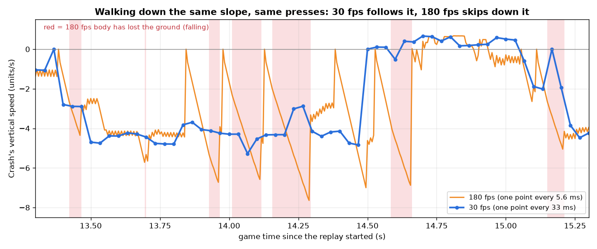

# 22. Crash "falling" for a split second above 30 fps: when the game logic hears about the ground

2026-10-01. Found in playtesting at 60 fps: stepping down a stair-like
descent of ordinary walkable ground (seen first near the entrance of the
Ratcicle Kingdom), Crash switches to his **falling animation** for a split
second at every step, then catches himself. At the original 30 fps the same
spots are fine.

Short version: going down a small step, the physics loses the ground for a
moment and finds it again a few hundredths of a second later, at 30 fps and
at 60 alike. At 30 fps that usually happens within one frame, so the logic
that picks Crash's moves never notices. At 60 fps the same moment spans two
frames, the move logic asks in between, hears "not on ground" and starts the
fall. The fix (`--ground_grace_ms`, 40 by default) hides a lost ground
contact from the game logic for a little longer than one original frame.
The physics itself is untouched.

## 1. How the physics keeps a character on the ground

**Character variables.** A behaviour doesn't keep its state in itself: each
character (`this+88`) has an array of numbered variables (`actor+32`; one
special actor uses the static table `0x82597B30` instead, lookup
`sub_821830E8`). Every moving character has a **`CPhysicsBehaviour`**
(RTTI, vtable `0x82032FC4`). Its setup (`sub_8217CD48`, vtable slot 2)
registers the variables it uses by ID and stores their indices in bytes:
`+39` = variable 10, the **ground contact** (a pointer to the collision
object under the character, 0 = none), `+40` = variable 11, a steep-ground
contact. `IsOnGround` (`sub_82182A88`, reached through the stub
`sub_82182B18`) is "ground contact != 0". It was found through its name,
registered for scripts at `0x82181A4C`.

**One frame** (`CPhysicsBehaviour::Update`, vtable slot 4, `sub_8217D0A0`,
`f1` = the frame's time step):

1. **Integrate** (`sub_821805F8`): gravity (`sub_82182A00`, −60 units/s²
   for Crash, −20 for the other characters seen), air drag only off the
   ground (in fixed 1/60 s steps), then the move = velocity x time step.
2. **Sweep.** The move goes on as a message; the collision code sweeps the
   character's collision ellipsoid through the world and reports what it
   touched through vtable slot 5 (`sub_8217DCF8` → `sub_8217E2A8` →
   `sub_821809C8`), which sets the ground contact through **SetContact**
   `sub_82182400(this, 0 ground / 1 steep, object)`.
3. **Reach check** (`sub_8217D008`). The contact is kept only while the
   *same collision triangle* is still within reach of the ellipsoid
   (`sub_8217D668` → `sub_8224E380`, a fixed distance); otherwise it's
   cleared (`SetContact(0, 0)` from `0x8217D090`).

A jump drops the contact itself (`ForceOffGround`, SetContact from
`0x82182CFC`) before the physics runs.

## 2. Who decides "falling": the fight tree, compiled into the game

Crash's moves and animations are chosen by his **fight tree**. Its source
ships on the disc as Lua (`fighttrees/Crashlua` in `default.rcf`). The file
format turned out to be Radical's own variant of Lua 5.0, read from the
game's loader (`LoadFunction` `0x8241AEA8`):

* header: `ESC "Lua"`, version byte `0x51`, little-endian, `int` / `size_t`
  / instruction / number sizes (number = 4-byte float), then a 4-byte test
  number;
* per function, Lua 5.0's order: source, line defined, 4 bytes (upvalues,
  parameters, vararg flag, stack size), line info as **16-bit** numbers,
  locals, upvalue names, constants (nil / float / string only) followed by
  the nested functions, then the code;
* instructions: Lua 5.0's layout and opcodes up to `RETURN` (27); `CLOSURE`
  is 35 (one opcode more than stock 5.0 before it).

Decoded, the walking/running state reads (source line ~2409):

```lua
if not IsOnGround(physics) and not IsTeleporting(physics) then
  if IsWalkingOffCliff(ledge) and GetSquareOfStickExtent(self) < 0.81 then
    return 522        -- walking slowly off an edge
  end
  return 523          -- fall
end
```

There's no counter and no timer: **one** "not on ground" answer starts the
fall. On the Xbox 360, though, the Lua is never run for this: tracing every
call of `IsOnGround` showed the script binding is never used while Crash
walks. The same tree is **compiled into the executable**. The walking state
is `sub_821A0DB0`, which returns the very same branch numbers (317, 321,
323, 324, ..., 522, 523, 531, 558, −1) and asks `IsOnGround` at
`0x821A121C`. The Lua copy (it also checks Wii remote motions) is for other
platforms.

## 3. Measuring it: a ground trace

`src/ground_physics.cpp` wraps `Update`, `SetContact` and `IsOnGround`
(strong definitions of the generated weak functions, like the audio trace).
With `--debug_ground_trace=<file.csv>` (`tools/play.sh --ground-trace`) it
writes one line per physics update of a moving character, one per contact
change (with the caller), and one per "not on ground" answer given to code
outside the physics (with the caller and how long ago the contact was
lost). Crash is easy to pick out: gravity −60.

**The order within one frame** (60 fps, milliseconds from the moment the
reach check dropped the contact):

| ms | What happens |
|---|---|
| −0.4 | the walking state asks: on the ground |
| +0.0 | physics update: the reach check drops the contact |
| +15.3 | next frame, the walking state asks: **not on the ground → fall** |
| +16.0 | physics update (still no contact) |
| +16.5 | collision sweep: ground again |

So the move logic only hears about a contact that's still lost after the
sweep of the frame that lost it.

## 4. Why a higher frame rate shows it

Going down a step, the contact is lost and found again a moment later, about
as often at 30 fps as at 60 (the same descent was walked at both). At
30 fps a frame lasts 33 ms, so most of those drops are over within the frame
that started them: the next sweep finds the lower step before the move logic
asks again. At 60 fps a frame lasts 17 ms. A drop that 30 fps hid now
spans two frames, the logic asks in between, and the fall starts. At 144 fps
it spans even more frames.

## 5. The fix

For up to **`--ground_grace_ms`** (default 40) after the reach check drops a
character's ground contact, every caller of `IsOnGround` *outside the
physics' own code* (`0x8217B000`-`0x82184000`) still hears "on the ground".
At 60 fps the logic asks about 16, 33 and 50 ms after a loss. Played on
the stair-like descent itself (traces at 60 fps):

| Grace | Losses heard by the move logic | Notes |
|---|---|---|
| 0 (off) | 48 of 63 | every loss of 10 ms or more |
| 30 ms (one original frame) | 5 of 15 | the two-frame drops (33-34 ms) still heard, 2-4 ms after the grace ran out: falls still seen now and then |
| 50 ms | 32 of 95 | nothing under 42 ms heard, but 50 ms sits right on the third check: heard or not by frame jitter |

40 ms, halfway between the second and third check, hides drops of up to two
60 fps frames. A real fall (an edge, a cliff) still starts within three
frames (~50 ms).

What stays exact:

* the physics (gravity, air drag, sliding, the reach check and the sweep),
  which keeps the real answer;
* jumps: their contact is dropped by `ForceOffGround`, which gets no grace;
* `--fps_cap=30`: the grace is off there (the original game, unchanged).

**A first attempt was wrong.** It changed gravity instead: a 1/30 s gravity
step while on the ground, to press characters onto uneven ground as hard as
at 30 fps. That made Crash slide on steep ground (the steep-ground slide
gathers that gravity) and didn't stop the falls, because the drops
themselves were never what differed between 30 and 60 fps. It was removed.

## 6. Results

The same scripted walk around the Ratcicle Kingdom courtyard:

| Run | Ground lost (airtime) | Heard by the move logic |
|---|---|---|
| 30 fps (original) | 3 (1, 1, 34 ms) | 1: the 34 ms one |
| 60 fps, no grace | 2 (17, 84 ms) | 2: both |
| 60 fps, grace 30 ms | 2 (15, 68 ms) | 1: the 68 ms one |
| 144 fps, grace 30 ms | 4 (0, 7, 21, 105 ms) | 1: the 105 ms one |

Short drops are hidden at 60 and 144 fps as at 30; longer ones still reach
the logic, as they did at 30 fps. In play on the descent, 30 ms removed most
falls; with 40 ms (the table in section 5) the falls on the descent are
gone.

## 7. Open questions

* More playtesting of the grace: other areas, other characters' move logic
  (the grace applies to every character), higher frame rates.
* Other logic that depends on the frame rate the same way (anything that
  reacts to a single frame's state).
* The fight tree's Lua copies: a disassembler for this format makes every
  character's move logic readable (`fighttrees/*lua`: Crash, the bosses, the
  enemy types), a start for the roadmap's script work.

## 8. Measured with exact replays: the slope "skip"

With the fixed step and game-frame replays (findings/29 s.6), the same
recorded presses can be run at exactly 30 and exactly 180 frames per second
with the ground grace off. A recorded walk down the stepped slope at the start
of the Ratcicle Kingdom courtyard (about 5 units of descent):

| | 30 fps | 180 fps |
|---|---|---|
| ground contact losses on the slope | none | 7 (44, 6, 39, 106, 139, 78, 61 ms) |
| vertical speed while walking down | steady about -4.3 units/s | sawtooth: snapped to 0.00, then gravity |

Frame by frame at 180 fps, each skip goes the same way: the body lands on the
slope with the slope's speed (about -3.9), a contact snaps the vertical speed
to exactly 0.00, gravity (-60 units/s², -0.33 per 1/180 s frame) needs
about 70 ms to rebuild -4.3, the body drifts off the surface meanwhile, the
reach check drops the contact, and the body falls for about 100 ms until it
meets the slope again. Long enough for the fight tree's fall branch: the
"trip".

**Who writes the 0.00.** The console's `who` on the physics velocity
(+108) over the whole slope: three writers, gravity (`sub_82182A00`), an
add-velocity helper (`sub_821829A8`, from the character's movement code) and
the setter `sub_821829E0`. Only the setter wrote 0, and every zero came from
the collision response `sub_8217F068` (at 0x8217F0CC). That response is a
slide: `sub_822EB850(out, v, n, e)` returns `v` unchanged when it moves away
from the surface (`n·v >= 0`), else `v - (1 + e)(n·v) n`. Exactly 0.00
vertical speed after a slide means a contact normal of exactly (0, 1, 0):
at those moments the body touches something FLAT, on a slope.

**The numbers of the reach check** (`sub_8217D668`): Crash's collision
shape is a `CReactiveCollisionEllipsoid` with half-sizes 0.5 / 0.8 / 0.5
(x / y / z, at shape +32); the contact stays while the body is within
0.8 x 0.25 = 0.2 units of the contact object (constant 0.25 at 0x8201F558;
a second probe for the ground uses 0.5 x 0.3 at 0x8201F9C8).

Open: where the flat contacts on the slope come from (the collision mesh
under the slope, or an edge contact between its triangles); the contact
normal at each response (contact record +68, restitution +84) answers it.

