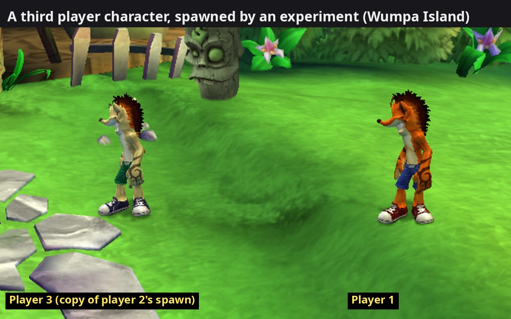
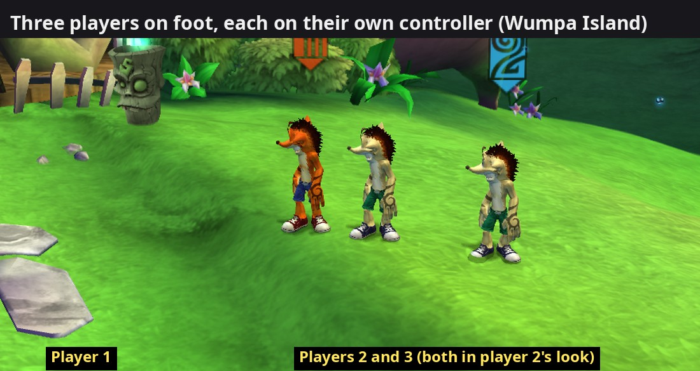
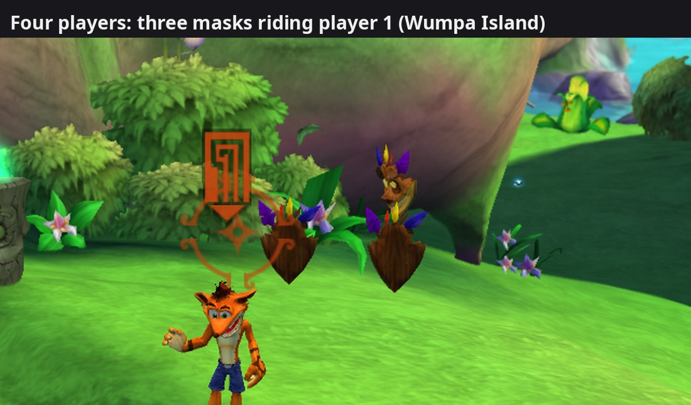
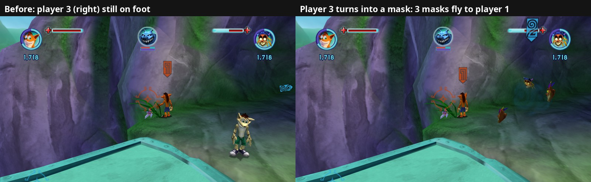

# 26. More than two local players (research + a first experiment)

2026-10-04. The original has drop-in co-op for two players. The aim of this
port is up to four players on one PC ([enhancements](../05-enhancements.md#up-to-four-players)).
This page is the first milestone on the way: how the game handles its two
players, every place that is built for exactly two, and an experiment that
put a **third player character** into a level.



Short version:

* Player 2's Crash is spawned with player 1's when a level loads, and waits
  "not joined". START on a second controller joins it **as the mask**
  (internally the "backpack"), floating next to player 1.
* What each player is doing lives in small global tables with **two
  entries** each (state, starting state, starting sub-state, which
  controller, a 1,028-byte block). They can't simply grow: other variables
  sit right after them.
* The game can hold a third player character: running player 2's spawn
  event a second time, as player 3, puts a third Crash in the level (in
  player 2's look), drawn, standing on the ground, with the game stable.
  He doesn't respond to a controller yet: his lookups read past the end of
  the two-entry tables.
* New test tool: `--debug_fake_pads=N`, up to three more fake controllers
  (players 2-4) driven by script or FIFO commands.

## 1. The original's co-op, as seen in a test run

A test copy of a Wumpa Island save, player 1 on a fake controller, player 2
on a second input device:

* "Join Game (B)" is shown at the top right while player 2 is free.
* Player 2's START joins at once (drop-in); a second START opens a "P2
  Paused" menu (Resume Game, Missions, Tutorials, **Drop Out**, Options,
  Save Game, Quit Game).
* Player 2 joins as the **mask**: the HUD gains player 2's portrait and
  health at the top right, and player 2's stick moves the mask.

The enum names in the executable spell out the states (`ECoOpPlayerState`,
in this order, so numbered 0-4): `NOT_JOINED_GAME`, `MASK`, `IN_GAME`,
`ENTERING_MASK`, `INVALID`. Sub-states (`ECoOpSubState`): `JOINING_GAME`,
`DEAD`, `DISPLAYING_NO_EXIT_ERROR`, `LEAVING_MASK`, `BEING_FORCED_INTO_MASK`,
`DYING`. The mask's "attach" behaviours (`CMaskAttachableBehaviour`,
`CMaskAttacherBehaviour`) and the action `CActionForceEnterBackpack` show
the internal name of the mask: the backpack.

## 2. The per-player tables

| Address | Entries | What | Users |
|---|---|---|---|
| `0x8259B11C` | 2 × u32 | current state (`ECoOpPlayerState`); player 1 = 2 after the level loads, player 2 = 0, then 1 (mask) when it joins | 37 code sites |
| `0x824F3C30` | 2 × u32 | starting state: `[2, 0]`; 0 = "CoOpNotJoinedGame", 3 = "EnterLevelInMask" (names from `sub_82235C30`) | 25 functions (with the next row) |
| `0x824F3C38` | 2 × u32 | starting sub-state: `[9, 9]` | (see above) |
| front end `+8524` | 2 × s32 | **controller of each player**, `(2131 + player) * 4` into the front end manager; -1 = none. Read by `sub_82266130` (36 callers), written by `sub_82266150`; START on a free controller takes the first free entry of the two | |
| `0x825A6280`, `0x825A6A88` | 2 × 1,028 bytes | per-player blocks read while spawning | 5 functions (spawn + front end) |

Facts from the code:

* "How many players" (`GetCurrentNumPlayers`, `sub_82270590`) counts the
  entries of `0x8259B11C` that equal 2, entry 0 and entry 1, written out:
  a player in the mask doesn't count.
* `HaveBothPlayersJoinedGame` (`sub_82265FB8`): in game state 5, both state
  entries non-zero; otherwise both players have a controller.
* What follows `0x8259B11C`: a second
  per-player table, one BYTE per player at `0x8259B124` (digging, the
  turret, co-op), two single bytes (`0x8259B126`; `0x8259B127`, set when
  the game object of section 9 is first created), and two pointers
  (`0x8259B128`, `0x8259B12C`, used by the co-op behaviours' script
  helpers). `0x8259B110/114/118` before it belong to the rope, tube route
  and stream-interest behaviours. So the state table can't grow without
  moving what follows it.

## 3. Who reads the state table

Every `lis`/`addi` style reference to `0x8259B11C` in the code, matched to
the class that owns the function (through the RTTI vtables of
`tools/rtti_vtables.py`, or the nearest caller that is a virtual method,
`tools/callgraph.py`):

| System | Classes (vtable slot) |
|---|---|
| Co-op core | `CCoOpBehaviour` (vtable `0x82037D54`: [4] update `sub_82234FB0`, which writes the state through `sub_82234DC8`; [5], [10], [14], [17]), `CCoOpCountdownBehaviour`, `CMaskAttachableBehaviour`, `CActionForceEnterBackpack` |
| Spawning and level logic | `CActionSpawnPlayer` (section 4), `CActionSpawnLauncher`, `CActionResetPlayer`, `CActionTeleportActor`, `CRequirementNumPlayers`, `CRequirementPlayerInGame`, `CRequirementTriggerVolume`, cinematics (`CMasterCinematicAction`), ambient actors |
| HUD and menus | `CHealthDisplay` (4 sites), `CPlayerIdentifierArrow` (the P1 / P2 arrows), `CMapScreenAction`, `CTutorialScreenAction`, `CFrontendManager` (pause menus, joining) |
| Gameplay | `Crash` (slots 5 and 10), `CCharacterFightTreeBehaviour`, `CFloorEffectAction` (+ projectile / radial), `CProximityVibrationEmitterBehaviour`, `CReticleAimingBehaviour`, `TurretProp`, `CControllerDigBehaviour` |
| Owner not found yet | `sub_8221E510`, `sub_822FF8A8`, `sub_821B9D48`, and co-op helpers `sub_82235160`-`sub_82235CB8` |

The camera is not in the list: it finds the players another way (the level
scripts know a player called `EPlayer_CAMERA_FOCUSING_ON`). The two-player
camera is planned to be reworked rather than patched for four.

How the write was found: a gdb hardware watchpoint on `0x8259B110-0x8259B12F`
(guest address + `0x100000000` on the host), set once the game's main loop
`sub_8227AEE0` runs, logging each write with the game functions on the
stack. Level load: `sub_8229C6F8` (the spawn, section 4) writes player 1's
2. Player 2's START: `sub_82234DC8` writes player 2's 1, called from the
game's script engine.

## 4. Spawning the players

Every level has one `CActionSpawnPlayer` event per player (vtable
`0x8203C2E4`, a `CActionSpawnActor` / `CObjectiveEvent`), executed by slot 2
= `sub_8229C6F8` when the level loads: player 1's first, then player 2's.
So player 2's Crash exists from the start, hidden, "not joined".

| Event offset | What |
|---|---|
| `+0` | vtable |
| `+4` | next event (player 1 -> player 2 -> 0) |
| `+16` | the actor it spawned; the base spawn (`sub_8229AC08`) only creates one while this is 0 |
| `+20`, `+24`, `+28` | position (floats) |
| `+44`, `+48` | 64-bit name hash of the new actor (differs per player) |
| `+88` | player index (0 = player 1, 1 = player 2) |

After the base spawn, `sub_8229C6F8` copies the starting state into the
current state (`0x8259B11C[i] = 0x824F3C30[i]`) and reads the per-player
blocks at `0x825A6280` / `0x825A6A88`. Player 2's different look
(`Crash_Player2.bmp` instead of player 1's texture) is a texture swap made
for the player's index.

## 5. Co-op in the game's scripts

The scripts in `default.rcf` (plain Lua bytecode, findings/19 section 1)
use co-op in about 15 files: `script/classes/crash` (the co-op behaviours
on Crash), `script/util` (`KillPlayer1` / `KillPlayer2`),
`script/mixins/npc_methods` (`GetCurrentNumPlayers`, kills in co-op),
`script/objectives/objectives` (players named `EPlayer_ONE`, `EPlayer_TWO`,
`EPlayer_EITHER`, `EPlayer_CAMERA_FOCUSING_ON`; `DO_ForcePlayerIntoMask`;
"one / two players out of pack" deaths; co-op tutorials and counters), the
levels' `objectives` files, the fight trees of Crash and several titans,
and `createtemplateactor` (the tilting co-op platforms: two-player
puzzles). `SetPlayerCoOpState` / `GetPlayerCoOpState` are never called by
a script: state changes happen in compiled code. Script rules that name
player one and two will need rules for three and four (who gets forced into
the mask, what a two-person platform does with three on it), which the
data patcher (findings/24 section 7) can deliver as changed script files.

## 6. The experiment: a third player character

A temporary hook on `sub_8229C6F8` (switched on by an environment variable,
not part of the port; replaced by section 8's spawn): right after player 2's event ran, it runs a copy of
it with player index 2, `+16` cleared (else the copy "already spawned"
player 2's Crash and does nothing: the first try), the name hash changed by
one bit (an actor name of its own) and the position moved 2 units. For the
call, the starting-state word read for index 2 (one past the table: really
player 1's starting sub-state) says "in game", and both words past the
tables are put back afterwards.

Result (picture at the top): a third Crash appears in player 2's look,
drawn, standing on the ground, idle; the game runs on, and player 2 still
joins as the mask. A controller playing as player 3 doesn't move him,
also with "controller 2" written into a third entry of the front end's
controller table: his state and controller lookups still read whatever
follows the two-entry tables.

## 7. Test tool: more fake controllers

`--debug_fake_pads=N` (1-3, with the debug input FIFO or script; see
`src/debug_input_script.h`) adds fake controllers 2 to N+1, which play as
players 2 to N+1 unless the Players tab says otherwise. A `p<N>.` prefix
sends a command to one of them:

```
--debug_fake_pads=3 --debug_input_fifo=<fifo>
echo "p2.start" > <fifo>          # player 2 joins (as the mask)
echo "p2.lsright 2000" > <fifo>   # ... and moves it
echo "p3.lsup+a 1000" > <fifo>    # player 3: stick up + jump
```

The keyboard driver must be on (it installs the player assignment); with
no keyboard player wanted, `player.keyboard = off` in the controls file.
Checked: fake controller 2's START joins player 2, its stick moves the
mask.

## 8. Four entries: the tables moved (built)

`src/players/more_players.*` gives the co-op tables four entries, always
on (a table can't change address during a run; nothing changes for players
1 and 2):

| Table | How it gets four entries |
|---|---|
| state `0x8259B11C` (37 sites) | grows in place to `0x8259B12B`; the flag bytes, the two single bytes and the pointer `0x8259B128` move to a block of ours (20 references) |
| starting state `0x824F3C30` (5 sites) | moves to our block |
| starting sub-state `0x824F3C38` (24 sites) | grows in place to `0x824F3C47`; `0x824F3C40` has no references, the float at `0x824F3C44` (read and written by `sub_821AD970`, read by `sub_821AE1A0`) moves |
| controllers (front end `+8524`) | getter `sub_82266130` / setter `sub_82266150` / reset `sub_82266178`: players 3-4 kept on our side |
| characters `0x8259B1C0` | getter / setter: players 3-4 play player 2's character |
| per-player lists `0x825A6280`, `0x825A6A88` | 2 hooks in the spawn: players 3-4 read empty lists of ours |
| reset `sub_82234B58` | rewritten for four players |

Tiny getters and setters are rewritten in C++. Every other reference gets a
**midasm hook** (`crash_mom_manifest.toml`), right before the instruction
that uses the old address, that points the register holding it at the new
place: after an `addi` that computed a table's address, the result register;
before a `lwz`/`stb` with a `lis` base, the base register (checked dead
afterwards, or used only for that variable). `GetCurrentNumPlayers` counts
four entries. `--local_players=3|4` adds players 3-4's spawn events to
every level: the game's own creator `sub_82283670` allocates and constructs
player 2's, then ours are built the same way **as player 2** (character,
spawn point, name) and renumbered, with a name hash of their own.

A lesson from the first version: the address scan stopped at a `lis`
base's first use, so it missed the second variable reached through the
same base. The float at `0x824F3C44` looked read-only and was served as a
constant; in a test Crash lay on the ground, respawning, and player 2 could
not join. The scan now follows a base register until it is overwritten;
with the float moved properly, two-player co-op behaves as before (player
2 joins as the mask, player 1 walks). With `--local_players=3` the third
spawn event is created; player 3's START still joins **as player 2**: the
join logic, below.

## 9. The join and the game object

The front end's per-frame input (`sub_82264988`) loops over the four
controllers. For one pressing START (or two other inputs) during play
(game state 5, not paused): nothing if `HaveBothPlayersJoinedGame`, or if
the controller already belongs to player 1 or 2; else the player to join
is player 2 when player 2's state is "not joined" (`r31` at `0x822650E0`),
the controller is given to that player (`sub_82266150`) and join messages
(ids 36, 1, 42) go to that player's actor.

The actor comes from the GAME OBJECT, a singleton at `0x825B0008` returned
by `sub_82270608` (311 call sites), which holds more per-player data:

| Offset | What | Code |
|---|---|---|
| `+16`, `+20` | the players' actors | 27 direct reads; ~29 indexed reads `(p + 4) * 4`, each behind a "player < 2" check |
| `+24`, `+28` | a second per-player list (cleared with the actors) | 10 direct reads; ~14 indexed reads `(p + 6) * 4` |
| `+36`, `+37` | per-player bytes | 4 + 4 reads |
| `+40` | an int, -1 at start | |

The "player < 2" checks made players 3-4 harmless at first: they got "no
actor". Next, in that order (section 10): the actor list with four entries (the `+24`
list moves; the checks let players 3-4 through), the join choosing the
first player not joined, then the mask, the off-screen rules and the camera
for more than two, and the HUD (portraits, health, arrows) with a look for
players 3 and 4.

## 10. Players 3-4 join; the one mask slot

Built on section 9 (all in `src/players/more_players.*`, hooks generated
by a scratch script that checks every site's instruction pattern):

* **The character list**: the 30 indexed readers and the writer
  (`sub_821AD9E0`, found with a gdb watch on the object's `+16..+31` during
  a level load) get two hooks each: the "player < 2" guard lets players 3-4
  through, and the read takes theirs from our block. Most guards let a
  player 3-4 through only once joined: with every guard open, the
  original's "which player is the other one" questions could find a hidden
  player 3. The join's own two lookups and the writer pass always.
* **Which player is this character?** (`sub_8226FD20`, the first step of
  `sub_8226FCD8`, 26 callers): rewritten to search four players. Before
  that, player 3's join never got past "not joined": the co-op behaviour
  asks it for its own number.
* **Wiring a character to a controller** (`sub_822747F8`): for a player
  without a controller the original takes "the one the other player
  doesn't use", a two-player rule. Players 3-4 take their own number's
  controller if free, else the first free one. Without any wiring the
  level never finished loading (tested).
* **The join** picks the first player not joined (hook at `0x822650F8`),
  `HaveBothPlayersJoinedGame` means "every local player", and the
  characters of players 3-4 are released when the next level's players are
  created (the store `sub_820B1D10` is reference-counted).

Result (`--debug_coop_trace` logs every state change, join decision and
controller assignment):

```
Co-op: controller 1 pressed START: joins as player 2
Co-op: player 2 controller = 1
Co-op: states 2 1 0 0
Co-op: controller 2 pressed START: joins as player 3
Co-op: player 3 controller = 2
Co-op: states 2 1 1 0          (player 1 in game, players 2 and 3 masks)
```

**The one mask slot.** With a third player, player 2's mask stays where it
appears and doesn't follow the stick. Bisected: without player 3's spawn it
works; moving player 3's spawn point 20 units away or not wiring player 3
does not matter (without wiring the level doesn't load). Counting every
co-op / mask function call (gdb) for 4 s after player 2's START: with three
players the mask's per-frame movement functions (`0x82237D60`,
`0x82238020`, `0x822380E0`, `0x822382C8`, `0x82238380`, 76 calls each with
two players) never run. The mask's update (`CMaskAttachableBehaviour`,
`sub_82237778`) only does its work while its mask is attached (`+144` bit
`0x80`); with two players player 2's mask is attached from the spawn (to
player 1, hidden), with three only player 3's ever is. So player 1 carries
ONE mask and the player-2-style Crash spawned last takes it: how masks
work with more than two players is the next design question (one mask per
Crash on foot, or players 3-4 joining on foot).

## 11. Three players on foot

A joined player can leave the mask with **B** and play as a Crash on foot
(state 2, "in game"). Test: players 2 and 3 join (START), press B, then
walk in opposite directions:

```
Co-op: states 2 1 1 0
Co-op: states 2 2 1 0          (player 2: B)
Co-op: states 2 2 2 0          (player 3: B)
```



Each Crash answers to its own controller, and the camera zooms out to keep
everyone in view. Players 3-4 have no HUD of their own and no marker over
their head yet, and player 2's mask stayed put while a player 3 existed
(section 10, fixed in section 12).

**Characters.** Each player has a character number (`0x8259B1C0`, getter
`sub_8229F8B8`): 0 = Crash, which with a player number other than 1 gets
player 2's texture (Carbon Crash, the white variant); 9 = Coco, who takes
player 2's place later in the story (an Ice Prison save). The first
version gave players 3-4 player 2's number: two Cocos. Now players 3-4
keep their own (Carbon Crash, 0, until something sets it), and their
spawn event, built as player 2's, asks for their character instead of
player 2's while it is constructed. Outfits are chosen per player in
Crash's house (players 1-2); players 3-4 can't choose yet.

The plan for masks with more players: a player who turns into a mask
rides the **nearest** Crash on foot, and one Crash can carry up to three
masks. That replaces the original's single mask slot on player 1 (built:
section 12).

## 12. Masks for more players: three riders, the nearest host



**How the original carries a mask.** Every Crash has a holder
(`CMaskAttacherBehaviour`, vtable `0x8203801C`, at Crash `+260`) with ONE
rider: the rider's Crash at holder `+52` (a reference-counted pointer; the
mask is that Crash's own mask form). Crash's message handler
(`sub_821ACAD8`) acts on mask messages (`+16` = 4 attach / 5 detach, `+20`
= the host, `+24` = the rider): attach calls the holder's `sub_822392A0`,
which FIRST lets go of whatever rider it has; detach calls `sub_82239418`,
which lets go of the rider without asking which. Every frame the holder's
message handler (`sub_82238F18`, message types 39 and 25) sends its rider
the attach point's matrix (a joint of the host's skeleton times the host's
world matrix), which the mask's own handler (`sub_82237960`, message 56,
subtypes 2/3) copies. At every level start each player-2-style Crash
attaches itself to player 1 (hidden until it joins). Found by logging both
holder functions and both message branches: with three players, player 3's
spawn pushed player 2 off player 1, and player 2's B (leave the mask)
detached player 3.

**Three riders per Crash** (`src/players/more_players.cpp`):

* attach: with a rider already on, the newcomer becomes an EXTRA rider (two
  more at most): the original attaches it with the main slot briefly empty,
  then the main rider goes back (the original's own "let go of the current
  rider" call inside the attach is passed through untouched; a first version
  promoted an extra rider there and scrambled the riders);
* detach: a hook on the detach branch (`0x821AD890`) remembers the leaving
  rider (message `+24`); an extra one leaves through the main slot for the
  call, the main one as before, and then the first extra one moves up;
* every frame: after the main rider got its matrix, each extra rider gets
  the same message; the mask's handler then moves an extra mask 0.45 units
  to one side or the other along the matrix's first row.

**The nearest host** (the design for more players: a player turning into a
mask rides the nearest Crash on foot): "the other player"
(`sub_82235B10`, 5 callers: turning into a mask, leaving it, the co-op
update) answers, with more than two players: a mask that rides someone ->
its host (the holder bookkeeping keeps a rider -> holder map; a first
version answered "nearest" here too and player 3's leave message went to
player 2, who wasn't carrying it); anyone else -> the nearest Crash in
state 2 (on foot) by world position (Crash `+44` points to its world
matrix, translation at `+48`; checked against the spawn positions).

Tested (fake controllers, `--debug_coop_trace`):

```
holder (player 1) attach player 2 as main / player 3 as extra / player 4 as extra
states 2 1 1 1                       (four players, three masks on player 1)
detach player 2: main -> player 3    (player 2's B: only player 2 leaves)
other player of player 2: player 3, the nearest Crash on foot (1.3 away)
holder (player 3) attach player 2 as main
```

**Crash's own player number** comes from its constructor (`sub_821AC378`):
the FIRST player number without a character yet (a loop over the game
object's list behind a "player < 2" guard). That guard must let every
local player through: with the joined-only one, player 4's Crash took
player 3's number, player 4's slot stayed empty and player 4's START sent
the join message to a null character (a fault loop at guest `0x34`, found
with a gdb breakpoint on the SDK's access-violation callback).

## 13. Leaving a level with players 3-4 (a crash, fixed)

With more than two players, a level change, or Quit Game and loading
another save, ended in "Call to invalid or unregistered function at guest
address 0x00000040" (or another small address). Reproduced with Quit Game
from player 1's pause menu (fake controllers: START, up = Quit Game, A,
left = Yes, A).

* When a Crash leaves the level, `sub_821AC768` clears its own slot in the
  game object's character list (`stwx r28(=0),r10,r3` at `0x821AC814`, r10
  = (p + 4) * 4) and releases the character. Found with a gdb watch on the
  list during Quit Game, then a scan for indexed WRITES into the list (the
  earlier scan only looked for reads). For players 3-4 the read before it
  was redirected to our block but the write was not: it zeroed the object's
  `+24` list and released player 3's character while our block still held
  it; the next level's spawn then released the freed character again
  (caught with a gdb breakpoint on the SDK's invalid-function report: the
  call came from our own release in `sub_82283670`). Now a hook sets the
  store's BASE so it clears our slot (a first version set the full slot
  address, the store added the index on top and missed by 24 bytes), and
  the function's two guards let every local player through.
* A holder that is disabled (its Crash leaves the level; the behaviour's
  slot 16, `sub_82239250`) lets go of ALL its riders; a first version moved
  an extra rider up into the main slot of a holder that was going away.

Quit Game + loading a save tested with three and four players: players
3-4's characters are cleared on the way out, created again in the next
level, and their masks attach again; no errors.

## 14. The loading screen's footprints (research)

The loading screen (`GameLoad_Loading.pag`, persistent package) draws
walking footprint trails from one white picture, `FE_Footprint.tga`,
tinted per trail (red for player 1, blue for player 2). Its update
(around `0x8226B2C8`) loops over the players behind a "player < 2" check
and asks each one's controller (`sub_82266130`): one trail per player with
a controller, two at most, with each trail's colour and walking state kept
in the loading screen object. Players 3-4 would need two more trails there
(state, colours) and the loop opened to four.

## 15. Level changes, masks on more Crashes, one model for every player

Tested with four players (fake controllers), each case with a real level
change: in the first level after Crash's house (name TBD), walking left
leads into the next level within a few seconds.

**A level change with player 3 or 4 on foot faulted** (an endless "read of
guest 0x11"). A gdb backtrace at the SDK's access-violation callback ended
in the Lua interpreter, called by the spawn (`sub_8229C6F8`). For a player
who starts a level on foot the spawn asks the game object for that
player's **carried-actor name** (`sub_822705F0`: object `+108 + 64 * p`,
written before a level change by `sub_8229CB78` through `sub_822705D0`); a
non-empty name is spawned by script next to the player (a titan brought
along). The object has two names: for player 3 the address is `+236`,
which holds other fields (`+240`, and `+244` / `+248` = the level and entry
point of the last level change), so the "name" was garbage. Both tiny
functions are rewritten; players 3-4's names live in our block (empty).

**The game object, field by field** (constructor `sub_8226FA18`):

| Offset | Per player | What |
|---|---|---|
| `+16`, `+20` | yes | characters (section 10) |
| `+24`, `+28` | yes | the **titan** each player rides (`CJackingBehaviour`), 0 = on foot |
| `+32` | no | one more actor (set when player 1's Crash spawns) |
| `+36`, `+37` | yes | a byte each (`+38`, `+39` are padding before `+40`) |
| `+40` | no | an int, -1 at start |
| `+108`, `+172` | yes | carried-actor names, 64 bytes each |
| `+236` .. | no | other fields: `+244` / `+248` level and entry of a level change |

The titan list had the same "player < 2" guard + `(p + 6) * 4` read as the
character list, at 13 sites plus three writers; one function
(`sub_822420D8`) had its guard opened by the character-list hooks and then
read player 4's titan from `+36` = the bytes `01010101`. Players 3-4's titans
now live in our block (guards open for every local player, reads and
writes redirected; manifest), and the helpers `sub_8226FC88` (a player's
titan, else character) and `sub_8226FD60` (whose titan is this) cover four
players. Titans are not yet carried into the next level for players 3-4
(the save loop in `sub_8229CB78` handles players 1-2).

**"May I turn into a mask?"** (`sub_82235CB8`): the original says yes only
when nobody is entering a mask and **players 1 and 2 are both on foot**. With
player 2 a mask, players 3-4 could never turn into one. Rewritten for every
local player: nobody entering a mask, I am on foot, my host (the nearest
Crash on foot) is on foot, on screen (the original's check) and carries
fewer than three masks.

**Riders follow their host.**



When a Crash that carries masks turns into a
mask itself, its holder is disabled and lets go of every rider; they froze
in place. They now wait and attach to the same Crash their old host
attaches to:

```
may player 3 turn into a mask (host F9D72150)? yes
holder F9F9E4A0 (owner F9F9B690) detach 00000000          (player 3's holder, disabled)
holder F9CB1F80 (owner F9D72150) attach F9F9B690 as main  (player 3 rides player 1)
rider F9F8E960 follows its host F9F9B690 to holder F9CB1F80   (player 2)
rider F9FA72A0 follows its host F9F9B690 to holder F9CB1F80   (player 4)
states 2 1 1 1
```

**A mask's host by player number.** At every level start each
player-2-style Crash attaches to player 1. Who rides whom is now kept by
player number (set at each attach of a joined player, cleared when the
player leaves the mask) and survives a level change: a mask goes back to the
same player if that player is on foot. A detach message to a Crash that
doesn't carry the leaving rider is ignored (before, the original let go of
that Crash's own rider: player 2's mask fell off player 1 when player 4,
riding nobody, pressed B).

Left as it is: `sub_82235D70` (how many players have a character, used by
two script helpers) counts players 1-2. Counting four stopped the hidden
masks' setup at the level start in a test.

**The aiming reticle** (research). `CReticleAimingBehaviour` registers its
reticle in a global table `0x8259AFAC`: one entry per player for players
1-2 and one shared entry for anyone else; the per-frame pass draws the
shared entry with player 1's number. The reticle's own code reads no
controller: what moves it comes from the mask's input. Players 3-4 not
moving it is not reproduced yet.

## 16. An audit: every "for each player" loop

To stop finding two-player code one bug at a time, every "compare with 2 +
branch" in a function that touches players (calls the game object getter,
a player-number function or a controller lookup, or references one of the
per-player tables) was listed: 67 functions, 107 sites (scratch scripts
`audit.py`, `loops.py`). Most are already hooked or unrelated (message
types, sub-states). One new class stood out: **20 loops over the players**
that walk the game object's characters and titans with a counter
(`rO = 16 + 4p` or `24 + 4p`), a "player < 2" guard inside, and
`cmpwi rO,24|32 ; blt top` at the end.

17 of them now run for every local player: the guards open, each list
read gives players 3-4 the entry in our block, and a hook on the end
compare goes back to the top while players remain. They belong to:
cutscenes (`CMasterCinematicAction`, `CAmbientActorAction`,
`CMovieScreenAction`: a message to every player and titan),
`CRequirementTriggerVolume` ("any / every player inside" a trigger
volume), `CRequirementJack`, rumble (`CProximityVibrationEmitterBehaviour`),
`CUpgradeableBehaviour`, `CCinematicKillActorAction`,
`CActionKillJackedActor`, `CActionSetMIPUnStoreActive`,
`CActionSpawnLauncher` (the nearest player), `CActionUnlockMove` (3 loops),
the front end, the aiming reticle's ray (players it ignores) and one
function whose owner is TBD (`sub_822F3978`).

Three stay two-player for now: the reticle registry (`sub_82161B40`,
writes a three-entry table), the save before a level change
(`sub_8229CB78`, writes the per-player 1,028-byte lists: players 3-4
don't bring a titan into the next level yet) and the character count
(`sub_82235D70`, section 15).

Tested: four players, three level changes, masks moving between hosts:
no errors; two-player co-op behaves as in the original.
