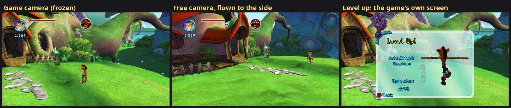
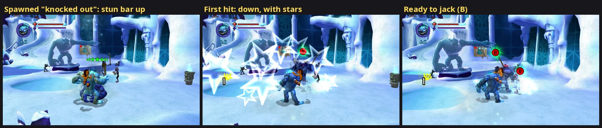

# 27. A cheat menu for testing (F5)

Testing the port means reaching specific situations again and again: a titan
at its last upgrade, a fight survived long enough to watch an effect, a glitch
slowed down, an area seen from an angle the fixed camera never shows. **F5**
opens a Cheats menu for that. Every cheat drives the game's own systems
(its upgrade routine, its level scripts, its time scale, its pause bits)
rather than imitating them, so what happens on screen is what the game
would do.

*Left: the game's camera, frozen. Middle: the same frozen moment from the
free camera, flown to the side of Crash's house. Right: "Level up" on Crash:
the game's own upgrade screen, started by its level script.*

## The menu

| Section | What it does |
|---|---|
| Character (player 1-4) | Shows what the player is (on foot, in a titan with its name, or a mask riding another player), the level, the mojo collected toward the next upgrade and its price, health. Buttons: **Level up**, **Max level**, **+100 / +1,000 / +10,000 mojo**, **Refill health**, **Kill**, **Free jack** |
| Spawn | A titan or an enemy from a list (or any template by name, experimental), 1-5 of them, beyond the chosen player as the camera sees it, loaded first if the level doesn't have it; titans optionally **knocked out** (one hit puts them down, ready to jack) |
| Everyone | **God mode**: no player's Crash or titan loses health; **No AI**: enemies stop thinking |
| Time | **Game speed** 0.1x to 4x, **Freeze**, **Step one frame** |
| Camera | **Free camera**: fly the view with W A S D, E / Q (up / down), Shift (fast), Ctrl (slow), right mouse button held or arrow keys to look; "Keys move the camera" off leaves the view in place and gives the keys back to the game |
| Screen | **Hide the HUD** |

The game keeps running and keeps the keyboard while the menu is open, so a
cheat can be watched as it happens (only the mouse over the window stays out
of the game). The window repaints with the game's frames rather than
continuously: asking ImGui for continuous repaints redrew it about 1,200 times
a second; following the game's picture it draws about 60 times a second and
the numbers stay live. Right Shift + F5 is left to MangoHud (its logging key,
`tools/mangohud/`).

Code: `src/cheats/cheats.*` (game side), `src/cheats/free_camera.*`,
`src/cheats/cheat_menu.*` (the window).

## 1. Where the numbers live: the stats manager

The game manager ("CUberManager", the object behind the scripts' `GetGameState`,
`HideHud` and friends) is `*(0x8259B190)`. Its `+96` is the stats manager
(`CStatsManager`), which holds every counter the game saves:

* ints at `+420 + 4 * id`, floats at `+16 + 4 * id`, bools at `+1152 + id`;
* the ids are the order of the `EStatInt_*` / `EStatFloat_*` / `EStatBool_*`
  names registered for the scripts (183 / 101 / 135 entries);
* setters: `sub_822E0FF0(stats, id, value)` (int), `sub_822E0F98` (add),
  `sub_822E0FD0` (bool), all one or two instructions.

Found from the fight-tree action `DO_StatSetInt` (`CActionStatSetInt`, vtable
`0x820404B0`, slot 2 `sub_8229D948`), which reads `*(0x8259B190) + 96` and
calls the int setter.

| id | name | meaning |
|---|---|---|
| 3 | `EStatInt_MojoCount` | every mojo ever collected |
| 4 | `EStatInt_MojoCountCrashUpgrade` | mojo toward Crash's upgrades |
| 10-19, 125-133 | `EStatInt_MojoCount<titan>Upgrade` | each titan kind's mojo |
| 102 | `EStatInt_CrashUpgradeLevel` | Crash's level |
| 103-118, 134-139 | `EStatInt_<titan>UpgradeLevel` | each titan kind's level |

A mojo pickup (`sub_821ACAD8`, the collector) adds its value (times the combo
multiplier) to stat 4 when the collecting Crash is on foot, otherwise asks the
jacked titan which stat is its own (a message whose answer is a stat id) and
adds there; then it adds the same to stat 3.

## 2. Leveling up

**Crash and the titans level up in two different ways.**

### Titans: an upgrade behaviour

Every titan has a `CUpgradeableBehaviour` (vtable `0x82032344`, constructor
`sub_82177888`), found at actor `+0x180` (checked by its vtable before use).
Its fields, from the property setters registered for the scripts
(`upgrade_1_mojo_number` ... `upgrade_5_value_number`, `sub_82178160` /
`sub_82178178` / `sub_82178188`) and the constructor:

| offset | field |
|---|---|
| +44 | the stat id of this titan's mojo |
| +48 | the stat id of its level (105, a boss, never upgrades) |
| +52 | the stat id of its "fully upgraded" bool |
| +56 + 16 n | step n (0-4): mojo price, type (0 power, 1 special attack), value, done byte (+12) |
| +140 | the step it is on |
| +144 / +148 | that step's price / the previous one |

The game's routine `sub_82177D38(this, actor, -, show)` buys steps while the
titan's mojo stat covers the next price: a power step sends message 13 with
the value to the actor, a special-attack step sets `+152`; it marks the step
done, writes the level stat, and with `show` = 1 queues the "Level Up!"
presentation (`sub_82178088`). A pickup reaches it through message 8 of the
behaviour's message handler (slot 5, `sub_82177AA8`). The behaviour gets no
per-frame update (its slot 4 never ran in a probe), so the cheat calls the
routine itself: **Level up** tops the mojo stat up to the next price (stat 3
gets the same difference) and calls it with `show` = 1; **Max level** repeats
that with `show` = 0 until every step is done.

Tested on a Ratcicle (Ratcicle Kingdom courtyard): level 1 -> 2 with the
game's "Strength Upgrade, Upgrades: 2/5" screen, then Max level bought the
three steps left (level 5 of 5, "fully upgraded").

### Crash: the level scripts

Crash has no upgrade behaviour (no pointer with that vtable anywhere in his
actor). His upgrades are given by the **level scripts**, which wait on the
objective requirement `WAIT_CrashMojoUpgradeValue`
(`CRequirementCrashMojoUpgradeValue`, vtable `0x82040C74`, check
`sub_822A1458`): stat 4 >= the requirement's threshold. The check also copies
the threshold it waits for to the global `0x8259B1CC` (the previous one to
`0x8259B1D0`). So **Level up** on Crash only raises stat 4 to `0x8259B1CC`;
the script then runs the upgrade itself (screen and all), exactly as after a
pickup. **Max level** keeps doing that every frame while new thresholds
appear (the next one is posted once the player closed the last "Level Up!"
screen) and stops 10 s after the last upgrade.

Tested on a Wumpa Island save: level 11 -> 12 ("Spin Attack Upgrade,
Upgrades: 12/32"), the next threshold moved 12,500 -> 16,500; Max level with B
pressed every 3 s: 14 upgrades in a row, level 25 ("Upgrades: 25/32").
If the script waits for nothing (the threshold is already met), the button
does nothing: later upgrades come with later parts of the story.

### Mojo

**+100 / +1,000 / +10,000 mojo** does what a pickup does: the amount goes to
stat 3 and to the body's own mojo stat (Crash's stat 4, or the titan's), and
for a titan the upgrade routine runs like after a pickup.

## 3. God mode

Every character's `CDamageableBehaviour` (vtable `0x8202D2E4`, no subclasses)
points at its hitpoints (`+64`) and maximum (`+68`) (floats elsewhere, found
through the `current_hitpoints_max_number` property setter `sub_821329A8`,
which writes through both pointers). All changes go through
`sub_821349E0(this, f1 = change)` (current += change, clamped to 0..max, the
fraction at `*(+72)`); `SetCurrentHitpoints` (`sub_82132808`) calls it too.
Its per-frame update (slot 4, `sub_82132F88(this, actor, dt)`) is where the
cheat learns which damageable belongs to which actor (Crash keeps the pointer
at `+0x12C`, titans elsewhere). A player's body = `more_players::
CharacterOfPlayer(p)` or `TitanOfPlayer(p)` (the game object's `+16` / `+24`
lists, ours for players 3-4). With god mode on, losses on players' damageables
are dropped and their updates refill them. Deaths that don't go through
hitpoints (pits, if they kill directly) aren't covered: not tested yet.

**Kill** sets the body's hitpoints to 0 through the same function (its
original, so god mode doesn't block it, and god mode's refill leaves that
damageable alone for 3 s); the game does the rest as for any death. On foot
Crash plays his death, the screen fades and he is back at the checkpoint with
full health; in a titan the titan dies the game's way (it collapses, Crash is
thrown out, mojo drops) and Crash goes on on foot. Tested both, with god mode
on, in Ratcicle Kingdom.

Tested with a test command that deals damage through the same function
(`cheat hurt`): a Ratcicle at 66 / 70 went to 16 / 70 without god mode;
with it, the hit was dropped and the health refilled to 70.

### No AI

Enemies and enemy titans are run by the AI manager (`CAIManager`, vtable
`0x82021948`). Its per-frame update (slot 10, `sub_820B8688`, f1 = frame
time) returns at once while the game is frozen (uber `+168` bits `0x20` /
`0x10`), else runs the AI's timers (`sub_820B8700`), its characters'
decisions (`sub_820B8790`, `sub_820B8830`) and their tasks (`sub_820B9860`;
the task classes `CAITaskApproachTargetActor`, `CAITaskAttack`,
`CAITaskBlock`, `CAITaskDodge`, ...). **No AI** skips that update: every AI
character keeps standing where its last decision left it, still animated,
still hittable. Players are not AI-driven, so they keep moving.

Tested on Wumpa Island with an enemy Ratcicle spawned next to Crash, who
stood still: AI on, Crash's health 90 -> 80 -> 57 -> 16 in 16 s; No AI, 90
the whole time and the titan idle in place; No AI switched off again, the
titan attacked (90 -> 60). Not a progress cheat: achievements stay on.

## 4. Time: speed, freeze, one step

* **Speed.** `CTimeManager::GetScale` (`sub_822FFA40`, manager at
  `*(0x8259B190) + 104`) is the game's own slow-motion factor: the frame
  function (`sub_8227C5D8`) multiplies its step by it at `0x8227C6A4`, five
  other places read it too. The cheat multiplies its result, so everything
  that follows the game's slow motion follows ours.
* **Freeze / step.** The game manager's byte `+168` holds pause bits. The
  scripts' `PauseGameForScreenshots` (`sub_8227D488`) toggles **0x04** and
  `SingleStepFrame` (`sub_8227D4A0`) sets **0x02** (the developers' tools,
  still registered in the release build). The frame function, with 0x04 set,
  steps 1e-7 s per frame (`0x8204731C`) instead of the real time; with 0x02 too
  it steps 1/60 s once and clears 0x02. The picture keeps rendering and the
  camera manager keeps running (`sub_8223A280` uses a fixed 1/60 s while 0x04
  is set). Bits 0x10 / 0x20 are the game's own pause states (pause menu,
  sound). At the original 30 fps cap the 1e-7 s steps never reach the frame
  function's 1/60 s minimum, so no frame would run; the frame-step hook
  (`CrashMomFrameStep`, findings/07) lets every pass through while frozen.

## 5. The free camera

The game draws through **one** Pure3D camera, a `VectorCamera` (vtable
`0x8200BE84`): a probe of the matrix rebuilds found a single camera object in
the hub. Its layout:

| offset | field |
|---|---|
| +80 | world-to-camera matrix (4x4 floats) |
| +144 | camera-to-world matrix; +192 = its position row |
| +208 | byte: the matrices are current |
| +216 / +228 / +240 | position / direction / up (3 floats each) |

The matrices are rebuilt **lazily**: `sub_82373D18` (VectorCamera slot 26)
builds camera-to-world from direction and up (`sub_82423A60`), copies the
position, inverts it into world-to-camera and sets `+208`. Every getter of the
base `Camera` class checks `+208` first and calls the rebuild when it is 0:
slots 13 (world-to-camera, `sub_823817D8`), 14 (camera-to-world,
`sub_82381820`), 17 and 18 (transforms, `sub_82381940` / `sub_823819B8`), 20
(position, `sub_82381AD0`), 22 (set up the view for drawing, `sub_82381B38`),
23 (`sub_82381D18`).

The free camera wraps the rebuild: its own position, direction and up go in
just before the original runs. While it is on, the getters clear `+208`
first, so every user of the camera (drawing, culling, sound, the water's
reflection) sees the latest free view even in frames where the game didn't
move its camera. It starts from the game camera's view (yaw = atan2(dx, dz),
pitch = asin(dy); y is up, yaw grows toward +x = right on screen) and moves
in real time, so it flies the same at any frame rate or game speed, and while
the game is frozen. The keys come from the keyboard driver's raw key state
(`KeyboardMouseDriver::InputHeld`), the mouse from a listener on the main
window; while it flies, the keyboard and mouse don't reach the game.

Tested frozen in the Ratcicle Kingdom courtyard: D moved the view right, the
right arrow turned it right, W forward, E up; off = back to the game's camera
at once.

## 6. The HUD

The developers' `HideHud` script command (`sub_8227D4B0`) flips bytes `+171`
and `+96` of the object `0x825A7374`, but nothing in the release build reads
them (a scan found no other access next to the call that returns the object);
trying it changed nothing. The cheat skips the HUD controller's draw instead
(`sub_8226A998`, already wrapped for the players 3-4 HUD, findings/26 s.18):
portraits, health and special bars disappear; the mojo count text, which lives
on the HUD's menu page, stays.

## 7. Achievements

**Max level** on a titan made the game unlock its "fully upgraded"
achievement. The game's achievement writer `sub_82292938` takes the next
queued unlock (28 bytes; the queue ends at the manager's `+168`), copies it to
`+180` and starts `XUserWriteAchievements` (`0x82300670`); the manager polls
the write (`sub_82291BB8`, overlapped at `+136`). After any **progress cheat**
(level up, max level, mojo, refill, god mode) the hook only takes the unlock
off the queue, until the game restarts: nothing is written. The game's own
in-game pop-up still shows (it comes from its stats). Freeze, speed, the
camera and the HUD don't count as progress cheats. The menu says when
achievements are off.

## 8. Players and masks

Each player's co-op state (`0x8259B11C`, four entries since findings/26): 0 =
not joined (the menu greys the player out), 1 / 3 = a mask riding another
player (no body of its own: level and mojo cheats act on Crash's upgrades,
which every player shares; no health), 2 = in the game on foot or in a titan.

## 9. Spawning (titans, knocked out or not)

*A second Ratcicle spawned "knocked out" next to the player's (Ratcicle
Kingdom courtyard): its stun bar shows; the first hit puts it down with the
game's stars; then the jack prompt (B) waits over it.*

**Templates.** Everything in a level is made from a template named
`<Group>:<Name>`: `Characters:Ratcicle`, `Collectables:c_mojoXL`,
`Villagers:RatcicleKid`, `Generators:Generator1`... (a probe of every creation
during a level load, and the names in `default.rcf`: 41 `Characters:`, among
them the titans Ratcicle, Spike, Roller, Battler, TK, Shurtle, Scorporilla,
Phantom, Stinky, Parafox, Sludge, Yuktopus and six "Hero" variants; the
enemies Znu, Slappy, Bratgirl, Monkey, Chiratta; bosses).

**Creating one.** `sub_82168620(template, actor name, 0, position, 0, heap 8)`
builds an identity matrix at the position and calls `sub_821686C0`. That takes
a free actor from the level's **pools** of ready-made ones (`sub_820B3998`:
pool pointers at `0x82597C70`, count at `0x825AAD54`; a pool = `+4` template
name, `+8` count, `+12` entries of 8 bytes, `+4` "in use"), or else calls the
scripts' `GenerateObject` (Lua, through `sub_82169180`). It is what brings a
jacked titan into the next level (the player spawn `sub_8229C6F8`, at
`0x8229CA40`).

**The name matters.** The actor name is an object holding a 32-bit string
hash (`sub_82357020(string, 0)`). The creation uses it to pick the
**inventory section** (the loaded assets, keyed by name hash; manager
`*(0x8259B264)`) whose assets the new actor gets: the game names actors after
their template (every large mojo has the same name hash), so the section of
`Characters:Roller` is found by naming the actor "Characters:Roller". A first
version named them "CheatSpawn1".., the new actor's physics looked for its
collision shape (`EllipsoidShape`, `sub_8217F808`) in the default section,
found nothing and read through a null pointer (`sub_822531E8`; caught with
`tools/gdb/catch_fault`).

**Loading what the level doesn't have.** The new actor needs its template's
section loaded. Before creating, the cheat asks what `sub_821686C0` itself
asks: does that section exist (`sub_822E3FC8`) and is it ready
(`sub_822E4D88` -> `sub_822E25A0`: state bits `+38 & 0xF00` = `0x300`), or does
a pool have a free actor of that template. A section exists for **every
group** in `levels/GlobalPackages.p3d` (records 0xD8532102; their names are in
the `NoHash` copy of the file: one group per template, named like it,
`Characters:Znu` = `package/Characters_Znu.p3d` plus its model and
animations), loaded or not: on Wumpa Island the Ratcicle's section exists
but isn't ready (spawning it anyway faulted as above). Sections are reference
counted: `sub_822E44B8(manager, &key)` finds one and calls `sub_822E24D0`
(count +1; an unloaded section is asked to load, `sub_822E20E0(section, 1)`),
`sub_822E4650` gives the reference back (`sub_822E2510`: at 0 it unloads,
`sub_822E20E0(section, 0)`). The level loader does just that for a titan
brought along (`sub_822E5E00`, `0x822E5EEC`), and the creation takes a
reference of its own for each actor. So the cheat takes a reference, waits
until the section is ready (Ratcicle 0.7 s, Znu 0.3 s, Spike 0.6 s on Wumpa
Island), spawns, and gives its reference back; after 20 s, or when the level
is left, it gives up and gives the reference back. Tested: Ratcicle, two Znus
and a knocked-out Spike on Wumpa Island (none of them in that level), then a
real level change and another spawn in the next level: no errors.
**Villagers crash** even with a ready section (a null read in their fight
tree's set-up, `sub_820C1578`): the level's own spawn events give them
something this route doesn't, so they are refused. Pickups are not offered
(in tests their pools were all in use).

**Boss titans.** Crunch and Cortex are in the Titans list as their boss
templates, `Characters:CrunchBoss` and `Characters:CortexBoss` (their own
groups in `GlobalPackages`; `Characters:Cortex` is his on-foot form). Outside
their boss levels, both crashed the game in their `CSoundDialogueBehaviour`
(vtable `0x820370A4`, the voice lines), whose sounds live in the boss level:
the set-up (`sub_8222CBB8`) links to up to four objects by name without
checking that the lookup found them (`sub_822D9D20` with null, then
`sub_822D9F48` read null + 0xC), and the update read a null sound object
at +136 (`sub_8222CFC8`, null + 8) as soon as the boss was jacked. Both now
skip what isn't there (`spawn.cpp`); the original could only crash at
those two points. Outside their arena the bosses are silent. Tested on
Wumpa Island: both spawn and fight (Cortex flies and shoots); jacking them:
below ("Ready to jack from the start").

**Placement.** Beyond the player as the camera sees it (the game camera's
direction, level, from the free camera's record of it), 10 units for a
knocked-out titan, 6 for other characters, side by side 5 units apart. The
body's own facing put a spawn behind the camera when a jacked titan faced it.

**Knocked out.** A titan's `CJackingBehaviour` (vtable `0x8202EF0C`, found
among the actor's or its AI controller's members, actor `+0x1C`) keeps a stun
meter: a float at `*(+40)`, the maximum at `*(+44)`, the state at `+1104` (2 =
stunned: the scripts' `IsStunned`, `sub_8214DD08`). `sub_8214EBF8(this, f1 =
change)` changes the meter; at 0 the state becomes 2. The damage code hands a
hit's power to it through the actor message "stun" (`CActionStun`, kind 37:
built by `sub_820B7C20`, sent with `sub_820B0B70`, handled at `0x8214D094`;
sent by the damageable at `0x821334B4`). Tries, in order:

| Try | Result |
|---|---|
| empty the meter at the spawn | state 2, but the titan's arrival filled the meter again and it fought |
| the stun message every 10 frames | state 2 the whole time, the titan fought on; and a stun message to a titan already at state 2 **fills the meter** (`0x8214EC58`): it kept it healthy |
| the stun message after the arrival (1.5 s), plus the "hit reaction" message (kind 28, `sub_820B7440`) | the titan flashed as if hit, fought on |
| plus "unaware" (the scripts' `DO_AI_SetAwarenessState`: message by `sub_820B43C0`, state at `+24`, 1 = unaware) | rolled at Crash once, then wandered off |
| **after the arrival, hold the meter at 0.5** | the stun bar shows over the titan; **the first hit knocks it down** with stars and the jack prompt (B) |

The titan's AI only goes down from a real hit (it decides from the hit's
result, not from the state), so "knocked out" means **one hit away from
down**. The cheat follows the titan until it is down (then the game takes
over: like any beaten titan it gets up after a while), for 60 s at most, and
lets go at once if a player jacked it (a jacked titan's meter is its health)
or the actor is gone.

**Ready to jack from the start (what the cheat does now).** The levels
spawn titans that are already down, ready to jack, for example the
Phantoms that come back in L7's first room (`L7_R1_PhantomRespawn1A`):
their objective `DO_SpawnEnemy` (`CActionSpawnEnemy`, vtable `0x82040300`,
spawn `sub_8229BF40`) names a fight-tree state, **`StartJackable`**. Before
creating the actor it hands that name to `sub_8213E6D0`, which only copies it
into the global `0x825A4FB8` ("the next fight tree starts in this state"),
and puts an empty name back after the creation (the player spawn
`sub_8229C6F8` does the same). The fight tree built in between starts in
that state instead of its root. The knocked-out spawn now does exactly this
(name object from `sub_8236ACB8`), and the meter route above stays only for a
template without such a state. `StartJackable` exists in the four titan
trees, `Strong`, `Bear`, `Captain` and `Projectile`. Tested on Wumpa Island:
Ratcicle, Yuktopus, Stinky, Roller and Scorporilla spawn calm with the jack
prompt over them (their jacking state reads 1), and Crash jacks them with B.

The boss trees have no `StartJackable`, but both have a `Stunned` state,
used as theirs: Crunch and Cortex spawn with the jack prompt too and are
jacked with B (Crunch 125 health, Cortex 250). That matters because they
can't be beaten into it: Crunch takes no damage at all (in the story he
ends up ready to jack without a meter), and Cortex's damage and stun follow
his boss fight's stages (`CBossFightBehaviour`, vtable `0x8202BDFC`, stage
at `+92`: -1, advanced 0 -> 1 -> 2 by `0x821296B8`; level scripts ask it
through `CActionBossFight`, kind 58). In one test, B presses kept going after
the jack made Crash leave Crunch again.

**Free jack.** The game's own power-up (the `Collectables:c_freeJack` pickup):
jack a titan without beating it. Crash's message handler (`sub_821ACAD8`,
slot 5 of the `Crash` controller class, vtable `0x82035294`, at the actor's
`+0x1C`) calls `sub_821AE998(controller, actor)` on the pickup: it starts the
`HLFreeJack` effect (the green glow) and sets the timer at controller `+304` to
about 2 x 10^31 s, i.e. until a jack uses it (`sub_821AEA70` ends it). The
scripts ask `IsFreeJackActive` (`sub_8219E110`: timer > 0). The cheat calls the
same function. Tested: the glow appears; jacking with it not yet tried by
hand.

Spawning and free jack count as progress cheats (achievements off).

## 10. Test commands (debug FIFO)

For runs without clicking, `--debug_input_fifo` takes `cheat <command>`:
`god on|off`, `freeze on|off`, `step`, `speed <x>`, `hud on|off`,
`noai on|off`, `levelup <player>`, `maxlevel <player>`, `mojo <player> <amount>`,
`refill <player>`, `kill <player>`, `freejack <player>`, `hurt <player> <amount>` (damage
through the game's own path), `combo <player> [hits]` (hits on a combo meter,
findings/26 s.25), `spawn <template> [player] [count] [ko]`, `freecam on|off`, `freecam_keys on|off`, `freecam_reset`, `info` (the
menu's numbers in the log), `menu` (opens / closes the window). The free
camera flies with `key W 1000` and the like, but note that debug key taps also
reach the game (they bypass the keyboard pause by design).
