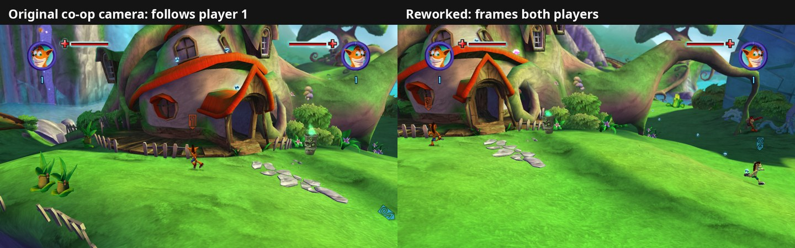

# 28. The co-op camera: framing every player

Status: experimental, **needs extensive testing** (on by default;
`--coop_camera=false` = the original). The group focus for three or four
players (section 2, item 4) is the newest part and has only been tested
with fake controllers.

With two players, the original camera follows one of them and only backs off
a little when the other walks away; the other player easily ends up off
screen. With players 3 and 4 ([findings/26](26-more-local-players.md)) it
didn't count them at all. The port's co-op camera keeps the game's own camera
(each area's angle, its smoothing, its collision) and changes two of its
inputs: **where it looks** (the centre of all players in game) and **how far
back it sits** (far enough for everyone to be in the picture).

*Same save, same scripted walk (Wumpa Island, two players running apart).
Left: the original camera stays on player 1; player 2 is already off screen.
Right: the reworked camera centres between them and backs off until both
fit.*

Code: `src/players/coop_camera.*`, one mid-function hook in the manifest
(`CoopCameraDistance`). `--coop_camera=false` gives back the original camera;
`--coop_camera_max_distance` (default 45) caps how far it backs off;
`--coop_camera_group_focus` (default 2, 0 = everyone counts the same) sets
how much a group of players outweighs a player on their own;
`--debug_coop_camera_trace` logs the camera, the players and the volume's
numbers every 10th frame.

## 1. How the game's camera works

Gameplay views come from a **camera volume** behaviour (`CCameraVolumeBehaviour`,
vtable `0x8202998C`), run by a `CCameraBehaviourController` (modes VOLUME,
SCRIPTCAMERA, MAYA, NIS, STATIC: cutscenes and scripted shots are the other
modes).

* **Volumes.** Each level's `cameradata.p3d` places camera volumes (424-byte
  records in the camera manager, `*(*(0x8259B190)+44)+8`); each gives an angle,
  a field of view (+396) and a **zoom range** (+388 min, +392 max).
  `levels/<L>/cameraoverrides.lua` (plain Lua bytecode in `default.rcf`) sets
  them per volume with the manager's script methods `MinZoomValue`,
  `MaxZoomValue`, `SetCameraVolumeFOV`, `DisableLeadCamera`,
  `AddTransitionOverride` (registered at `0x8223AA9C`). Wumpa Island near
  Crash's house: 12 / 20.
* **Interests.** What the camera should show are *interests*:
  `CCameraInterestBehaviour` (vtable `0x82029864`) on an actor, with a priority
  (PRIMARY / SECONDARY), a weight and a size (CRASH, STRONG, BEAR, CAPTAIN,
  BOSS, PROJECTILE). Fields: +28 the actor, +32 a fixed position used instead
  of the actor's when flag `0x10` of +56 is set (scripts), +44 priority, +48
  weight. They reach the volume behaviour as messages through the camera
  manager (subtype 0 add, 1 priority change, 2 remove, 16 weight; handler
  `sub_82108548`). The volume behaviour keeps two lists of 36-byte records,
  PRIMARY at +196 and SECONDARY at +212 (+4 = the interest).
* **The focus.** A third list at +492, with room for **two**, holds the
  players' interests; its first entry is the **focus** (`sub_82109848`), and
  `sub_821099C0` writes its player number to the game object's +40, which the
  level scripts read as `EPlayer_CAMERA_FOCUSING_ON`.

Per frame:

| step | function | what |
|---|---|---|
| target | `sub_82107290` | +228 = the focus's position, pulled toward SECONDARY interests (enemies, a boss) by weight |
| volume | `sub_82107628` | +264 = the volume containing the target |
| spread | `sub_82107000` | +484 = number of PRIMARY interests, +488 = how far the farthest one is from the focus |
| zoom | `sub_821076B0` | min zoom, or with 2+ primaries min + (max - min) x f(spread); handed to a smoother at +296 |

Every interest position in these steps comes from one function,
`sub_82105538` (record -> pointer to its position: the interest's fixed
position, else its actor's world matrix position, blended in height while a
record is new; its callers are all in the camera code).

**Jumps.** A record also holds the camera's height through a jump
(`sub_82105758`, called per record per frame by `sub_82105628` with the
interest's flags): at take-off (flag `0x80` of +56, "in the air") the height
is held at +16 and the blend +8 set to 0; while held, `sub_82105538` answers
that height (x and z still follow); after landing the blend runs back to 1
and the height eases to the new ground (squared ease); landing LOWER than
the held height follows at once (dropping off a ledge). Flag `0x40` snaps
the blend to 1.

**Measured in one-player play** (every frame, Wumpa Island): walking, the
camera follows Crash almost rigidly (offset camera - Crash stays near
(-3.5, 5, 10.4), within a few tenths); jumping, its height doesn't move at
all (Crash 3.3 units up, camera y fixed); after a double jump onto ground 2
units higher it eased up in about 0.25 s; walking down a slope it followed
down at once.

**+296 is the camera's distance from its target**, measured: at rest the
camera sat 12.0 units from Crash, and it went to 20 as the players
separated. A two-player trace (same save) showed the result: the camera moved
only with player 1 (the focus), the zoom stopped at 20, and at 57 units apart
player 2 was far outside the picture. Both players were PRIMARY interests;
players 3-4's interests never made it into the two-entry focus list.

The Pure3D camera that ends up drawing (`VectorCamera`,
[findings/27](27-cheat-menu.md) section 5) has its **horizontal field of
view at +16** (1.113 rad = 64 degrees here) and its **aspect ratio at +28**
(16:9). Checked against a capture: Crash's feet project where they appear on
screen.

## 2. The reworked camera

With **two or more players in game** (state IN_GAME; masks don't count):

1. **Target = the centre of the players.** `sub_82105538` answers the centre
   (a 12-byte guest buffer of ours) for any interest whose actor is a
   player's Crash or jacked titan. The original still runs first for that
   record, so each player keeps the **jump hold** above: its answer is that
   player's *camera point*, and the centre is made of camera points (a
   player's jump doesn't move the camera; a landing higher eases it). Record
   creation (`sub_82105420`, call at `0x82105450`) gets the original answer.
   An interest with a fixed position (flag `0x10`) keeps it. As a result the
   volume is picked by the centre, the focus can't swap, the spread is 0 and
   the game's zoom stays at its minimum: the same view a single player gets,
   centred on the group. SECONDARY interests still pull the target as before.
   A player joining or leaving fades in or out of the centre over 0.6 s.
   **Smoothing:** the centre follows the camera points with a critically
   damped spring (no overshoot), smoothing time 0.22 s, down to 0.06 s as
   **urgency** rises. Urgency (0..1) comes from the picture just drawn: 0
   while every player's feet and head are inside 85% of the half-width /
   half-height, 1 at the edge or beyond. Two players running apart reached
   0.35 and nobody left the picture.
2. **Distance = enough to see everyone.** A mid-function hook at
   `0x82107864` (where both paths of the zoom function meet, `f1` = the
   distance the game wants, `r31` = the volume behaviour) raises `f1` to the
   smallest distance at which every player's feet and head (2 units up, 4.5
   for a titan) are inside the picture: 78% of the half-width either side,
   62% of the half-height up (the HUD sits at the top), 75% down (players
   3-4's HUDs sit in the bottom corners). The camera keeps its angle: the
   test moves it along the line from the centre to where it was last frame,
   using the camera's field of view and aspect ratio; a bisection finds the
   distance. Never closer than the game's own, never farther than
   `--coop_camera_max_distance` (45).
3. **Backing off.** The game's smoother is slow (12 to 45 units took about
   4 s, and two players running apart left one of them off screen), so when
   more room is needed the hook also moves the current distance (+296)
   toward the new one: 1.5x per second when calm, up to 10x per second
   (about 95% in 0.3 s) when urgent. (A first version always used 8x and
   skipped the jump hold: the camera bobbed and zoomed with every jump.) The
   fit uses the camera points, so jumps don't change the zoom either. Coming
   back in stays the game's own smoothing.

4. **Groups (three or four players).** The centre leans toward where MOST
   players are. Each player's *group size* is 1 plus, for every other player
   in game, how near they are: 1 within 7 units, fading to 0 at 15 (a soft
   edge, so no weight jumps when someone crosses a line). In the centre a
   player counts group size to the power `--coop_camera_group_focus` (2):
   two players together and one apart = 4 : 4 : 1, so the camera sits with
   the pair and the one apart gets a ninth of the say; two pairs = 4 each,
   balanced. With two players both always have the same group size, so
   two-player co-op is unchanged. The distance still fits EVERYONE: the
   player apart stays in the picture while the maximum distance allows it,
   and past it is the first to leave the screen (where the game's own
   catch-up applies: section 4).

With **one player in game** nothing changes: the trace before a join matched
the original camera to the hundredth of a unit. Cutscenes and scripted
cameras don't use the volume behaviour and are untouched.

## 3. Tested

On Wumpa Island with fake controllers (`--debug_fake_pads`):

* **Two players** running apart (scripted, 33-57 units): both stay in the
  picture up to the cap; the camera follows the centre through three volume
  changes; walking back together it closes in again.
* **Four players** (`--local_players=4`) running in four directions: all four
  in the picture (one far back, one in front, two at the sides), clear of
  the corner HUDs; all four interests count (the volume reported 4
  primaries). Turning back into masks one by one, the camera returned to the
  original single-player view on player 1.
* **Two players walking and jumping together:** the camera's height stays
  through the jumps; walking, it trails the pair by under 2 units and
  catches up when they stop.
* **Three players, two walking off together** (players 2-3 about 25 units
  from player 1): group sizes 2 / 2 / 1, centre 3 units from the pair
  instead of 8 (the plain middle); at the 45-unit cap player 1 is still in
  the picture, at its edge.
* No errors in the logs.

Played on two levels: experimental, working well so far (two players far
apart on Wumpa Island both stay in the picture). Not tested yet: fights (enemies as SECONDARY interests), titans (their size),
bosses, tight spaces (the wider view may show places the level designers
never meant to be seen), cutscenes started with players apart, and how it
feels in play.

## 4. The game's own catch-up: B while off screen

The original has a way back for a player who got lost: every frame the
co-op behaviour's update (`sub_82234FB0`) asks whether that player's Crash
is **off screen** (`sub_82235978`: the camera's visibility test, vtable slot
68 of `*(game + 76) + 444`, on the actor's position) and whether the player
just **released B** (`sub_82272338(controller, 5, 42, 0)`: input map PLAYER,
event `SPECIAL` = `AddInputUp(CIRCLE)` in `inputmap_methods.lua`). Both =
sub-state 5, "forced into a mask": the player becomes a mask on a partner.
On screen, B is the ordinary "turn into a mask", which instead requires the
partner to be ON screen (`sub_82235CB8`). So the same button either hops
on a nearby partner or pulls a far-away player back.

`sub_82235978` only answers "off screen" while players 1 AND 2 are both in
game (states 2 or 3, read from `0x8259B11C`): with player 1 and players 3-4
but no player 2, nobody counts as off screen and the catch-up never fires.
The camera's fit (section 2) keeps everyone in view up to the maximum
distance, so the catch-up only matters past it.

## 5. Second round: cutscenes, shimmer, room around players

Three problems came up in play, all seen on Wumpa Island at the NV mail
(two players, the mail's in-engine cutscene and the cartoon movie after it,
both skipped).

**Zoomed far out after a cutscene.** Cutscenes and scripted shots rebuild
the same `VectorCamera` (`sub_82373D18`) that gameplay uses, so the co-op
code kept reading the CUTSCENE'S view while one played: both players were
"off screen" from its angle (urgency 1). At the first gameplay frame the fit,
still working from that view, asked for the 45-unit maximum and moved the
current distance (+296) most of the way at once; the game's own smoother
then took several seconds to come back in from about 35 units.

Fix: a view counts as gameplay only when the volume behaviour's zoom
(`sub_821076B0`) ran since the previous rebuild. Traced: in gameplay that is
every frame (one rebuild per frame, never two), during cutscenes and movies
never. While no volume view arrives the co-op camera is off. When play
resumes it takes over again starting from the target the game's camera was
looking at (+228, the focus player), gliding to the centre of the players.
For the first 15 frames it doesn't push the distance out itself unless a
player is about to leave the picture. The first fit after the skip asked
for 14 units instead of 12 for a moment. After the fix: 14 at the first
frame, 12 within 0.6 s, with no visible zoom.

**A shimmer while standing still.** With both players idle the trace showed
the distance cycling 12.1 → 12.5 → 12.1 units about every 5 frames, with
the camera moving a tenth of a unit back and forth. The fit read where the
camera was on the previous frame to know its angle, and the camera moved
with each fit, so every frame chased the last one. Fix:

* the camera's offset from the centre is taken in the camera's own frame
  (right, up, forward) and averaged over about 0.4 s;
* the distance we ask for goes out at once when more room is needed, but
  only comes back in once the fit is at least 0.6 units closer, then eases in
  the whole way;
* urgency rises at once and falls back over 0.4 s, so the centre's smoothing
  speed doesn't flip with every step near the edge.

The distance's direction changes in the same test (with both players idle,
then after the cutscene): 63 in 2,131 frames before, 4 in 1,793 after.

**Room around each player.** Feet and head on screen wasn't enough. A player
at the edge of the picture couldn't see the ground around them (a ledge, a
drop). Besides feet and head, the fit now keeps points
`--coop_camera_room` units (default 4, about two Crash heights) to each
player's left and right and beyond them on screen. Not the point between a
player and the camera: the game's own view keeps Crash in the lower half of
the picture, so that point sits below him on screen and backed the camera
off to 18-22 units even with both players together (tried, removed). With
the room, two players standing together still get the game's own 12-unit
view (12.3 side by side). Walking apart on the cliff by the house, the player
on the cliff edge keeps more ground and water around them than without the
room (`--coop_camera_room=0` gives the old fit).

## 6. A partner frozen far away: the level's active zones

**The symptom.** In Ratcicle Kingdom's courtyard, player 2 walked up the
snowy path while player 1 stood still. At one spot player 2 stopped dead:
no input worked (back, sideways, jump), not even gravity. Player 1 walking
near brought them back. With 3-4 players the same applies to everyone but
the camera's focus player.

**Not the camera's fit, not the off-screen rule.** The stop point was the
same spot (319.1, 38.5, -199.5) every time: with the original camera
(`--coop_camera=false`), with the off-screen answer of section 4 forced to
"on screen", and with player 1 standing 13 units closer. A per-actor count
of the physics update (`CPhysicsBehaviour` slot 4, `sub_8217D0A0`) showed
the reason: player 2's update stopped being called at that moment, as did a
few other characters' nearby.

**How the level decides who runs.** A guest stack walk from that update
led to the world manager's frame (`sub_822E6EC0`): the level is split into
**zones** (its list at +20), and each zone's characters are updated
(`sub_822F0100`) only while `sub_822EFFD8` calls the zone **active**:

- the zone is loaded (+596 == 2), and
- either the **camera** is near it (`sub_822F4AA0`: the camera's position,
  `*(*(uber + 76) + 444) + 216`, against the zone's bounding sphere at
  +488 / radius² +500, then its portals at +376),
- or it is the zone of the player the camera **focuses** on
  (`sub_822E7A70`: game +40 = that player, their character's +40 = its zone).

A character belongs to the zone its position falls in (the same frame's
loop over moving actors at +144 re-files them: `sub_822E6AA0`, actor +40).
Only one player is the focus. With the original camera a partner that far
away is already off screen (and B brings them back as a mask, section 4).
With ours, which backs off to keep everyone in the picture, the frozen
partner stays in view.

**The fix.** A mid-function hook at `0x822F003C`, where both of
`sub_822EFFD8`'s answers meet in r11 (r31 = the zone): a loaded zone that
holds any player in game (their Crash, or the titan they ride) is active
too (`CoopCameraZoneActive` in `src/players/coop_camera.cpp`). The same walk
now goes on up the path (to 332, -206), back down, sideways and jumps.
Characters in the partner's zone (enemies too) now run as well, as they
would for the focus player.

## 7. Front to back: the camera stays with the nearest player

**The problem.** The centre of section 2 was the middle of the players in
all three directions. When one player walked deep into the picture (up a
path, away from the camera), the camera's aim followed them halfway, and
the player near the camera slipped off the bottom of the picture, although
the far player was in plain view all along.

**Why front to back is different.** The game's cameras look down only about
10 degrees. A far player on the ground appears near the middle of the
picture, just smaller, without the camera moving toward them. Left / right
and height are what push a player out of the picture.

**The change.** Along the camera's forward direction (kept level) the centre
now sits with the player **nearest** the camera; left / right and height
still use the middle (`--coop_camera_near_focus`, 1 = nearest player,
0 = the middle as before; the launcher's "Stay with the nearest player").
The distance fit is unchanged, so the camera still backs off when the far
player would leave the top or the sides. The nearest player's distance
along that direction is a minimum over the players, which changes
continuously, so two players swapping who is nearer doesn't make the
camera jump.

Same walk as in the picture (fake controllers, player 2 climbing the path
from the Ratcicle Kingdom courtyard): with the middle, the camera ended up
looking at a wall with nobody in view; with the nearest player, player 1
stayed on screen throughout and player 2 stayed in view up the path.
