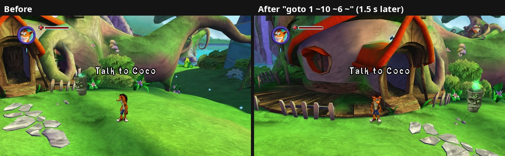

# 29. The debug console: asking the running game questions

Status: a developer tool (Linux), off unless `--debug_console=<socket>` is
given. The input recording it replays is on by default.

Test runs used to work one way only. A script could press buttons
(`--debug_input_script`, the live FIFO), but what happened next had to be read
from screenshots and log lines. Any question about memory ("what's at +80 of
the save manager?", "where is player 2?") needed a gdb run, which boots
slowly, can't attach to a running game, and pauses it. The debug console
answers instead: a command goes in, a reply comes back, and the game keeps
running.



*Crash on Wumpa Island, moved 10 units sideways and 6 up by `goto 1 ~10 ~6 ~`;
1.5 s later he has landed on the ground and the camera has followed. Both
pictures were taken by the console's `photo` command.*

## 1. How it works

`src/debug_console.cpp` listens on a Unix socket. `tools/mom.py` is the
client: each argument is one command, and the replies are printed. Every
reply ends with a line `@end ok` or `@end error <why>`, which the client
turns into its exit code, so shell scripts can chain commands safely:

```bash
tools/mom.py -s /tmp/mom.sock --wait-socket 20 "wait level 60000" players \
  "read [t1+44]+48 vec3" "lsright 1500" "wait ms 1600" photo
```

Each connection gets its own thread, so a long `wait` or `watch` on one
connection doesn't block commands sent on another.

| Command | What it does |
|---|---|
| `state`, `players`, `frontend` | level / front end / cheats; per player: character, titan, level, health, actor, position; the front end's current state and last exit |
| `eval`, `read`, `write` | address expressions; values (`u8 u16 u32 s32 f32 vec3 str wstr bytes`) |
| `wait ms / state N / exit / level / replay / <expr> <type> <op> <value>` | block until it's true (default timeout 30 s) |
| `snap <name> <expr> <bytes>`, `diff <name>` | save a memory range, then list every word that changed since (hex and float) |
| `watch <ms> <expr>:<type> ...` | values sampled once per game frame; one line per change |
| `pos [p]`, `goto <p> <x> <y> <z>` | where a player is; teleport (`~` keeps a coordinate, `~5` adds 5) |
| `photo` | F10; replies with the saved files once they're written |
| `fkey <Key>` | an app shortcut (F5 cheats, F6 controls, F9 renderer...) as if pressed |
| `replay <file> [from] [to]` | play back recorded presses (section 3) |
| anything else | a live input line, exactly like the FIFO's (`down`, `key Return`, `cheat god on`, `p2.start`) |

**Address expressions** are numbers, `+ - *`, `( )` and `[x]`, where `[x]` is
the 32-bit word at address x (a pointer chase). Names: `uber` =
`[0x8259B190]` (the game's central object), `game` = `0x825B0008`, `p1`-`p4`
= a player's Crash, `t1`-`t4` = the titan they ride. Every address is checked
readable first, because a read of an unmapped guest page would kill the game.
A bad address becomes an error reply.

Reads run on the console's own thread while the game runs, so a value can be
caught mid-update. `watch` avoids that: it samples at the end of each frame,
on the game's main thread (a PDDI frame-end listener, `src/pddi/intercept.h`).

## 2. What the console found while it was being built

* **When a level is playable.** "A level is played" (game state 5) turns true
  under the loading screen, and a photo taken then is the loading screen. The
  front end has a state for it: after a load it goes InGame (486) →
  ExitLoadingComplete → ExitGameRunning → **GameRunning (489)**, and pause
  menus leave 489 (pause = 868 in the test save). `frontend` reports the
  current state: the front end's decision dispatcher (`sub_8211AF40`) is
  asked about it every frame. Node numbers and names come from
  `fighttrees/Frontend.bfig` ([findings/24](24-save-system.md) s.6.4).
* **The level's fade-in.** At GameRunning the picture is still black. The
  front end (`uber +52`) **+144 counts from 1 down to 0** over about 1.2 s
  while the level fades in, and **+148** then counts the seconds since. Found
  with `snap`/`diff` of the front end during the fade, then confirmed by
  reading +144 next to photos: 0.98 = black, 0.49 = dim, 0 = full picture.
  `wait level` waits for GameRunning and +144 = 0.
* **The loading screen** is drawn by `CLoadingScreen`'s draw (`sub_8226BDA0`);
  `more_players::Loading()` is true while it was drawn in the last 250 ms.
* **Where a character's physics lives.** Writing a titan's world matrix
  position (actor +44 → +48) moves it, but Crash on foot snapped back on the
  next frame. Following every pointer in his actor found **actor +308 →
  `CPhysicsBehaviour`** (vtable `0x82032FC4`; its +88 points back at the actor,
  the same for player 2). It keeps its own position (+140) and velocity
  (+104), see [findings/22](22-ground-contact-high-fps.md). `goto` writes the matrix
  and the physics' position, and zeroes the velocity.

## 3. Input recording and replay

`src/input_record.*` wraps the game's controller read (`sub_824742F0`, the
XInputGetState wrapper; the save library already wrapped it). Each session
writes `<log name>-inputs.txt` next to its log, one line each time a
player's controller state changes, exactly as the game read it. This happens
after the port's own filters, so the device doesn't matter (pad, keyboard,
fake controller). Lines with `fe` mark the front end's exits, which helps to
find a moment in a long session:

```
20993 1 0000 0 0 32767 0 0 0      ms since launch, player, buttons, LT, RT, LX, LY, RX, RY
22593 1 1000 0 0 0 32767 0 0
19950 fe 486                      the front end took an exit to state 486
```

`replay <file> [from_ms] [to_ms]` feeds that part of a recording back in,
starting at once. Players the recording mentions get the recorded state, and
their real controllers are ignored meanwhile. A test that recorded a scripted
walk and replayed it into a fresh run of the same save showed every press
arriving within one frame (at most 20 ms) of its original time. The game runs
on real time, so where the character ends up is close but not identical
(about 5 units apart after 5 s of walking). A replay is good for "does this
sequence of moves trigger it", not for frame-exact reproduction. The
launcher's Report a problem adds each chosen session's recording to the zip.
