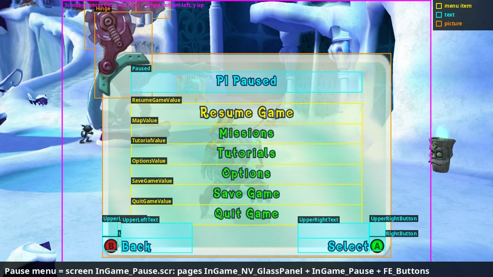
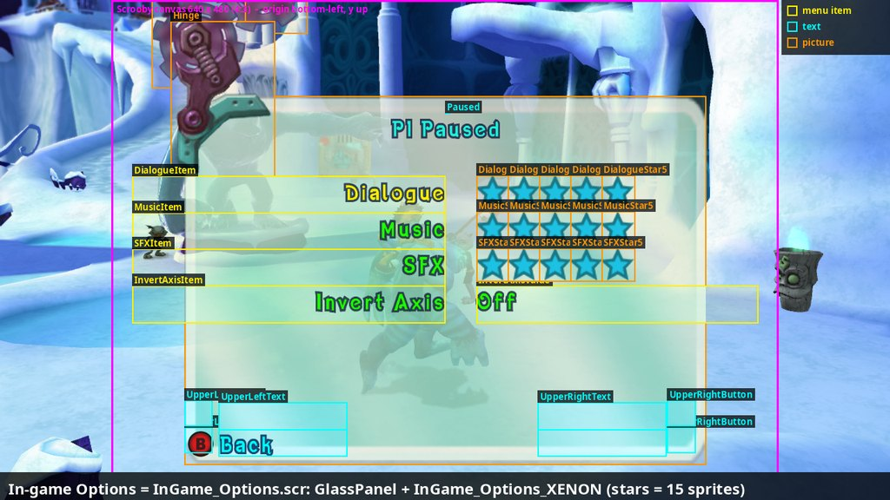
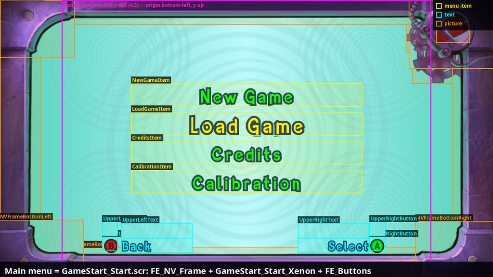

# 30. Menus and the HUD: how the game builds its screens

Status: research, nothing changed in the game. Written to prepare the port's
own in-game menus (settings, controls, players) in the game's own look. New
tool: `tools/scrooby_dump.py`.

Every menu in the game is two things working together:

1. **A layout made of data** ("Scrooby", Radical's 2D front-end library):
   which pictures and texts exist, where they sit, their colours and fonts.
   Nothing about positions or looks is in the code.
2. **A state machine made of data** (the front end's fight tree,
   `fighttrees/Frontend.bfig`, findings/24 s.6.4): which screen is shown in
   which state, which buttons lead where. Small C++ classes (one per kind of
   screen) fill in the texts and react to the buttons.

The HUD is the exception: its bars, portrait and icons are drawn by game code
(section 6). Only its texts are Scrooby.

*The pause menu with every Scrooby element of its three pages drawn on top:
yellow = menu items, cyan = texts, orange = pictures, magenta = the 640 x 480
canvas every page is laid out on. The boxes come straight from the data
(`tools/scrooby_dump.py`) and land exactly on what the game draws.*

## 1. Scrooby: projects, screens, pages, elements

The game's RTTI names the library's classes: `pure3d::frontend::Project`,
`Screen`, `Page`, `Layer`, `Group`, `Menu`, `MenuItem`, `TextMenuItem`,
`SpriteMenuItem`, `Text`, `Sprite`, `Polygon`, `App`, `ProjectLoader`. The
data lives in Pure3D packages (`package/<hash>.p3d` in `default.rcf`), one
chunk per object, little-endian (format in the tool's header):

| Level | Chunk | What it is |
|---|---|---|
| Project | 0x18000 `InGame.prj` | everything one package offers; 640 x 480 |
| Screen | 0x18001 `InGame_Pause.scr` | a list of pages shown together |
| Page | 0x18002 `InGame_Pause.pag` | a 640 x 480 canvas; pages are SHARED between screens |
| Layer | 0x18020 | a group of elements that can be shown or hidden as one |
| Menu | 0x18010 | a vertical list of items: up / down moves, the selected one turns yellow and grows |
| Menu item | 0x18011 | what is drawn (a text or picture) + optionally a VALUE: a text whose strings are its choices (Off / On, Mono / Stereo) |
| Text | 0x18023 | box, alignment (left / right / centre), colour, font, one or more strings |
| Picture | 0x18022 | box, colour + translucency, one picture per FRAME (a star's open / closed picture, a save panel's nine level pictures) |
| Polygon | 0x18009 | a flat shape with a colour per corner (the black dimmers, letterbox bars) |

**Coordinates.** Every page is 640 x 480 with the origin at the BOTTOM-LEFT
and y going UP; an element's (x, y) is its bottom-left corner. The canvas is
4:3 and is drawn centred on the 16:9 screen: at 1280 x 720, screen x =
160 + 1.5 x, screen y = 720 - 1.5 y. Decorations for widescreen sit outside
the canvas (x below 0 or above 640): the menus' frame page has two layers,
`NVFrameBorder_Widescreen` (pieces from x = -109 to 750) and
`NVFrameBorder_Fullscreen` (inside 0-640), and the game shows the one that
fits the display.

**Texts.** Two fonts draw every menu text: `Titans_Large` (main menu items,
mission titles, "Loading") and `Titans_Small` (everything else). A text names
its strings by id in a text bank: `frontend`, `ingame`, `persistent`,
`bootup` (chunk 0x1800D, one sub-chunk 0x1800E per language: the frontend
bank has 14 languages x 504 strings; the in-game one in this package English
only, 744 strings). Ids are readable names (`InGame_Pause_ResumeGame`,
`GameStart_Options_Widescreen`, `Fe_Menu_Yes`); the bank stores them as
16-bit keys under 65599 whose hash function hasn't been identified yet (h x
31, h x 65599, FNV and their 64-bit forms don't match), so ids aren't mapped
to their English text by the tool. `_Empty` = filled in by code. Button
pictures are characters of the same fonts (findings/23 s.1.2: U+00A5-00BE).

**What the four projects hold** (Xbox 360 package names):

| Project | Package | Screens |
|---|---|---|
| `BootUp.prj` | 7efdcd91 | boot messages |
| `GameLoad.prj` | b4c85fe7 (always loaded) | `FE_Buttons` (the four button prompts), `FE_GameSlot` (save list), `FE_TRG_Message`, `FE_TRG_ConfirmMessage` (question box), `GameLoad_loading`, `FE_Black` |
| `GameStart.prj` | cdd70a8c (main menus) | title, main menu (`GameStart_Start`: Xbox / PS2 / Wii pages + the "NV door"), Options (PS2 page only), difficulty, name entry, credits, concept art, skins, enemy info, Crash stats, language select, movie selection, calibration, a debug menu, `FE_NV_Frame` (purple frame) |
| `InGame.prj` | one per level group (7a7fb434 ... 7a8b117b, c1e387c7) | `InGame` (HUD texts, message bar, announcements, "Join Game" corners, collectable counter), pause (1 and 2 players, with / without Save), options (Xbox / PS2 / Wii pages), map, tutorial, upgrade (level up), mini-game list, movie skip, letterbox, game complete |

## 2. Screens are glass panels and frames

The pieces repeat across the whole game. Each screen is a few shared pages
stacked:

* **In game**, every menu sits on `InGame_NV_GlassPanel`: a large translucent
  glass panel (`FE_Common_GlassPanel_Rectangle_Large`, 78 % opaque, 500 x 354
  units at (70, 34)) with a mechanical hinge and two cogs at its top-left
  corner. The level stays visible behind it. Pause, Options, Tutorials,
  Level Up and the mini-game list are this panel + one page of their own.
* **In the main menus**, `FE_NV_Frame` draws the purple machine frame with
  the NV logo light and cogs top right, over a cyan background with slow
  circular ripples (the "NV background" track below).
* **Messages and questions** (`FE_TRG_Message`, `FE_TRG_ConfirmMessage`): the
  frame or level is dimmed, the text is centred cyan, the choices are a small
  menu (Yes / No side by side).
* **Button prompts** (`FE_Buttons`): four corners of the canvas, each a
  button glyph + a cyan label. Lower left = Back (B), lower right = Select
  (A); the upper corners take extra actions (the save list's Delete Y and
  Rename X). The in-game screens put the same prompts at the bottom of the
  glass panel.
* **Save list** (`FE_GameSlot`): three small glass panels, each with five
  texts (name, date, time, %, difficulty) and a level picture.

*In-game Options = the glass panel page + `InGame_Options_XENON`: a menu of
four items, each a right-aligned label and a value (Invert Axis: "Off");
the volume rows show five star pictures each (open / closed frames) instead
of a value text.*

## 3. The front end: states that switch screens

The front end (`CFrontendManager`, findings/24-25) runs the tree in
`Frontend.bfig`: 994 nodes, states with named exits, numbered in file order
(findings/24 s.6.4). Between the node records each state carries
three track lists, **enterTracks**, **duringTracks** and **exitTracks**.
A track is a record whose type is a hashed name. The hash is the game's
string hash `sub_82357020`: h = h x 31 + c over the bytes, h starting at 0.
With it the types read:

| Track type | What it does in a state |
|---|---|
| `FEScreen` | show a Scrooby screen by name |
| `FEPage` | show / hide one page of it |
| `FEMenu` | which menu (page + menu name) takes the input |
| `FEMenuCursor` | which menu shows the selection cursor |
| `FEScreenButtons` | the prompts: text ids for each corner (`FE_Button_Text_Back`, `FE_Button_Text_Select`) and their glyphs |
| `FENVBackground` | the purple frame + rippling background (main menus) |
| `FETRGMessage` | a message box text |
| `FE<Name>Screen` | the C++ class for that screen (`FEPauseScreen`, `FEInGameOptionsScreen`, `FEMainMenuScreen`, `FEGameSlotScreen`, `FENameEntryScreen`, `FEMapScreen`, `FETutorialScreen`, `FEUpgradeScreen`, `FECreditScreen` ...) |

The track classes are named in the RTTI too (`CScreenTrack`, `CPageTrack`,
`CMenuTrack`, `CMenuCursorTrack`, `CScreenButtonsTrack`, `CNVBackgroundTrack`,
`C<Name>ScreenTrack`), and each screen class has an action that does the work
(`CPauseScreenAction`, `CInGameOptionsScreenAction`, `COptionsScreenAction`,
`CGameSlotScreenAction`, ...).

**Example, the pause menu (state 868).** Its enter tracks set the prompts
(Back, Select). Under it, branch nodes per case (`OnePlayer`, `TwoPlayer`,
`Demo`) add `FEPauseScreen InGame_Pause`, `FEMenu InGame_Pause PauseMenu`,
`FEMenuCursor` and two `FEPage` tracks that switch between the one-player
page and `InGame_Pause2Player` (the page with Drop Out). Its exits are named
by what was picked: `ExitResumeGame`, `ExitMapScreen`, `ExitTutorials`,
`ExitDropOut`, `ExitOptions` (to state 956), `ExitSaveGame`, `ExitQuitGame`.

**Platforms are branches too.** The in-game Options state (956) has
branches `ContentXenon`, `ContentPS2`, `ContentWii`: the Xbox one shows
`InGame_Options_XENON` and hides the PS2 and Wii pages. The PS2 page has one
row more (Vibration); the Wii page one less (no Invert Axis).

**The main menu has no Options on the Xbox.** `GameStart_Start_Xenon` lists
New Game, Load Game, Credits, Calibration. The Options screen
(`GameStart_Options.scr`) exists only as the PS2 page `GameStart_OptionsPS2`:
a glass panel, a cog and a hinge, and a menu with Widescreen (Off / On),
Sound (Mono / Stereo), Vibration (On / Off), Progressive Scan (On / Off) and
Credits. It is still in the Xbox package, unused: a ready-made settings
screen in the game's own look, with the label / value rows a settings menu
needs.

*The main menu: `FE_NV_Frame` (widescreen layer: the frame's pieces reach
past the canvas on both sides), the four-item menu in `Titans_Large`, and
the two lower prompts.*

## 4. The look, measured

Colours sampled from 1280 x 720 captures (native renderer) and read from the
data:

| Role | Colour | Where |
|---|---|---|
| Menu item | `#00F800` green (data `#00FF00`) | every menu |
| Selected item | `#FDED06` yellow (menu data `#FFF110`), drawn larger | every menu |
| Titles, messages, prompt labels | `#00F6EF` cyan (data `#00FFF7`) | "P1 Paused", questions, Back / Select |
| Text outline | `#142F5E` dark navy | all coloured texts |
| Glass panel | `#A2E3E4` (the level shows through, ~78 % opaque) | in-game menus |
| Main menu background | `#86E3DA` teal with circular ripples | front end |
| Frame | `#3D2D64` purple metal, cogs, NV logo light | front end |
| HUD health bar | `#D81B1B` red, `#3A0505` dark | HUD |
| HUD special bar | `#8E33BD` purple | HUD |
| Map screen bars | `#1DFFF2` cyan, `#6628BB` purple | Missions |

Sizes: `Titans_Small` lines are 27-36 units tall (40-54 px at 720p),
`Titans_Large` 41-55. Menu rows are 35 units apart in game (pause) and 50 in
the main menu. Button glyphs are coloured discs (A green, B red, X blue,
Y yellow) drawn by the font.

## 5. What the screens' code does with the layout

The screen classes find elements BY NAME and change a few properties. These
are the calls the port already uses (findings/24, 26, 28):

| What | Function / field |
|---|---|
| find a text / picture / menu in a page | `sub_82371AD0` / `sub_82371A90` / `sub_82371A50` (page, name) |
| set a text's string (UTF-16, copied) | `sub_82373360` (text, string) |
| show / hide an element | element +110 bit 0x80 = visible |
| position | element +92 / +96 (floats, fraction of 640); `sub_82370EE8(element, dx, dy)` moves; `sub_82371198` scales around the centre; `sub_82370A58` resets the transform |
| page fade | `sub_82370888` (alpha) |
| menu selection | items at +112, selected index +152; `SetSelection sub_8237A4C0`, `MoveNext sub_8237A668`, `MovePrevious sub_8237A550`; item +137 bit 0x80 = selectable |
| a question box with any text | `ShowConfirmMessage sub_8225F758` (findings/26 s.33) |
| which front-end state is current | the decision dispatcher `sub_8211AF40` (findings/29) |

The port has also ADDED to all three layers: new pages and texts in packages
at load time (`src/data/data_patcher.*`: players 3-4's HUD texts and "Join
Game" pages, the name keyboard in the in-game package), new pictures (players
3-4's markers), and new front-end states with C++ decisions (the rename route,
findings/24 s.7).

## 6. The HUD

The HUD screen `InGame.scr` is six pages: `InGame` (mission header / title,
hint text, mojo counts and multipliers, counter-button texts),
`InGame_MessageBar` (a small glass panel at the bottom with a title, a
message and a counter), `InGame_Announcement`, `InGame_CoOp_Player1/2` ("Join
Game" + button, top corners), `InGame_CollectableCounter`. Most of its texts
have no position of their own (1 x 1 at (0, 0)): the code places them.

The rest is drawn by `CHUDController`: one `CHealthDisplay` per player
(findings/26 s.18) draws the round portrait (Crash or the jacked titan), the
red health bar and purple special bar with their icons, and places the mojo
count under the portrait, from a base point per player (top left, top right;
the port adds bottom left / right for players 3-4). Combo meters, lock-on
arrows and counter prompts are front-end objects of their own (findings/26
s.25, s.27).

## 7. Building our own menus on this

Three ways, from most to least like the game:

1. **Scrooby pages + front-end states** (as the rename route and the lost
   controller box do): a page added to the package (copies of existing
   elements with new names and positions), a state in the tree that shows it,
   a C++ action that fills in texts and reacts to the buttons. Looks and
   behaves exactly like the game, works with every renderer and with the
   game's menu input (up / down, A / B, owner rules). Limits: the 640 x 480
   canvas, the two fonts and their characters, existing pictures (new ones
   possible, as the markers show), and menus that are vertical lists
   (horizontal Yes / No exists; scrolling lists need code, as the save list
   has).
2. **Our own 2D drawing in the native renderer**: anything goes (sliders,
   tabs, scrolling), using the game's fonts and pictures, but only in the
   native picture.
3. **ImGui windows** (F5 cheats, F6 controls today): quick and complete, but
   visibly not part of the game.

A settings screen fits route 1 well: label / value rows with left / right to
change a value are what the unused PS2 Options page already is, and the
in-game Options screen is the same pattern on the glass panel.

## 8. Tools

* `tools/scrooby_dump.py <package.p3d> [page ...]`: the tree of every page
  (positions, colours, fonts, string ids, picture names), `--json` for all
  of it. Packages come out of `default.rcf` with any RCF extractor (format:
  findings/19).
* The track decoding and the annotated pictures were made with scratch
  scripts (hash names over the bfig's track records; boxes drawn with the
  formula of section 1 over F10 photos from a debug-console run).
