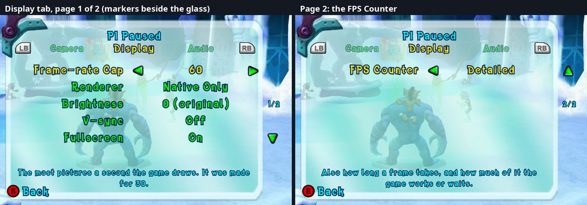
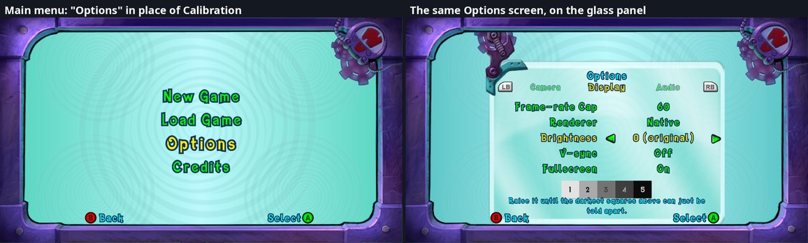

# 31. The Options screen: tabs, port settings and live changes

Status: built (first version). Pause -> Options opens the port's Options
screen: the game's glass panel and menu look, with tabs (Display, Audio,
Controls, Camera), and every change takes effect at once. Code:
`src/options/` (page, settings, screen) and `src/ui/scrooby.*` (helpers for
the game's menu library). Builds on the menu research of findings/30.

*Left: the Display tab, page 1 of 2 (the arrows show the selected value
can move both ways; beside the glass: "1/2" and a down arrow). Right: page
2, the FPS Counter row.*

## 1. What the original screen is

The in-game Options state (956 in `Frontend.bfig`) runs two actions:

* `CInGameOptionsScreenAction` (Enter `sub_820CDAD0`, Update `sub_820CDCC0`):
  only the panel's slide-in (the glass panel page and the options page moved
  in from 800 units, the background faded, the two cogs turned as they move)
  and the "P1 Paused" title.
* `CMenuAction` (Enter `sub_820D2828`, Update `sub_820D2A00`, Exit
  `sub_820D2F08`): the generic driver behind every Scrooby menu screen. It
  finds the page and the menu by the name hashes in its track (track +20
  page, +28 menu), then each frame moves the cursor (IsButtonPressed buttons
  45 up / 16 down, sounds `down_left` / `up_right` of the `FE_SFX` bank) and
  walks value lists (27 left / 40 right).

`CMenuAction` holds **special code for one menu name**: when the menu's
name hash equals the global at `0x825A0598` (the hash of
`InGameOptionsMenu`, filled at start-up), Enter lights the star pictures
(`sub_820D2F80`: `DialogueStar1-5`, `MusicStar1-5`, `SFXStar1-5`, lit =
frame 0 + the colour word at `0x825078E4`, unlit = frame 1 + `0x4BFFFFFF`)
and sets the Invert Axis value; Update changes a volume or Invert Axis BY ROW
NUMBER (0 Dialogue, 1 Music, 2 SFX, 3 Invert Axis) and plays the Music
preview while row 1 is selected.

The game's own options:

| Option | Read / write | Notes |
|---|---|---|
| Dialogue volume | `sub_82266240` / `sub_82266268` (f1) | 0.0-1.0 in steps of 0.2 (a star); sound `FE_SFX_Volume_D` "Dialogue" on a change |
| Music volume | `sub_822661F0` / `sub_82266218` | `sub_822615D0` / `sub_822615E8` = Music row selected / left (its preview) |
| SFX volume | `sub_82266290` / `sub_822662B8` | sound `FE_SFX_Volume_S` "SFX" |
| Invert Axis | front end +8588 + `sub_82266130(front end, player)` | a byte per player (1 = on); read only by the aiming reticle (`CReticleAimingBehaviour`, `sub_82255160`), which flips its vertical aim |

## 2. The page

The data patch (`options_page.cpp`) replaces the page
`InGame_Options_XENON.pag` in every in-game menus package (`InGame.prj`,
one per level group) with one made of copies of the page's own elements:
the Dialogue row (a menu item: label text + value text) for each row, a
star picture, the "Paused" title, plus the map screen's arrow picture
(`TitleArrowLeft` of `InGame_Map.pag`, a down arrow) for the value
selector. The page and menu keep their names, so the state's tracks find
them as before.

Layout (Scrooby units, findings/30 s.1): tabs at y 312, three at a time:
the current one in the middle (0.97 x size, yellow), the previous and next
ones beside it (0.8 x, half see-through: there is more to either side,
wrapping around), the font's LB / RB pictures at both ends;
up to five rows from y 270, 35 apart; labels right-aligned ending at x 300;
values centred in a selector from x 312 to 568 with an arrow at each end;
stars centred in the same place; a warning (yellow) and a description
(cyan, two lines) at 0.72 x size above the game's Back prompt.

Things learnt building it:

* **A menu item's texts aren't found by name** in the page
  (`sub_82371AD0` returns 0): the item holds them, +140 the drawn text (the
  label) and +144 the value text, both Text objects.
* **Texts don't wrap** by themselves: the description is broken into lines
  at spaces in code ("\n").
* **The font has no `<` or `>`.** Its arrow characters (U+00BA, U+00BB)
  don't match (the left one is an outline), hence the map's arrow picture,
  turned with `sub_823710C8(element, angle, axis)` (the call the screen
  action uses for its cogs; degrees, around the element's centre; +90 makes
  the down arrow point left).
* **A pointer into a node's child list goes stale when the list grows**: the
  counter's patch first kept a pointer to its template text and appended
  copies to the same list; the first append moved the list, the next copies
  read freed memory and damaged the heap (aborts in `malloc` / at exit, at
  random moments). Caught deterministically with glibc's malloc checks
  (`LD_PRELOAD=libc_malloc_debug.so.0 MALLOC_CHECK_=3 MALLOC_PERTURB_=165`):
  copy first, then append.
* Element sizes: `sub_82370A58` resets an element's transform,
  `sub_82371198(element, scale)` scales it around its centre.

## 3. The screen's code

`options_menu.cpp` wraps the three `CMenuAction` methods. For our menu
(recognized by the track's menu hash, before Enter has found the menu
itself) the original runs with the `InGameOptionsMenu` global zeroed for
the call: the special code doesn't recognize the menu, the generic part
(up / down, its sounds, skipping rows that aren't selectable) still works.
Then:

* left / right = the same IsButtonPressed buttons 27 / 40, through the
  port's menu-owner rule (findings/26 s.21: the player who paused answers);
* tabs = LB / RB (or Back) on the owner's controller, as the game last read
  it (the XInputGetState wrapper reports every state);
* unused rows: texts hidden (element +110 bit 0x80), item not selectable
  (+137 bit 0x80);
* A on an action row (Rebind Keys) opens the F6 Controls window.

What the rows are and do lives in `options_settings.cpp`: label, values,
description and warning per value, how to read / write / apply each.

**Pages.** A tab shows five rows at a time; a longer one is cut into pages.
The menu's own up / down (Scrooby `Menu::MoveNext` `sub_8237A668` /
`MovePrevious` `sub_8237A550`, already hooked by the save list) asks the
screen first: past the last / first row of a page it turns to the next /
previous page (wrapping around), the cursor lands on its first / last row,
and the menu plays its usual sound. Beside the glass on the right: the
map's arrow (turned over for "up") where there are more rows that way, and
"1/2" between them.

**The X button** can belong to a row: while that row is selected (and its
value allows it) the game's lower right button prompt (page `FE_Buttons`,
`LowerRightButton` / `LowerRightText`; the main menu's "Select A" there is
replaced) says what X does. The Renderer row's X is **Dual Mode** (= F8,
the native picture in a second window) on Emulated and Native, the two
values where both renderers draw.

**The Brightness guide** is the original's calibration screen picture
(`FE_calibration_greyscale.tga`, page `GameStart_VideoCalibration` of the
main menus' package), copied into the in-game packages. A picture element
draws at its picture's own size hanging from the top of its box (the box's
width and height don't scale it): drawn at 0.6 x by code.

| Tab | Row | Values | Where | Applied |
|---|---|---|---|---|
| Display | Frame-rate Cap | 30 (original), 60, 120, 144, 165, 180, 240, Unlimited (+ a hand-set value) | `fps_cap` | read every frame (findings/07) |
| | Renderer | Emulated Only, Emulated, Native, Native Only (the default since 2026-10-10: `native_only` on) | `emulated_only`, `native_only` + the shown picture | `NativeRenderer::SetShowNative` (= F9); the emulated GPU's drawing on / off at once; Emulated Only = the native renderer idle, F9 / F8 locked (both read when asked) |
| | Brightness | -5 ... 0 (original) ... +5 | GPU flag `gamma_ramp_power` (SDK patch 0015) = 2^(-step/10) | the emulated GPU re-uploads the game's gamma ramp with the power applied at its next swap; the native renderer applies the same curve to the same ramp (measured: +3 = the level 182 -> 192.5/255 in both pictures) |
| | V-sync | Off, On | `present_vsync` (frame_rate.h) | On = the window's present mode FIFO (the SDK's `vulkan_allow_present_mode_immediate` / `_mailbox` / `_fifo_relaxed` all off; the swapchain made again with `Presenter::OnSurfaceResizeFromUIThread`: mode 2 in the log) AND the frame pacer capped at the monitor's refresh rate (SDL: the window's display, else the primary; an Unlimited or higher cap becomes the refresh rate, 30 stays the original pacing). A first version only switched to mailbox (no tearing, but no limit): not what V-sync means to players |
| | Fullscreen | Off, On | the SDK's `fullscreen` | its change callback resizes the window |
| | FPS Counter | Off, Simple, Average, Detailed | `fps_overlay` (`src/fps_overlay.*`) | the port's own counter (no MangoHud), a text in the game's font, ALWAYS on screen: copies on the button prompts' page `FE_Buttons.pag` (package b4c85fe7, drawn over every MENU screen) and on the HUD page `InGame.pag` (drawn in play), same places, so they overlap exactly; updated 4 times a second from the front end's update (`sub_82261C40`, every frame in menus and play), coloured against the cap. The GAME's frames: FPS of the last 0.25 s, average of 5 s, 1% low of 10 s, frame / game / swap ms (GAME without the frame pacer's wait). In both pictures and in photos. (First versions: an ImGui window, then a HUD-only text.) |
| | FPS Position | Top Left, Top Centre, Top Right, Bottom Left, Bottom Right | `fps_overlay_position` | five texts per page (one per place, in the 16:9 picture's corners past the 4:3 canvas), only the chosen one shown |
| Audio | Dialogue, Music, SFX | 0-5 stars | the game's own | as the original screen |
| Controls | Invert Axis | Off, On | the game's own (per player) | as the original screen |
| | Rebind Keys | (action) | | opens F6 |
| Camera | Co-op Camera | Frame Everyone, Original | `coop_camera` | read every frame (findings/28) |
| | Camera Follows | Nearest Player, Middle | `coop_camera_near_focus` | read every frame |

No row for `coop_mask_from_anywhere` (findings/26 s.35): in the original, B
already makes a mask nearly everywhere (on screen through the ordinary
check, off screen through the catch-up); the rule only differs when a
player is on screen and the partner isn't, which only the co-op camera
causes. It's a fix, not a choice, and stays on.

Port settings changed on the screen are written to `user/settings.toml` when
it closes: only those keys (a key back on its default is removed), every
other line kept, through a temporary file and a rename. The game's own
options stay where the game keeps them.

## 4. The main menu's Options

The Xbox main menu has no Options, but the PS2 route is still in the data:
the PS2 main menu page (`GameStart_Start_PS2`) has an `OptionsItem`
(string `GameStart_MainMenu_Options`, translated in all the front end's
languages), the tree has the PS2 menu's `ExitOptions` (node 77) into
`OptionsScreen` (96, decision `sub_8211B818`: the cancel flag takes ExitBack
106 back to the main menu), which shows the screen `GameStart_Options` with
the PS2 page `GameStart_OptionsPS2` (Widescreen, Sound, Vibration,
Progressive Scan, Credits) through `COptionsScreenAction`.

A second data patch, of the main menus' package (`cdd70a8c`, `GameStart.prj`):

* `GameStart_Start_Xenon.pag`: a copy of the PS2 `OptionsItem` as the third
  item, in place of Calibration (the original's TV brightness test screen:
  a grey scale and an instruction, no setting; its picture is now the
  Brightness row's guide). Four items, as laid out by the game.
* `GameStart_OptionsPS2.pag`: our page (same builder as in game; its menu
  keeps the name `OptionsMenu`, the state's track names it), with the
  in-game screen's glass panel, cogs and hinge made from the page's own
  pictures, and a title text carrying the same translated "Options". The
  texts start from the menus' own bank's `_Empty` (the in-game bank isn't
  loaded there); the two star pictures are copied in from an in-game
  package (the main menu package has every other picture).

Code (`options_menu.cpp`): the main menu's decision `sub_8211B6C8`
(GetMenuIndex 0-3 -> exits 86-89) is answered with our order: New Game 86,
Load Game 87, Options = exit 77, Credits 88 (the engine follows any exit's
target, findings/24 s.7; the calibration state 484 is no longer reached).
`COptionsScreenAction` keeps only what every screen needs (Enter: take the
track's updates, show `GameStart_Options` with `sub_82262730`, clear the
result flags; Exit: give the updates back, menus take input again); its PS2
rows' code doesn't run. B sets the cancel flag (front end +8593 bit 2) for
the state's decision. The Music row's preview is left out there (the main
menu plays its own music).

## 5. Not in this version
* Keyboard on / off: the keyboard driver is made at start-up only.
* Resolution above 720p, motion blur: the features don't exist yet.
* A game-style Rebind Keys screen (the row opens the F6 window for now),
  animated previews of the settings.
